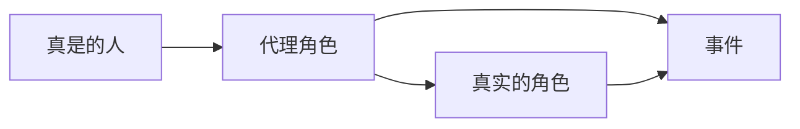

# Spring

## 一，有关Spring

### 1，简介

- Spring框架的雏形：interface21框架

- 2004年正式发行了1.0版本

- Rod Johnson，Spring Framework创始人，一个音乐系博士

- spring理念：使现有的技术更加容易使用，本身是一个大杂烩，整合了现有的技术框架

- ~~~xml
  <!-- https://mvnrepository.com/artifact/org.springframework/spring-webmvc -->
  <dependency>
      <groupId>org.springframework</groupId>
      	<artifactId>spring-webmvc</artifactId>
  	<version>5.2.4.RELEASE</version>
  </dependency>
  ~~~

### 2，优点

- Spring是一个开源的免费的框架（容器）
- Spring是一个轻量级的，非入侵式的框架
- 控制反转（IOC），面向切面编程（AOP）
- 支持事务的处理，对框架整合的支持

总结一句话: Spring就是一个轻量级的控制反转(IOC) 和面向切面编程（AOP）的框架!

### 3，组成


## 二，IOC

### 1，简单测试

在我们之前的业务中，用户的需求可能会影响我们原来的代码，我们需要根据用户的需求去修改原代码!如果程序代码量十分大，修改-一次的成本代价十分昂贵


使用set接口实现：

~~~java
private UserDao userDao;

@Override
public void setUserDao(UserDao userDao){
    this.userDao = userDao;
}
~~~

- 之前，程序是主动创建对像，控制权在开发人员手里
- 使用set接口后，不再具有主动性，只能被动接受对象

从本质上解决了问题，开发人员不用再去管理对象的创建了，系统的耦合性大大降低，可以更加专注业务的实现上，这是IOC的原型!

### 2，IOC本质

控制反转，是一种思想，DI(依赖注入)是实现IoC的一种方法，也有人认为DI只是IoC的另一种说法没有IOC的程序中，我们使用面向对象编程，对象的创建于对象间的依赖关系完全硬编码在程序中，对象的创建由程序自己控制，控制反转后将对象的创建转移给第三方,所谓控制反转就是:获得依赖对象的方式反转了。

采用XML方式配置Bean的时候，Bean的定 义信息是和实现分离的，而采用注解的方式可以把两者合为一体, Bean的定义信息直接以注解的形式定义在实现类中，从而达到了零配置的目的。

控制反转是一种通过描述(XML或注解)并通过第三方去生产或获取特定对象的方式。在Spring中实现控制反转
的是IoC容器，其实现方法是依赖注入(Dependency Injection,DI) .

### 3，IOC容器

xml配置方法

~~~xml
<bean id="hello" class="com.liu.po.Hello">
    <property name="str" value="Spring"/>
</bean>

<!--
id = 变量名
class = new 的对象
property 相当于给对象中的属性设置一个值！
使用的时候
通过
ApplicationContext context = new ClassPathxmlApplicationContext( configLocation: "beans.xml");
来获取spring的上下文对象
ref：引用Spring容器中创建好的对象
-->
~~~

现在只需要修改一个配置文件就可以实现对程序的控制，而不是去修改代码

==对象由Spring来创建，管理装配==

### 4，IoC创建对象的方式

~~~java
//这是创建源码，是AbstractBeanDefinition类下的resolveBeanClass方法 创建bean的所有方法都会在这里进行创建
@Nullable
public Class<?> resolveBeanClass(@Nullable ClassLoader classLoader) throws ClassNotFoundException {
    String className = getBeanClassName();
    if (className == null) {
        return null;
    }
    // 很明显使用了反射的方式创建的
    Class<?> resolvedClass = ClassUtils.forName(className, classLoader);
    this.beanClass = resolvedClass;
    return resolvedClass;
}
~~~

（）使用无参构造的方法创建对象，默认的

~~~xml
<!--	bean.xml-->
<!--    注册一个bean 使用默认的无参构造器方式-->
<bean id="user" class="com.wen.pojo.User">
	<property name="name" value="liu" />
</bean>
~~~

~~~java
// User.java
public class User {
    private String name;

    public String getName() {
        return name;
    }

    public void setName(String name) {
        this.name = name;
    }

    public User() {
        System.out.println("使用到了无参构造方法，对象被创建了");
    }

    public void show(){
        System.out.println("name:"+name);
    }
}
~~~


1. 使用有参方法创建对象

   - 使用下标赋值

     ~~~xml
     <!--	bean.xml-->
         <!--    使用有参的构造器创建bean的第一种 下标赋值-->
     <bean id="user" class="com.wen.pojo.User">
     	<constructor-arg index="0" value="演示使用有参的构造器创建bean" />
     </bean>
     ~~~

     ~~~java
     // User.java
     public class User {
         private String name;
     
         public User(String s) {
             System.out.println("调用了有参构造器"+s);
         }
     
         public String getName() {
             return name;
         }
     
         public void setName(String name) {
             this.name = name;
         }
     
         public User() {
             System.out.println("使用到了无参构造方法，对象被创建了");
         }
     
         public void show(){
             System.out.println("name:"+name);
         }
     }
     ~~~

   - 使用类型匹配创建

     不建议使用 如果多个相同类型无法创建

     ~~~xml
     <!--	bean.xml-->
     <bean id="user" class="com.wen.pojo.User">
     	<constructor-arg type="java.lang.String" value="演示使用有参的构造器创建bean2" />
     </bean>
     ~~~

     ~~~java
     public class User {
         private String name;
     
         public User(String s) {
             System.out.println("调用了有参构造器");
             this.name = s;
         }
     
         public String getName() {
             return name;
         }
     
         public void setName(String name) {
             this.name = name;
         }
     
         public User() {
             System.out.println("使用到了无参构造方法，对象被创建了");
         }
     
         public void show(){
             System.out.println("name:"+name);
         }
     }
     ~~~

   - 引用创建,直接通过参数名来设置

     ~~~xml
     <!--	bean.xml-->
         <bean id="user" class="com.wen.pojo.User">
             <!--这里的s是有参构造方法中的s参数-->
             <constructor-arg name="s" value="演示使用有参的构造器创建bean3" />
         </bean>
     ~~~

     ~~~java
     // User.java
     public class User {
         private String name;
     
         public User(String s) {
             System.out.println("调用了有参构造器");
             this.name = s;
         }
     
         public String getName() {
             return name;
         }
     
         public void setName(String name) {
             this.name = name;
         }
     
         public User() {
             System.out.println("使用到了无参构造方法，对象被创建了");
         }
     
         public void show(){
             System.out.println("name:"+name);
         }
     }
     ~~~

总结：在配置文件加载的时候，容器中管理对象就已经初始化了。

### 5，Spring配置

#### (1)，别名

~~~xml
<alias name="user" alias="newliu"/>
~~~

如果设置了别名，就可以使用别名来创建bean

```java
ApplicationContext context = new ClassPathXmlApplicationContext("bean.xml");

User user = (User) context.getBean("newliu");

user.show();
```

#### (2)，Bean的配置

id : bean的唯一标识符。 也就是相当于我们学的对象名
class : bean 对象所对应的全限定名，包名 +类型
name：也是别名，而且name可以同时取多个别名

可以直接通过name来声明别名

~~~xml
    <bean id="user" class="com.wen.pojo.User" name="newliu1 newliu1 newliu1">
        <!--这里的s是有参构造方法中的s参数-->
        <constructor-arg name="s" value="演示使用有参的构造器创建bean3" />
    </bean>
~~~

#### (3)，import

这个import，一般用于团队开发声明，他可以将多个配置文件，导入合并为一个

```xml
<!--在applicationContext.xml中-->
<import resource="beans.xml"/>
<import resource="beans2.xml"/><import resource="beans3.xml"/>
```

使用的时候直接使用总的配置就可以了

### 6，依赖注入(DI)

#### (1)，构造器注入

#### (2)，set方式注入

- 依赖注入：set注入

  - 依赖：bean对象的创建依赖于容器
  - 注入：bean对象中的所有属性，由容器来注入

  ~~~xml
  <bean id="student" class="com.kuang.pojo.Student">
      <!--第一种，普通值注入。value-->
      <property nane="name" value="刘"/>
      <!--第二种，Bean注入。ref-->
      <property nane="address" ref="address"/>
      <!-- 数组 -->
      <property name="books">
          <array>
              <value>红楼梦</value>
              <value>西游记</value>
              <value>水游传</value>
              <value>三国演义</value>
          </array>
      </property>
      <!--List-->
  	<property nane="hobbys >
  	<list>
  		<value>听歌</value>
  		<value>限代码</value>
  		<value>看电影</value>
  	</list>
  	</property>
  	<!--Map-->
  	<property nane="card">
  	<map>
  		<entry key="身份证" value="12546546546513" />
  		<entry key="银行卡" value="12546546546513" />
      </map>
  	</property>
      <!--Set-->                                      
  	<property nane="card">
      <set>
      	<value>EVE</value>
      	<value>WOW</value>
      	<value>SCⅢ</value>
      </set>
      </property>
      <!--null-->                                     
  	<property nane="wife">
      <set>
           <null />
      </set>
      </property>
      <!--Properties-->                                     
  	<property nane="info">
      <props>
            <prop key="dirver">2010</prop>
            <prop key="url">202</prop>
            <prop key="username">10</prop>
            <prop key="password">123465</prop>
      </props>
      </property>
  </bean>
  ~~~

  ~~~java
  public class Student {
      private String nane;
      private Address address;
      private String[] books;
      private List<String> hobbys;
      private HashMap<String,String> card;
      private Set<String> ganes;
      private String Hife;
      private Properties info;
  
      public String getNane() {
          return nane;
      }
  
      public void setNane(String nane) {
          this.nane = nane;
      }
  
      public Address getAddress() {
          return address;
      }
  
      public void setAddress(Address address) {
          this.address = address;
      }
  
      public String[] getBooks() {
          return books;
      }
  
      public void setBooks(String[] books) {
          this.books = books;
      }
  
      public List<String> getHobbys() {
          return hobbys;
      }
  
      public void setHobbys(List<String> hobbys) {
          this.hobbys = hobbys;
      }
  
      public HashMap<String, String> getCard() {
          return card;
      }
  
      public void setCard(HashMap<String, String> card) {
          this.card = card;
      }
  
      public Set<String> getGanes() {
          return ganes;
      }
  
      public void setGanes(Set<String> ganes) {
          this.ganes = ganes;
      }
  
      public String getHife() {
          return Hife;
      }
  
      public void setHife(String hife) {
          Hife = hife;
      }
  
      public Properties getInfo() {
          return info;
      }
  
      public void setInfo(Properties info) {
          this.info = info;
      }
  }
  ~~~

#### (3)，扩展方式注入

1. p命名空间注入
2. s命名空间注入

~~~xml
<!--p命名空阿注入。可以直接注入民性的值: property-->
<bean id="user" class="com.liu.pojo.User" p:name="liu" p:age="18"/>
<1--c命名空阿注入。超过构透器注入: construct-args-->
<bean id="user2" class="com.liu.pojo.User" c:age="18" c:nare="si"/>
~~~

### 7，bean作用域

1. 单例模式(Spring默认机制)

   ~~~xml
   <bean id="user2" class"com.liu.pojo.user" c:age="18" c:name="names”
   scopen"singleton"/>
   ~~~

2. 原型模式:每次从容器中get的时候，都会产生一个新对象!

   ~~~xml
   <bean id="accountservice" classe"com.liu.Defaultaccountservice"
   scope="prototype"/>
   ~~~

3. 其余的request. session. application. 这些个只能在web开发中使用到!

### 8，Bean自动装配

- 自动装配是Spring满足bean依赖一种方式!
- Spring会在上下文中自动寻找，并自动给bean装配属性!

在Spring中有三种装配方式

1. 在xml中显式的装配
2. 在java中显式的装配
3. 隐式的自动装配bean【重要】

使用注解实现自动装配

要使用注解须知：

- 导入配置  context约束

- 配置注解的支持  ` <context:annotation-config/>`

  ````xml
  <?xml version="1.0" encoding="UTF-8"?>
  <beans xmlns="http://www.springframework.org/schema/beans"
         xmlns:xsi="http://www.w3.org/2001/XMLSchema-instance"
         xmlns:context="http://www.springframework.org/schema/context"
         xsi:schemaLocation="http://www.springframework.org/schema/beans
                             http://www.springframework.org/schema/beans/spring-beans.xsd
                             http://www.springframework.org/schema/context
                             http://www.springframework.org/schema/context/spring-context.xsd">
  
      <context:annotation-config/>
  
  </beans>
  ````

  **@Autowired** 

  直接在属性上使用即可！也可以在set上使用，使用Autowired我们可以不用编写set方法了，前提是你这个自动装配的属性在IOC(Spring)容器中存在且符合名字byname

  如果显式定义了@Autowired的属性

  @Autowired(required = false) 那么说明这个子段可以为空

  ~~~java
  public @interface Autowired {
      boolean required() default true;
  }
  ~~~

  如果@Autowired自动装配的环境比较复杂，自动装配无法通过一个注解[ @Autowired]完成的时候.我们可以使用@Qualifier(value=' xxxx )法配置@Autowired的使用，指定一个唯一的bean对象注入

  **@Nullable** 

  字段标记了这个注解，说明这个字段可以是空。

  **@Resource注解**

  小结: 

  @Resource和@ Autowired的区别:

  - 都是用来自动装配的，都可以放在属性字段上
  - @ Autowired 通过byType的方式实现
  - @Resource默认通过byname的方式实现，如果找不到名字,则通过byType实现!如果两个都找不到的情况，就报错
  - 执行顺序不同：@Autowired通过byType的方式实现

### 9，使用注解开发

在Spring4之后，要使用注解开发，必须要保证aop的包引入

使用注解需要导入context约束，增加注解的支持

```xml
<?xml version="1.0" encoding="UTF-8"?>
<beans xmlns="http://www.springframework.org/schema/beans"
       xmlns:xsi="http://www.w3.org/2001/XMLSchema-instance"
       xmlns:context="http://www.springframework.org/schema/context"
       xsi:schemaLocation="http://www.springframework.org/schema/beans
                           http://www.springframework.org/schema/beans/spring-beans.xsd
                           http://www.springframework.org/schema/context
                           http://www.springframework.org/schema/context/spring-context.xsd">


    <!--开启注解的支持-->
    <context:annotation-config/>
    <!--指定要扫描的包，这个包下的注解就会失效-->
    <context:component-scan base-package="com.liu.pojo"/>

</beans>
```

**@Component** : 组件，放在类上，说明这个类被Spring管理了，就是bean！

相当于`<bean id="user" class="com.liu.pojo.User" />`

**@Value("name")** : 为属性注入一个值

相当于`property name="name" value="shidacaizi"`

~~~java
@Component
public class User {
    @Value("十大才子")
    public String name;
}
~~~

也可以注入在set方法上

~~~java
@Component
public class User {
    public String name;

    @Value("十大才子")
    public void setName(String name) {
        this.name = name;
    }
}
~~~

衍生注解：

@Component有几个衍生注解，我们在web开发中。会按照mvc三层架构分层

dao：@Repository 

service：@Service

controller：@Controller

实际上这三个的作用是一样的，但是为了区分mvc三个层次所以分出了这三个注解


xml与注解

- xml更加万能，适用于任何场合，维护简单方便
- 注解不是自己的类就无法使用，维护相对复杂

最佳搭配实践

- xml是用来管理bean
- 注解只负责完成属性的注入
- 我们在使用的过程中，只需要注意一个问题，必须让注解生效，就必须开启注解的支持

### 10，使用java的方式配置Spring

可以完全不是用Spring的xml配置，全部交由java来做

JavaConfig是Spring的一个子项目，在Spring4 之后，成为了一个核心功能

### 11，代理模式

代理模式就是SpringAOP的底层【SpringAOP，ApringMVC】

代理模式的分类




#### (1)，静态代理

角色分析

- 抽象角色：一般会使用接口或者抽象类来解决
- 真实角色：被代理的角色
- 代理角色：代理真实角色，代理角色后，我们一般会做一些附属操作
- 客户：访问代理对象的角色

~~~java
public interface Rent {
    public void rent();
}

//房东
public class Host implements Rent{
    @Override
    public void rent() {
        System.out.println("我是房东，~我要出租房子");
    }
}

// 代理
public class Proxy implements Rent{
    private Host host;

    public Proxy() {
    }

    public Proxy(Host host) {
        this.host = host;
    }

    @Override
    public void rent() {
        seeHouse();
        host.rent();
        fare();
        heTong();
    }

    // 看房
    public void seeHouse(){
        System.out.println("这里是中介带客户去看房");
    }
    // 收中介费
    public void fare(){
        System.out.println("收中介费");
    }
    // 合同
    public void heTong(){
        System.out.println("合同");
    }
}

// 客户
public class Client {
    public static void main(String[] args) {
        Host host = new Host();
        // 代理 代理角色一般会有被代理角色无法做操作
        Proxy proxy = new Proxy(new Host());
        proxy.rent();
        proxy.seeHouse();
    }
}
~~~

代理模式的优点：

- 可以使真实角色更加纯粹！不用去关注一些公共的业务
- 公共业务就交给了代理角色，实现了业务的分工!
- 公共业务发生扩展的时候，方便集中管理

缺点：

- 一个真实角色就会产生一个代理角色，代码量翻倍效率降低

#### (2)，动态代理

- 动态代理和静态代理角色一样
- 动态代理的代理是动态生成的，不是我们直接写好的
- 动态代理分为两大类:基于接口的动态代理，基于类的动态代理
  - 基于接口---JDK动态代理
  - 基于类：cglib
  - java字节码实现：javasist
- 需要了解两个类：proxy，InvocationHandler：调用处理程序

##### InvocationHandler

优点;

- 可以使真实角色更加纯粹！不用去关注一些公共的业务
- 公共业务就交给了代理角色，实现了业务的分工!
- 公共业务发生扩展的时候，方便集中管理
- 一个动态代理类代理的是一个接口，一般就是对应的一类业务
- 一个动态代理类可以代理锁哥多个类，只要实现了同一个接口即可

## 三，AOP

### 1，什么是AOP

AOP (Aspect Oriented Programming)意为:面向切面编程，通过预编译方式和运行期动态代理实现程序功能的统一维护的一种技术。AOP是OOP的延续，是软件开发中的一个热点，也是Spring框架中的一个重要内容，是函数式编程的一种衍生范型。利用AOP可以对业务逻辑的各个部分进行隔离，从而使得业务逻辑各部分之间的耦合度降低，提高程序的可重用性,同时提高了开发的效率。

### 2，AOP在Spring中的作用

==提供声明式事务:允许用户自定义切面==

- 横切关注点:跨越应用程序多个模块的方法或功能。即是，与我们业务逻辑无关的，但是我们需要关注的部分，就是横切关注点。如日志,安全,缓存,事务等等...
- 切面(ASPECT) :横切关注点被模块化的特殊对象。即，它是-一个类。
- 通知(Advice) :切面必须要完成的工作。即，它是类中的-一个方法。
- 目标(Target) :被通知对象。
- 代理(Proxy) :向目标对象应用通知之后创建的对象。
- 切入点(PointCut) :切面通知执行的“地点"的定义。
- 连接点UointPoint) : 与切入点匹配的执行点。

方式一：使用Spring API实现

方式二：使用自定义类来实现

方式三：注解

~~~xml
<?xml version="1.0" encoding="UTF-8"?>
<beans xmlns="http://www.springframework.org/schema/beans"
       xmlns:xsi="http://www.w3.org/2001/XMLSchema-instance" xmlns:aop="http://www.springframework.org/schema/aop"
       xsi:schemaLocation="http://www.springframework.org/schema/beans http://www.springframework.org/schema/beans/spring-beans.xsd http://www.springframework.org/schema/aop https://www.springframework.org/schema/aop/spring-aop.xsd">

    <bean id="userService" class="com.liu.service.UserServiceImpl"/>
    <bean id="log" class="com.liu.log.Log"/>
    <bean id="afterlog" class="com.liu.log.AfterLog"/>

    <!--使用原生spring API接口-->
    <!--配置AOP-->
    <!--<aop:config>
        &lt;!&ndash;切入点 expression 表达式&ndash;&gt;
        <aop:pointcut id="pointcut" expression="execution(* com.liu.service.UserServiceImpl.*(..))"/>
        &lt;!&ndash;执行环绕增加&ndash;&gt;
        <aop:advisor advice-ref="log" pointcut-ref="pointcut"/>
        <aop:advisor advice-ref="afterlog" pointcut-ref="pointcut"/>
    </aop:config>-->
    <!--使用自定义类-->
    <!--<bean id="newlog" class="com.liu.log.NewLog"/>
    <aop:config>
        &lt;!&ndash;自定义切面，ref 要引用的类&ndash;&gt;
        <aop:aspect ref="newlog">
            &lt;!&ndash;切入点&ndash;&gt;
            <aop:pointcut id="point" expression="execution(* com.liu.service.UserServiceImpl.*(..))"/>
            &lt;!&ndash;通知&ndash;&gt;
            <aop:before method="alog" pointcut-ref="point"/>
            <aop:after method="llog" pointcut-ref="point"/>
        </aop:aspect>
    </aop:config>-->
    <!--方式三-->
    <bean id="annotationpointCut" class="com.liu.diy.AnnotationPointCut"/>
    <!--开启注解支持-->
    <!--JDK默认是 proxy-target-class="false"  cglilb设置为proxy-target-class="true"-->
    <aop:aspectj-autoproxy proxy-target-class="true"/>
</beans>
~~~

~~~java
public class AfterLog implements AfterReturningAdvice {
    @Override
    public void afterReturning(Object o, Method method, Object[] objects, Object o1) throws Throwable {
        System.out.println("执行了"+method.getName()+"方法，返回了"+o);
    }
}

public class Log  implements MethodBeforeAdvice {
    @Override
    public void before(Method method, Object[] objects, Object o) throws Throwable {
        System.out.println(o.getClass().getName()+"的"+method.getName()+"方法被执行了");
    }
}
~~~

~~~java
public class NewLog {
    public void alog(){
        System.out.println("alog");
    }
    public void llog(){
        System.out.println("llog");
    }
}
~~~

~~~java
// 使用注解方式实现AOP
@Aspect // 标记这个类是一个切面
public class AnnotationPointCut {

    @Before("execution(* com.liu.service.UserServiceImpl.*(..))")
    public void before(){
        System.out.println("====方法执行前====");
    }

    @After("execution(* com.liu.service.UserServiceImpl.*(..))")
    public void after(){
        System.out.println("====方法执行后====");
    }

    // 在环绕增强中，我们可以给定一个参数，代表我们要获取处理切入的点
    @Around("execution(* com.liu.service.UserServiceImpl.*(..))")
    public void around(ProceedingJoinPoint point) throws Throwable {
        System.out.println("====环绕前====");

        // 获得签名
        Signature signature = point.getSignature();
        System.out.println("签名："+signature);

        // 执行方法
        Object proceed = point.proceed();

        System.out.println("====环绕后====");
        System.out.println(proceed);
    }
}
~~~

## 四，整合Mybatis

步骤

1. 导入相关jar包
   - mybatis
   - junit
   - mysql数据库
   - spring相关
   - aop相关
   - mybatis-spring【new】
2. 编写配置文件
3. 测试

## 五，声明式事务

### 1，回顾事务

- 要么都成功，要么都失败
- 事务在项目开发中，十分重要，设计到数据的一致性问题
- 确保完整性和一致性

~~~xml
<!--配置声明式事务-->
<bean id="transactionManager" class="org.springframework.jdbc.datasource.DataSourceTransactionManager">
    <property name="dataSource" ref="dataSource"/>
</bean>
<!--结合AOP实现事务的植入-->
<!--配置事务通知: -->
<tx:advice id= "txAdvice" transaction-anager="transactionManager">
    <!--龄那非方法配置事务-->
    <!--配置事务的传播特性: new propogation= -->
    <tx:attributes>
        <tx:method name="add" propagation="REQUIRED"/>
        <tx:method name="delete" propagations="REQUIRED"/>
        <tx:method name="update" propagation="REQUIRED"/>
        <tx:method name="query" read-only="true"/>
        <tx:method name="*" propagation="REQUIRED"/>
    </tx:attributes>
</tx:advice>
<!--配置事务切入-->
<aop:config>
    <aop:pointcut id="txPointCut" expression=" execution(* com.liu.mapper.*.*(..))"/>
    <aop:advisor advice-ref="txAdvice" pointcut-ref="txPointCut"/>
</aop:config>
~~~


思考:

为什么需要事务?

- 如果不配置事务，可能存在数据提交不一致的情况
- 如果我们不在spring中去配置声明式事务，我们就需要在代码中手动配置事务!
- 事务在项目的开发中十分重要，设计到数据的一致性和完整性问题，不容马虎!