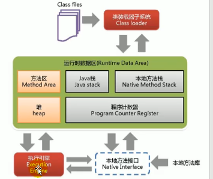

# 一，JVM内存与垃圾回收

## 一，JVM与Java体系结构

### 1，Java及JVM简介

| 我们写的应用程序 |
| :--: |
| **spring**     **mybatis**   **SpringMVC**   **SpringBoot** |
| JavaAPI |
| JVM |

高级语言经过编译成为汇编语言，汇编语言再转化为机器指令才可以在CPU中执行

字节码：任何能在jvm平台上执行的字节码格式都是一样的，所以统称为jvm字节码

### 2，虚拟机与Java虚拟机

#### （1），虚拟机

虚拟机(Virtual machine)，就是一台虚拟的机器，他是一款软件，用来执行一系列虚拟计算指令，大体上，虚拟机可以分为系统虚拟机和程序虚拟机

1. Visual Box，VMware属于系统虚拟机，它们完全是对物理计算机的仿真，提供了一个可运行完整操作西戎的软件平台。
2. 程序虚拟机的典型代表就是Java虚拟机，它专门为执行单个计算机程序而设计，在Java虚拟机中执行的指令我们成为Java字节码指令

无论是系统虚拟机还是程序虚拟机，在上面运行的软件都被限制于虚拟机提供的资源中

#### （2），Java虚拟机

- java虚拟机是一台执行Java字节码的虚拟计算机，它拥有独立的运行机制，其运行的Java字节码也未必由Java语言编译而成。
- JVM平台的各种语言可以共享Java虚拟机带来的跨平台性，优秀的立即回收器，以及可靠的及时编译器。
- Java技术的核心就是Java虚拟机因为所有的Java程序都运行在Java虚拟机内部。
- 作用Java虚拟机就是二进制字节码的运行环境们负责装载字节码到其内部，解释/编译为对应平台上的机器指令执行，每一条Java指令，Java虚拟机规范中都有详细定义，如怎么取操作数，怎么处理操作数，处理结果放在那里。
- 特点：
  - 一次编译，到处运行
  - 自动内存管理
  - 自动垃圾回收功能

### 3，JVM整体结构



### 4，Java代码执行流程


### 5，JVM的架构模型

Java编译器输入的指令流基本上是一种基于栈的指令集架构，另外一种指令集架构则是基于寄存器的指令集架构

#### (1),基于栈式架构的特点

1. 设计和实现更简单，适用于资源受限的系统
2. 避开了寄存器的分配难题，使用零地址指令方式分配
3. 指令流中的指令大部分是零地址指令，其执行过程依赖于操作栈，指令集更小，编译容易实现。
4. 不需要硬件支持，可移植性更好，更好实现跨平台

#### (2),基于寄存器架构的特点

1. 典型的应用是x86的二进制指令集：比如传统的PC以及Android的Davlik虚拟机
2. 指令及架构则完全依赖硬件，可移植性差
3. 性能优秀和执行更高效
4. 花费更少的指令去完成一项操作
5. 大部分情况下基于寄存器架构的指令往往都以一地址指令，二地址指令和三地址指令为主，而基于栈式架构的指令集却是以零地址指令为主

由于跨平台性的设计，Java指令都是根据栈来设计的，不同平台CPU架构不同，所以不能设计为基于寄存器的，优点是跨平台，指令集小，编译器容易实现，缺点是性能下降，实现同样的功能需要更多的指令

### 6，JVM的生命周期

#### 虚拟机的启动

Java虚拟机的启动是通过引导类加载器（bootstarap class loader）创建一个初始类（initial class）来完成，这个类是有虚拟机的具体实现指定的。

#### 虚拟机的执行

- 一个运行中的java虚拟机有着一个清晰的任务:执行Java程序
- 程序开始执行时它才运行，程序运行结束后它就停止
- 执行一个所谓的Java程序的时候，真真正正在执行的是一个叫Java虚拟机的进程

#### 虚拟机的退出

## 二，类加载子系统


### 1，类加载器子系统作用

- 类加载器子系统负责从文件或者网络中加载class文件，class文件在文件开头有特定的文件标识
- ClassLoader只负责class文件的加载，至于它是否可以运行，则有ExecutionEngine决定
- 加载的类信息存放于一块成为方法区的内存空间，除了；类的信息外，方法去中还会有存放运行时常量池信息，可能还包括字符串字面量和数字常量（这部分常量信息是Class文件汇总常量池部分的内存映射）

### 2，类的加载过程

#### （1），加载（Loading）

1. 通过一个类的全限定名获取定义此类的二进制字节流
2. 将这个字节流所代表的静态存储结构转化为方法区运行时数据结构
3. 在内存中生成一个代表这个类的java.lang.Class对象，作为方法区这个类的各种数据的访问入口

#### （2），链接（Linking）—>验证（Verifcation）

1. 目的在于确保Class文件的字节流中包含信息符合当前虚拟机的要求，保证被加载类的正确性，不会危害虚拟机自身安全
2. 主要包括四种验证，文件格式验证，元数据验证，字节码验证，符号引用验证。

#### （3），链接（Linking）—>准备（Preparation）

1. 为类变量分配内存并且设置该类变量的默认初始值，即零值。
2. 这里不包括用final修饰的static，因为final在编译的时候就会分配了，准备阶段会显示初始化
3. 这里不会为实例变量分配初始化，类变量会分配在方法区中，而实例变量是会随着对象一起分配到Java堆中

#### （4），链接（Linking）—>解析（Resolution）

1. 将常量池内的符号引用转换为直接引用的过程
2. 事实上，解析操作往往会伴随着JVM在执行完初始化后再执行
3. 符号引用就是一组符号来描绘所引用的字面量形式明确定义在《Java虚拟机规范》的Class文件格式中，直接引用就是直接指向目标的指针，相对偏移量或一个间接定位到目标的句柄 
4. 解析动作主要正对类或借口，字段，类方法，接口方法，方法类型等，对应常量池中的CONSTANT_Class_info,CONSTANT_Fieldref_info,CONSTANT_Methodref_info等。

#### （5），初始化（Initalization）

1. 初始化阶段就是执行类构造器方法\<clinit>()的过程
2. 此方法不需定义，是javac编译器自动收集类中的所有类变量的赋值动作和静态代码块中的语句而来
3. 构造器方法中指令按语句在源文件中出现的顺序执行
4. \<clinit>()不同于类的构造器。（关联：构造器是虚拟机视角下的\<init>()）
5. 若该工具具有父类，jvm会保证子类的\<clinit>()执行前，父类的\<clinit>()已经执行完毕
6. 虚拟机必须保证一个类的\<clinit>()方法在多线程下被同步加锁 

### 3，类加载器分类

1. JVM支持两种类型的类加载器，分别为引导类加载器和自定义类加载器
2. 从概念上来讲，自定义类加载器一般指的是程序中由开发人员自定义的一类类加载器，但是Java虚拟机规范却没有这么定义，而是将所哟派生与抽象类ClassLoader的类加载器都划为自定义类加载器
3. 无论类加载器的类型如何划分，在程序中我们最常见的类加载器始终只有3个。
4. 

#### （1），引导类加载器，BootStrap ClassLoader

1. 这个类加载使用C/C++语言实现的，嵌套在JVM内部
2. 用它来加载Java的核心库，用于提供java自身需要的类
3. 并不继承自java.lang.ClassLoader没有父加载器
4. 加载扩展类和应用程序类加载器，并指定为他们的父类加载器
5. 出于安全考虑，Bootstrap启动类加载器之加载包名为java，javax，sun，开头的类

#### （2），扩展类加载器，Extension ClassLoader

1. Java语言编写，由sun.misc.Launcher$ExtClassLoader实现
2. 派生于ClassLoader类
3. 父类加载器为启动类加载器
4. 从java.ext.dirs系统属性指定的目录中加载类库，或从JDK的安装目录的jre/lib/ext子目录（扩展目录）下加载类库，如果用户创建的JAR放在此目录下，也会自动由扩展类加载器加载

#### （3），应用程序类加载器，（系统类加载器）AppClassLoader

1. java语言编写，由sun.misc.Launcher$AppClassLoader实现
2. 派生于ClassLoader类
3. 父类加载器为扩展类加载器
4. 它负责加载环境变量classpath或系统属性，java.class.path指定路径下的类库
5. 该类加载是程序中默认的类加载器，一般来说。Java应用的类都是由它来完成加载
6. 通过ClassLoader#getSystemClassLoader()方法获取到该类加载器

##### 手写类加载器

~~~java
public class MyClassLoader extends ClassLoader {
    private String rootPath;

    public MyClassLoader() {
        super();
    }

    public MyClassLoader(String rootPath) {
        this.rootPath = rootPath;
    }

    @Override
    protected Class<?> findClass(String name) throws ClassNotFoundException {
        Class<?> clz = findLoadedClass(name);
        if (clz != null)
            return clz;
        byte[] classData = getData(name);
        clz = defineClass("com.lixianzhong.classLoader.Hello", classData, 0, classData.length);
        return clz;
    }

    private byte[] getData(String className) {
        String pathName = rootPath + className.replace(".", "/") + ".class";
        System.out.println(pathName);
        byte[] bytes = null;
        try (FileInputStream fis = new FileInputStream(pathName); 
                ByteArrayOutputStream bos = new ByteArrayOutputStream();) {
            byte[] flush = new byte[1024 * 1024];
            int len = -1;
            while (-1 != (len = fis.read(flush))) {
                bos.write(flush);
            }
            bytes = bos.toByteArray();
        } catch (Exception e) {
            System.out.println("异常");
        }
        return bytes;
    }
}
~~~


### 4，双亲委派机制

Java虚拟机对class文件采用的是按需加载的方式，也就是说当需要使用该类时才会将它的class文件加载到内存生成class对象，而且加载某个类的class文件时，Java虚拟机采用的是双亲委派模式，即把请求交由父类处理，它是一种任务委派模式

#### 工作原理：

1. 如果一个类加载器收到了类加载请求，它并不会自己先去加载，而是把这个请求委托给父类的加载器去执行
2. 如果父类加载器还存在其父类加载器，则进一步向上委托，依次递归，请求最终将到达顶层的启动类加载器
3. 如果父类加载器可以加载成功，就返回成功，如果父类加载器无法完成加载任务，子加载器才会尝试自己去加载，这就是双亲委派模式

#### 优势

1. 避免类的重复加载
2. 保护程序安全，防止核心API被随意篡改

### 5，类的主动使用和被动使用

#### （1），主动使用

1. 创建类的实例
2. 访问某个类或接口的静态变量，或者对该静态变量赋值
3. 调用类的静态方法
4. 反射（Class.forname("")）
5. 初始化一个类的子类
6. Java虚拟机启动被标明为启动类的类
7. JDK7开始提供的动态语言支持：java.lang.invoke.MethodHandle实例的解析结果REF_getStatic,REF_putStatic,REF_invokeStatic句柄对应的类没有初始化，则初始化

#### （2）被动使用

除主动使用的七中情况以外的使用Java类的方式都被看做是对类的被动使用，都不会导致类的初始化

## 三，运行时数据区概述及线程


Java虚拟机定义了若干种程序运行期间会使用到的运行时数据区，其中有一些会随着虚拟机启动而创建，随着虚拟机退出而销毁，另外一些则是与线程一一对应的，这些与线程的数据区域会随着线程开始和结束而创建和销毁

上图中灰色的为单独线程私有的，红色的为多个线程共享的

1. 每个线程：独立包括程序计数器，栈，本地栈
2. 线程间共享：堆。堆外内存（永久代或元空间，代码缓存）——>方法区


### 线程：

- 线程是一个程序里的运行单元。JVM允许一个应用有多个线程并行的执行，
- 在Hotspot JVM里，每个线程都与操作系统的本地线程直接映射
  - 当一个Java线程准备好执行以后，此时一个操作系统的本地线程也同时创建，Java线程执行终止后，本地线程也会回收
- 操作系统负责所有线程的安排调度到任何一个可用的CPU上，一旦本地线程初始化成功，它就会调用Java线程中的run()方法

## 四，程序计算器（PC寄存器）

### 1，PC Register 介绍

JVM中的程序计数寄存器中，Register的命名源于CPU的寄存器，寄存器存储指令相关的现场信息，CPU只有把数据装载到寄存器才能够运行。

这里，并非是广义上所指的物理寄存器，或者将其翻译为pc计数器（或指令计数器）会更加贴切（也称为程序钩子），并且也不容易引起一些不必要的误会，JVM中的PC寄存器是对物理PC寄存器的一种抽象模拟

#### 作用

PC寄存器用来存储指向下一条指令的地址，也就是即将要执行的指令代码，由执行引擎读取下一条指令

#### 说明

1. 它是一块很小的内存空间，几乎可以忽略不计，也是运行速度最快的存储区域
2. 在JVM规范中，每个线程都有它自己的程序计数器，是线程私有的，生命周期与线程的生命周期保持一致
3. 任何时间一个线程都只有一个方法在执行，也就是所谓的当前方法，程序计数器会存储当前线程正在执行的Java方法的jvm指令地址，或者，如果在执行native方法，则是未指定值（undefined）
4. 它是程序控制流的指示器，分支，循环，跳转，异常处理，线程恢复等基础功能都需要依赖这个计数器来完成
5. 字节码解释器工作时就是通过改变这个计数器的值来选取下一条需要执行的字节码指令
6. 它是唯一一个在Java虚拟机规范中没有规定任何OutOfMemoryError情况的区域

## 五，虚拟机栈

### 1，虚拟机栈概述

由于跨平台性的设计，Java的指令都是根据栈来设计的，不同平台CPU架构不同，所以不能设计为基于寄存器的。

优点是跨平台，指令集小，编译器容易实现，缺点是性能下降，实现同样的功能需要更多的指令。

栈是运行时的单位，而堆是存储的单位

即：栈解决程序的运行问题，即程序如何执行，或者说如何处理数据。堆解决的是数据存储的问题，即数据怎么放，放在那里

- java虚拟机栈，早期也叫java栈，每个线程在创建一个虚拟机栈，其内部保存一个个的栈帧，对应着一次次的java方法调用

  ​	是线程私有的

- 生命周期：生命周期和线程一致

- 作用：主管java程序的运行，它保存方法的局部变量，部分结果，并参与方法的调用和返回

#### 栈的特点（优点）

- 栈是一种快速有效的分配存储方式，访问速度仅次于程序计数器
- JVM直接对java栈的操作有两个
  - 每个方法执行，伴随着进栈（入栈，压栈）
  - 执行结束后的出站工作
- 对于栈来说不存在垃圾回收问题

### 2，栈的存储结构

#### （1），栈中存储什么

- 每个线程都有自己的栈，栈中的数据都是以栈帧的格式存在
- 在这个线程上正在执行的每个方法都各自对应一个栈帧
- 栈帧是一个内存区块，是一个数据集，维系着方法执行过程中的各种数据信息

#### （2），栈的运行原理

- JVM直接对Java栈的操作只有两个，就是对栈帧的压栈和出栈，遵循"先进后出"/"后进先出"原则
- 在一条活动线中，一个时间点上，只会有一个活动的栈帧，即只有当前正在执行的栈帧（栈顶栈帧）是有效的，这个栈帧被称为当前栈帧，与当前栈帧相对应的方法就是当前方法，定义这个方法的类就是当前类
- 执行引擎运行的所有字节码指令只针对当前栈帧进行操作
- 如果在该方法中调用了其他方法，对应的新的栈帧会被创建回来，放在栈的顶端，称为新的当前帧
- 不同程序中所包含的栈帧是不允许存在相互引用的，即不可能在一个栈帧之中引用另外一个线程的栈帧
- 如果当前方法调用了其他方法，方法返回之际，当前栈帧就会传回此方法，的执行结果给前一个栈帧，接着虚拟机会丢弃当前栈帧，使得前一个栈帧重新成为当前栈帧
- Java方法有两种返回函数的方式，一种最正常的函数返回，使用人return指令，另外一种是抛出异常，不管使用哪种方式，都会导致栈帧被弹出

#### （3），栈帧的内部结构

每个栈帧中存储着：

1. 局部变量表（Local Variables）
2. 操作数栈（Operand Stack）（或表达式栈）
3. 动态链接（Dynamic Linking）（或指向运行时常量池的方法引用）
4. 方法返回地址（Return Address）（或方法正常退出或者异常退出的定义）
5. 一些附加信息

##### 1），局部变量表

- 局部变量表也被称为局部变量数组或本地变量表
- 定义为一个数字数组，主要用于存储方法参数和定义在方法体内的局部变量，这些数据类型包括各类基本数据类型，对象引用，以及returnAddress类型
- 由于局部变量表是建立在线程的栈上，是线程的私有数据，因此不存在数据安全问题
- 局部变量表所需的容量大小是在编译期确定下来的，并保存在方法的Code属性的maximum local variables数据项中，在方法运行期间是不会改变局部变量表的大小的

##### 2），关于Slot（插槽）的理解

- 参数值的存放总是在局部变量数组的index0开始，到数组长度-1的索引结束
- 局部变量表，最基本的存储单元是Slot（变量槽）
- 局部变量表中存放编译期可知，基本数据类型（8种），引用类型（returnAddress类型），64位的类型（long和double）占用两个solt
  - byte，short，char在存储前被转换为int，boolean也被转换为int，0表示false，非0表示true
  - long和double则占据两个Slot
- JVM会为局部变量表中的每一个slot都分配一个访问素引，通过这个素引即可成功访问到局部变量表中指定的局部变量值
- 当一个实例方法被调用的时候，它的方法参数和方法体内部定义的局部变量将会按照顺序被复制到局部变量表中的每一个Slot.上
- 如果需要访问局部变量表中一个64bit的局部变量值时，只需要使用前一个索引即可。(比如:访问1ong或doub1e类型变量)
- 如果当前帧是由构造方法或者实例方法创建的，那么该对象引用this将会存放在index为0的
  slot处，其余的参数按照参数表顺序继续排列。

重复利用问题

1. 栈帧中的局部变量表中的槽位是可以重用的，如果一个局部变量过了其作用域，那么在其作用域之后申明的新的局部变量就很有可能会复用过期局部变量的槽位，从而达到节省资源的
   目的。

##### 3），操作数栈

- 每一个独立的栈帧中除了包含局部变量表以外，还包含一个后进先出的操作数栈，也可以称之为表达式栈、
- 操作数栈，在方法执行过程中根据字节码指令，往栈中写入数据或提取数据，即入栈（push）/出栈（pop）
  - 某些字节码指令将值压入操作数栈，其余的字节码指令将操作数取出栈，使用它们后再把结果压入栈
  - 比如：执行复制，交换，求和等操作
- 如果被调用的方法带有返回值的话，其返回值将会被压入当前栈帧的操作数栈中，并更新PC寄存器中下一条需要执行的字节码指令
- 操作数栈中元素的数据类型必须与字节码指令的序列严格匹配，这由编译器在编译期间进行验证，同时在类加载过程中的类检验阶段的数据流分析阶段要再次验证
- 另外我们说Java虚拟机的解释引擎是基于栈的执行引擎，其中的栈指的就是操作数栈

#### （4），栈顶缓存技术

1. 前面提过，基于栈式架构的虛拟机所使用的零地址指令更加紧凑，但完成一项操作的时候必然需要使用更多的入栈和出栈指令，这同时也就意味着将需要更多的指令分派( instruction dispatch) 次数和内存读/写次数。
2. 由于操作数是存储在内存中的，因此频繁地执行内存读/写操作必然会影响执行速度。为了解决这个问题，Hotspot JVM的设计者们提出了栈顶缓存(Tos， Top-of-stack Cashing)技术，将栈项元素全部缓存在物理CPU的寄存器中，以此降低对内存的读/写次数，提升执行引擎的执行效率。

#### （5），动态链接

- 每一个栈帧内部都包含一个指向运行时常量池中该栈帧所属方法的引用。包含这个引用的目的就是为了支持当前方法的代码能够实现动态链接(Dynamic Linking)比如: invokedynamic指 令
- 在Java源文件被编译到字节码文件中时，所有的变量和方法引用都作为符号引用(Symbolic Reference)保存在class文件的常量池里。比如:描述-一个方法调用了另外的其他方法时，就是通过常量池中指向方法的符号引用来表示的，那么动态链接的作用就是为了将这些符号引用转换为调用方法的直接引用。

静态类型语言是判断变量自身的类型信息，动态类型语言是判断变量值的类型信息，变量没有类型信息，变量值才有类型信息，这是动态语言的一个重要特征

#### （6），方法返回地址

- 存放调用该方法的PC寄存器的值
- 一个方法的结束，有两种方式：
  1. 正常的执行完成
  2. 出此未处理的异常，非正常退出
- 无论通过那中方式退出，在方法退出后都返回到该方法被调用的位置，方法正常退出时，调用者的pc计数器的值作为返回地址，即调用该方法的指令的下一条指令的地址，而通过异常退出的返回地址是要通过异常表来确定，栈帧中一般不会保存这部分信息

当一个方法开始执行后，只有两种方式可以退出这个方法

1. 执行引擎遇到一个方法返回字节码指令（return），会有返回值传递给上层的方法调用者，简称正常完成出口

   - 一个方法在正常调用完成之后究竟需要使用哪一个返回指令还需要根据方法返回值的实际数据类型而定
   - 在字节码指令中，返回指令包含ireturn（当返回值是boolean，byte，char，short和int类型时使用），lreturn，freturn，dreturn以及areturn，另外还有一个return指令干供声明void方法，实例初始化方法，类和接口的初始化方法使用

2. 在方法执行的过程中遇到异常（Exception），并且这个异常没有在方法内处理，也就是只要在本方法的异常表中没有搜索到匹配的异常处理器，就会导致方法退出，简称异常完成出口

   方法执行过程中抛出异常处理，存储在一个异常处理表，方便在发生异常的时候找到处理异常的代码

3. 本质上，方法的退出就是当前栈帧出栈的过程，此时，需要恢复上层方法的局部变量表，操作数栈，将返回值压入调用者栈帧的操作数栈，设置pc寄存器值等，让调用者方法继续执行下去。

   通过异常完成出口退出的不会给他的上层调用者产生任何的返回值

#### 其他：

- 举例栈溢出的情况（StackOverflowError）
  - 通过-Xss设置栈的大小；OOM
  - 栈固定时不足
  - 栈不固定时内存不足
- 调整栈大小，不能保证不出现溢出
- 分配栈内存不是越大越好，会浪费内存资源。
- 垃圾回收器不会涉及虚拟机栈
- 方法中定义的局部变量是否线程安全，具体情况具体分析
  - 如果只有一个线程才可以操作此数据，则必是线程安全的
  - 如果有多个线程操作此数据，则此数据是共享数据，如果不考虑同步机制的话，会存在线程安全问题

## 六，本地方法接口

### 1，什么是本地方法

简单地讲，一个Native Method就 是一个Java调用非Java代码的接口。一个Native Method是这样一个Java方法:该方法的实现由非Java语言实现，比如C。这个特征并非Java所特有，很多其它的编程语言都有这一机制，比如在C++中，你可以用extern "C"告知C+ +编译器去调用一个C的函数。

在定义一个native method时， 并不提供实现体(有些像定义一个Java interface)，因为其实现体是由非java语言在外面实现的。

本地接口的作用是融合不同的编程语言为Java所用，它的初衷是融合C/C++程序。

### 2，为什么要使用native method

Java使用起来非常方便，然而有些层次的任务用Java实现起来不容易，或者我们对程序的效率很在意时，问题就来了。

#### （1），与JAVA环境外交互

有时Java应用需要与Java外面的环境交互，这是本地方法存在的主要原因。你可以想想Java需要与一-些底层系统，如操作系统或某些硬件交换信息时的情况。本地方法正是这样一种交流机制:它为我们提供了一个非常简洁的接口，而且我们无需去了解Java应用之外的繁琐的细节。

#### （2），与操作系统的交互

JVM支持着Java语言本身和运行时库，它是Java程序赖以生存的平台，它由一个解释器(解释字节码)和一些连接到本地代码的库组成。然而不管怎样，它毕竟不是一个完整的系统，它经常依赖于一些底层系统的支持。这些底层系统常常是强大的操作系统。通过使用本地方法，我们得以用Java实现了jre的与底层系统的交互，甚至JVM的一些部分就是用c写的。还有，如果我们要使用一些Java语言本身没有提供封装的操作系统的特性时，我们也需要使用本地方法。

#### （3），Sun's java

sun的解释器是用c实现的，这使得它能像-些普通的C- 样与外部交互。jre大部分是用Java实现的，它也通过一些本地方法 与外界交互。例如:类java. lang . Thread的setpriority ()方法是用Java实现的，但是它实现调用的是该类里的本地方法setPriority0()。这个本地方法是用c实现的，并被植入JVM内部，在windows 95的平台上，这个本地方法最终将调用win32 Setpriority() API. 这是一个本地方法的具体实现由JVM直接提供，更多的情况是本地方法由外部的动态链接库(external dynamic link library) 提供，然后被JVM调用。

## 七，本地方法栈

- Java虚拟机栈用于管理Java方法的调用，而本地方法栈用于管理本地方法的调用。
- 本地方法栈，也是线程私有的。
- 允许被实现成固定或者是可动态扩展的内存大小。(在内存溢出方面是相同的)
  - 如果线程请求分配的栈容量超过本地方法栈允许的最大容量，Java虛拟机将会抛出一个stackoverflowError 异常。
  - 如果本地方法栈可以动态扩展，并且在尝试扩展的时候无法申请到足够的内存,或者在创建新的线程时没有足够的内存去创建对应的本地方法栈，那么Java虚拟机将会抛出一个outofMemoryError 异常。
- 本地方法是使用C语言实现的。
- 它的具体做法是Native Method Stack中 登记native方法，在Execution Enqine 执行时加载本地方法库。
- 当某个线程调用一个本地方法时，它就进入了一个全新的并且不再受虚拟机限制的世界。它和虚拟机拥有同样的权限。
  - 本地方法可以通过本地方法接口来访问虚拟机内部的运行时数据区。
  - 它甚至可以直接使用本地处理器中的寄存器
  - 直接从本地内存的堆中分配任意数量的内存。
- 并不是所有的JVM都支持本地方法。因为Java虚拟机规范并没有明确要求本地方法栈的使用语言、具体实现方式、数据结构等。如果JVM产品不打算支持native方法，也可以无需实现本地方法栈。
- 在Hotspot JVM中，直接将木地方法栈和虚拟机栈合二为一。

## 八，堆

## 九，方法区

## 十，直接内存

## 十一，执行引擎

## 十二，StringTable

## 十三，垃圾回收概述

## 十四，垃圾回收相关算法

## 十五，垃圾回收相关概念

## 十六，垃圾回收器

# 二，JVM字节码与类的加载

# 三，性能监控与调优

# 四，面试

# 五、jvm参数

## 1，XX

#### （1），Boolean类型

##### ①，公式

- -XX:+或者-某个属性值
- +表示开启
- -表示关闭
- 常用参数
  - -Xmx/-Xms：最大和初始堆大小。最大默认为物理内存的1/4，初始默认为物理内存的1/64。
  - -Xss：等价于`-XX:ThresholdStackSize`。用于设置单个栈的大小，系统默认值是0，**不代表栈大小为0**。而是根据操作系统的不同，有不同的值。比如64位的Linux系统是1024K，而Windows系统依赖于虚拟内存。
  - -Xmn：新生代大小，一般不调。
  - -XX:MetaspaceSize：设置元空间大小。
  - -XX:+PrintGCDetails：输出GC收集信息，包含`GC`和`Full GC`信息。
  - -XX:SurvivorRatio：新生代中，`Eden`区和两个`Survivor`区的比例，默认是`8:1:1`。通过`-XX:SurvivorRatio=4`改成`4:1:1`
  - -XX:NewRatio：老生代和新年代的比列，默认是2，即老年代占2，新生代占1。如果改成`-XX:NewRatio=4`，则老年代占4，新生代占1。
  - -XX:MaxTenuringThreshold
  - 新生代设置进入老年代的时间，默认是新生代逃过15次GC后，进入老年代。如果改成0，那么对象不会在新生代分配，直接进入老年代。

##### ②，Case

- 是否打印GC的收集细节
  - -XX +PrintGCDetails
- 是否使用串行垃圾回收器

#### （2），KV设值类型

##### ①，公式

- -XX:属性key=属性值value

##### ②，Case

- -XX:MetaspaceSize=128m
- -XX:MaxTenuringThreshold=15

#### （3），jinfo举例，如何查看当前运行程序的配置

- jinfo -flag 配置项 进程编号
- jinfo -flags 进程编号

#### （4），题目

- 两个经典参数
  - -Xms 等价于-XX:InitialHeapSize
  - -Xmx 等价于-XX:MaxHeapSize

## jvm引用

- 强引用
  - Reference
  - 当内存不足，JVM开始垃圾回收，对于强引用的对象，就算是出现了OOM也不会对该对象进行回收
  - 强引用是我们最常见的普通对象引用，只要还有强引用指向一个对象，就能表明对象还“活着”，垃圾收集器不会碰这种对象。
  - 在Java中最常见的就是强引用，把一个对象赋给一个引用变量，这个引用变量就是一个强引用。当一个对象被强引用变量引用时，它处于可达状态，它是不可能被垃圾回收机制回收的，即使该对象以后永远都不会被用到JVM也不会回收。
  - 强引用是造成Java内存泄漏的主要原因之一
  - 对于一个普通的对象，如果没有其他的引用关系，只要超过了引用的作用域或者显式地将相应(强)引用赋值为null，一般认为就是可以被垃圾收集
- 软引用
  - SoftReference
  - 软引用是一种相对强引用弱化了一些的引用，需要用java.lang.ref. SoftReference类来实现，可以让对象豁免一些垃圾收集。
  - 对于只有软引用的对象来说，当系统内存充足时官不会被回收，当系统内存不足时它会被回收。
  - 软引用通常用在对内存敏感的程序中，比如高速缓存就有用到软引用，内存够用的时候就保留，不够用就回收!
- 弱引用
  - WeakReference
  - 弱引用需要用java.lang.ref.WeakReference类来实现，它比软引用的生存期更短。
  - 对于只有弱引用的对象来说，只要垃圾回收机制一运行，不管JVM的内存空间是否足够，都会回收该对象占用的内存。
  - WeakHashMap
- 虚引用
  - PhantomReference
  - 虚引用需要java lang.ref.PhantomReference类来实现。
  - 顾名思义，就是形同虚设，与其他几种引用都不同，虚引用并不会决定对象的生命周期。
  - 如果一个对象仅持有虚引用，那么它就和没有任何引用一样，在任何时候都可能被垃圾回收器回收，它不能单独使用也不能通过它访问对象，虚引用必须和引用队列(ReferenceQueue)联合使用。
  - 虚引用的主要作用是跟踪对象被垃圾回收的状态。仅仅是提供了一种确保对象被finalize以后，做某些事情的机制。
  - PhantomReference的get方法总是返@null,因此无法访问对应的引用对象。其意义在于说明一个对象已经进入finalization阶段，可以被gc回收，用来实现比finalization机制更灵活的回收操作。
  - 换句话说，设置虚引用关联的唯一目的，就是在这个对象被收集器回收的时候收到一个系统通知或者后续添加进一步的处理。
  - Java技术允许使用finalize() 方法在垃圾收集器对象从内存中清除出去之前做必要的清理工作。

# JVM四种GC算法

## 引用计数算法（Reference counting）

### 算法思想：

每个对象在创建的时候，就给这个对象绑定一个计数器。每当有一个引用指向该对象时，计数器加一；每当有一个指向它的引用被删除时，计数器减一。这样，当没有引用指向该对象时，该对象死亡，计数器为0，这时就应该对这个对象进行垃圾回收操作。

### 核心思想：

为每个对象额外存储一个计数器 RC ，根据 RC 的值来判断对象是否死亡，从而判断是否执行 GC 操作。

### 优点：

- 简单
- 计算代价分散
- “幽灵时间”短（幽灵时间指对象死亡到回收的这段时间，处于幽灵状态）

### 缺点：

- 不全面（容易漏掉循环引用的对象）
- 并发支持较弱
- 占用额外内存空间

例子：

初始状态：


改变后：


## 标记–清除算法（Mark-Sweep）

### 算法思想：

为每个对象存储一个标记位，记录对象的状态（活着或是死亡）。分为两个阶段，一个是标记阶段，这个阶段内，为每个对象更新标记位，检查对象是否死亡；第二个阶段是清除阶段，该阶段对死亡的对象进行清除，执行 GC 操作。

### 优点

- 最大的优点是，相比于引用计数法，标记—清除算法中每个活着的对象的引用只需要找到一个即可，找到一个就可以判断它为活的。
- 此外，这个算法相比于引用计数法更全面，在指针操作上也没有太多的花销。更重要的是，这个算法并不移动对象的位置（后面俩算法涉及到移动位置的问题）。

### 缺点

- 很长的幽灵时间，判断对象已经死亡，消耗了很多时间，这样从对象死亡到对象被回收之间的时间过长。
- 每个活着的对象都要在标记阶段遍历一遍；所有对象都要在清除阶段扫描一遍，因此算法复杂度较高。
- 没有移动对象，导致可能出现很多碎片空间无法利用的情况。

例子


这个图中，圆圈内灰色的对象就是已经死亡的对象，被标记为死亡，等待清除。

## 标记–整理算法

### 算法思想

标记-整理法是标记-清除法的一个改进版。同样，在标记阶段，该算法也将所有对象标记为存活和死亡两种状态；不同的是，在第二个阶段，该算法并没有直接对死亡的对象进行清理，而是将所有存活的对象整理一下，放到另一处空间，然后把剩下的所有对象全部清除。这样就达到了标记-整理的目的。

### 优点

- 该算法不会像标记-清除算法那样产生大量的碎片空间。

### 缺点

- 如果存活的对象过多，整理阶段将会执行较多复制操作，导致算法效率降低。

例子
如图：


上面是标记阶段，下面是整理之后的状态。可以看到，该算法不会产生大量碎片内存空间。

## 复制算法

### 算法思想

该算法将内存平均分成两部分，然后每次只使用其中的一部分，当这部分内存满的时候，将内存中所有存活的对象复制到另一个内存中，然后将之前的内存清空，只使用这部分内存，循环下去。

### 注意：

这个算法与标记-整理算法的区别在于，该算法不是在同一个区域复制，而是将所有存活的对象复制到另一个区域内。

### 优点

- 实现简单

- 不产生内存碎片

### 缺点

- 每次运行，总有一半内存是空的，导致可使用的内存空间只有原来的一半。


==**在 JVM 的年轻代使用的是复制算法来进行垃圾回收（由于其中的存活对象比例较小）；而在老年代，使用的却是标记-清除法或标记-整理法（由于每次回收都只回收少量对象）**==

## 垃圾回收器(4种)

### 串行(Serial)

- 它为单线程环境设计且只使用一个线程进行垃圾回收，会暂停所有的用户线程，所以不适合服务器环境

### 并行(Parallel)

- 多个垃圾收集线程并行工作，此时用户线程时暂停的，适用于科学计算/大数据处理首台处理变弱的交互场景

### 并发(CMS)

- 用户线程和垃圾收集线程同时执行(不一定是并行，可能交替执行)，不需要停顿用户线程，互联网公司多用它，适用对响应时间有要求的场景

### G1

- G1垃圾回收器将堆内存分割成不同的区域然后并发的对其进行垃圾回收

# 七种垃圾回收

jdk8的默认垃圾回收器：ParallelGC


垃圾收集器就来具体实现这些GC算法并实现内存回收。

### 1，UseSerialGC

### 2，UseSerialOldGC

### 3，UseParallelGC 

### 4，UseConcMarkSweepGC

### 5，UseParNewGC

### 6，UseParallelOldGC

### 7，UseG1GC

## 新生代的收集器

### Serial(串行)收集器

串行收集器：一个单线程的收集器，在进行垃圾收集时候，必须暂停其他所有的工作线程直到它收集结束。


串行收集器是最古老，最稳定以及效率高的收集器，只使用一个线程去回收但其在进行垃圾收集过程中可能会产生较长的停顿(Stop-The-World"状态)。

虽然在收集垃圾过程中需要智停所有其他的工作线程，但是它简单高效，对于限定单个CPU环境来说，没有线程交互的开销可以获得最高的单线程垃圾收集效率，因此Serial垃 圾收集器依然是java虚拟机运行在Client模式下默认的新生代垃圾收集器。

新生代垃圾回收器

对应jvm参数是：-XX:UseSerialGC

开启后会使用Serial(young区用)+Serial Old(Old区用)的收集器组合

新生代，老年代都会使用串行来及回收器，新生代使用复制算法，老年代使用标记-整理算法

-Xms 10m -Xmx10m -XX:+PrintGCDetails -XX:+UseSeriaIGC


~~~java
对应关系


DefNew               Default New Generation //默认新生代使用的垃圾回收器

Tenured                   Old  // 老年区

ParNew                Parallel New Generation   //在新生代用并行回收 

PSYoungGen             Parallel Scavenge //并行回收

ParOldGen          Parallel Old Generation //在老年代用并行回收 
~~~


### ParNew(并行)收集器

并行收集器：使用多线程进行垃圾回收，在垃圾收集时，会Stop-the-World暂停其他所有的工作线程直到它收集结束。


ParNew收集器其实就是Seria收集器新生代的并行多线程版木，最常见的应用场景是配合老年代的CMSGC工作，共余的行为Seral收集器完全一样。

ParNew垃圾收集器在垃圾收集过程中同样也要暂停所有其他的工作线程。 它是很多java虚拟机运行在Server模式下新生代的默认垃圾收集器。

常用对应JVM参数: -XX:+UseParNewGC 启 用ParNew收集器，只影响新生代的收集，不影响老年代
开启上述参数后，会使用: ParNew(Young区用) + Serial Old的收集器组合，新生代使用复制算法，老年代采用标记-整理算法

-XX:ParallelGCThreads 限制线程数量，默认开启和CPU数目相同的线程数
-Xms 10m -Xmx10m -XX:+PrintGCDetails -XX:+UseParNewGC

### 并行回收GC(Parallel)/(Parallel Scavenge)收集器


Parallel Scavenge收集器类似ParNew也是一个新生代垃圾收集器，使用复制算法，也是一个并行的多线程的垃圾收集器，俗称吞吐量优先收集器。

一句话:串行收集器在新生代和老年代的并行化

可控制的吞吐量(Thoughput=运行用户代码时间/(运行用户代码时间+垃圾收集时间),也即比如程序运行100分钟，垃圾收集时间1分钟，吞吐量就是99%)。

高吞吐量意味着高效利用CPU的时间，它多用于在后台运算而不需要太多交互的任务。

自适应调节策略也是ParallelScavenge收集器与ParNew收集器的一个重要区别。

自适应调节策略:虚拟机会根据当前系统的运行情况收集性能监控信息，动态调整这些参数以提供最合适的停顿时间(-XX:MaxGCPauseMillis)或最大的吞吐量。

-XX:ParallelGCThreads=数字N

表示启动多少个GC线程

## 老年代的收集器

### 串行GC(Serial Old)/(Serial MSC)


### 并行GC(Parallel Old)/(Parallel MSC)

Parallel Old收集器是Parallel Scavenge的老年代版本，使用多线程的标记-整理算法

在JDK1.6之前，新生代使用ParallelScavenge收集器只能搭配年老代的Serial Old收集器，只能保证新生代的吞吐量优先，无法保证整体的吞吐量。

在JDK1.6之前(Parallel Scavenge + Serial Old )Parallel Old正是为了在年老代同样提供吞吐量优先的垃圾收集器，如果系统对吞吐量要求比较高，JDK1.8后可以优先考虑新生代

Parallel Scavenge和年老代Parallel Old收集器的搭配策略。

在JDK1.8及后(Parallel Scavenge + Parallel Old )
JVM常用参数:
-XX:+UseParallelOldGC 使用Parallel Old收集器， 设置该参数后，新生代Parallel+老年代Parallel Old

### 并发标记清除GC(CMS)

CMS收集器(ConcurrentMarkSweep:并发标记清除)是一种以获取最短回收停顿时间为目标的收集器。
适合应用在互联网站或者B/S系统的服务器上，这类应用尤其重视服务器的响应速度，希望系统停顿时间最短。
CMS非常适合堆内存大、CPU核数多的服务器端应用，也是G1出现之前大型应用的首选收集器。


Concurrent Mark Sweep并发标记清除，并发收集低停顿,并发指的是与用户线程- -起执行

开启该收集器的JVM参数: -XX:+UseConcMarkSweepGC 开启该参数后会自动将-XX:+UseParNewGC打开

开启该参数后，使用ParNew(Young区用) + CMS(Old区用) + Serial Old的收集器组合，Serial Old将作为CMS出错的后备收集器

-Xms10m -Xmx10m -XX:+PrintGCDetails -XX:+UseConcMarkSweepGC

1. 初始标记(CMS initial make)

   进行GC Roots跟踪的过程，和用户线程一起工作，不需要暂停工作线程。主要标记过程，标记全部对象

   为了修正在并发标记期间，因用户程序继续运行而导致标记产生变动的那--部分对象的标记记录，仍然需要暂停所有的工程。

   由于并发标记时，用户线程依然运行，因此在正式清理前，再做修正

2. 并发标记(CMS concurrent mark)和用户线程一起

   清除GC Roots不可达对象，和用户线程一起工作，不需要暂停工作线程。基于标记结果，直接清理对象

   由于耗时最长的并发标记和并发清除过程中，垃圾收集线程可以和用户现在一起并发工作，所以总体上来看CMS收集器的内存回收和用户线程是一-起并发地执行。

3. 重新标记(CMS remark)

   重新进行标记，修正Concurrent Mark期间由于用户程序运行导致对象关系间的变化及新创建的对象，耗时短

4. 并发清除(CMS concurrent sweep)和用户线程一起

   并行的进行无用对象的回收

- 优点：
  - 并发收集停顿低
- 缺点：
  - 并发执行，对CPU资源压力大
    - 由于并发进行，CMS在收集与应用线程会同时会增加对堆内存的占用，也就是说，CMS必须要在老年代堆内存用尽之前完成垃圾回收，否则CMS回收失败时，将触发担保机制，串行老年代收集器将会以STW的方式进行一 次GC，从而造成较大停顿时间
  - 采用的标记清除算法会导致大量碎片
    - 标记清除算法无法整理空间碎片，老年代空间会随着应用时长被逐步耗尽，最后将不得不通过担保机制对堆内存进行压缩。CMS也提供了参数-XX:CMSFullGCsBeForeCompaction(默认0， 即每次都进行内存整理)来指定多少次CMS收集之后，进行一次压缩的Full GC


- 单CPU或小内存 ,单机程序
  -XX:+UseSerialGC
- 多CPU ,需要最大吞吐量,如后台计算型应用
  XX:+UseParallelGC或者-XX: +UsaParllOldGC
- 多CPU，追求低停顿时间需快速响应如互联网应用
  -XX: +UseConcMarkSweepGC
  -XX:+ ParNewGC

## G1(Garbage frist)收集器

是一款面向服务端应用的收集器

像CMS收集器- -样，能 与应用程序线程并发执行。
整理空闲空间更快。
需要更多的时间来预测GC停顿时间。
不希望牺牲大量的吞吐性能。
不需要更大的Java Heap。

G1收集器的设计目标是取代CMS收集器，它同CMS相比，在以下方面表现的更出色:

- G1是一个有整理内存过程的垃圾收集器，不会产生很多内存碎片。
- G1的Stop The World(STW)更可控， G1在停顿时间上添加了预测机制，用户可以指定期望停顿时间。

1. G1能充分利用多CPU、 多核环境硬件优势，尽量缩短STW。
2. G1整体上采用标记-整理算法，局部是通过复制算法，不会产生内存碎片。
3. 宏观上:看G1之中不再区分年轻代和老年代。把内存划分成多个独立的子区域(Region), 可以近似理解为一个国棋的棋盘。
4. G1收集器里面讲整个的内存区都混合在一起了，但其本身依然在小范围内要进行年轻代和老年代的区分，保留了新生代和老年代，但它们不再是物理隔离的，而是一部分Region的集合且不需要Region是连续的，也就是说依然会采用不同的GC方式米处理不同的区域。
5. G1虽然也是分代收集器，但整个内存分区不存在物理上的年轻代与老年代的区别，也不需要完全独立的survivor(to space)堆做复制准备。G1只有逻辑上的分代概念，或者说每个分区都可能随G1的运行在不同代之间前后切换;

最大好处是化整为零，避免全内存扫描，只需要按照区域来进行扫描即可

步骤：

1. 初始标记:只标记GCRoots能直接关联到的对象
2. 并发标记:进行GC Roots Trac ing的过程
3. 最终标记:修正并发标记期间，因程序运行导致标记发生变化的那一-部分对象
4. 筛选回收:根据时间来进行价值最大化的回收


## 示例：

### DefNew+Tenured

~~~java
-Xms10m -Xmx10m -XX:+PrintGCDetails -XX:+PrintCommandLineFlags -XX:+UseSerialGC   (DefNew+Tenured)

-XX:InitialHeapSize=10485760 -XX:MaxHeapSize=10485760 -XX:+PrintCommandLineFlags -XX:+PrintGCDetails -XX:+UseCompressedClassPointers -XX:+UseCompressedOops -XX:-UseLargePagesIndividualAllocation -XX:+UseSerialGC 
[GC (Allocation Failure) [DefNew: 2680K->320K(3072K), 0.0028744 secs] 2680K->939K(9920K), 0.0132848 secs] [Times: user=0.02 sys=0.00, real=0.01 secs] 
[GC (Allocation Failure) [DefNew: 3007K->282K(3072K), 0.0020975 secs] 3627K->1410K(9920K), 0.0021321 secs] [Times: user=0.00 sys=0.00, real=0.00 secs] 
[GC (Allocation Failure) [DefNew: 2971K->0K(3072K), 0.0015294 secs] 4099K->2917K(9920K), 0.0015598 secs] [Times: user=0.02 sys=0.00, real=0.00 secs] 
[GC (Allocation Failure) [DefNew: 1559K->0K(3072K), 0.0011065 secs] 4477K->4424K(9920K), 0.0011412 secs] [Times: user=0.00 sys=0.00, real=0.00 secs] 
[GC (Allocation Failure) [DefNew: 1559K->0K(3072K), 0.0009751 secs][Tenured: 5930K->3011K(6848K), 0.0032008 secs] 5983K->3011K(9920K), [Metaspace: 3466K->3466K(1056768K)], 0.0045213 secs] [Times: user=0.00 sys=0.00, real=0.00 secs] 
[GC (Allocation Failure) [DefNew: 1559K->1559K(3072K), 0.0000172 secs][Tenured: 6024K->2258K(6848K), 0.0028299 secs] 7584K->2258K(9920K), [Metaspace: 3467K->3467K(1056768K)], 0.0028981 secs] [Times: user=0.01 sys=0.00, real=0.00 secs] 
[GC (Allocation Failure) [DefNew: 1615K->1615K(3072K), 0.0000162 secs][Tenured: 5271K->5271K(6848K), 0.0026102 secs] 6887K->5271K(9920K), [Metaspace: 3467K->3467K(1056768K)], 0.0026764 secs] [Times: user=0.00 sys=0.00, real=0.00 secs] 
[Full GC (Allocation Failure) [Tenured: 5271K->5152K(6848K), 0.0035456 secs] 5271K->5152K(9920K), [Metaspace: 3467K->3467K(1056768K)], 0.0035720 secs] [Times: user=0.00 sys=0.00, real=0.00 secs] 
Heap
 def new generation   total 3072K, used 109K [0x00000000ff600000, 0x00000000ff950000, 0x00000000ff950000)
  eden space 2752K,   3% used [0x00000000ff600000, 0x00000000ff61b680, 0x00000000ff8b0000)
  from space 320K,   0% used [0x00000000ff900000, 0x00000000ff900000, 0x00000000ff950000)
  to   space 320K,   0% used [0x00000000ff8b0000, 0x00000000ff8b0000, 0x00000000ff900000)
 tenured generation   total 6848K, used 5152K [0x00000000ff950000, 0x0000000100000000, 0x0000000100000000)
   the space 6848K,  75% used [0x00000000ff950000, 0x00000000ffe581c0, 0x00000000ffe58200, 0x0000000100000000)
 Metaspace       used 3498K, capacity 4496K, committed 4864K, reserved 1056768K
  class space    used 382K, capacity 388K, committed 512K, reserved 1048576K
java.lang.OutOfMemoryError: Java heap space
	at java.util.Arrays.copyOf(Arrays.java:3332)
	at java.lang.AbstractStringBuilder.ensureCapacityInternal(AbstractStringBuilder.java:124)
	at java.lang.AbstractStringBuilder.append(AbstractStringBuilder.java:674)
	at java.lang.StringBuilder.append(StringBuilder.java:208)
	at com.liu.everyGC.everyGCDemo01.main(everyGCDemo01.java:27)

~~~

### ParNew+Tenured

```java
-Xms10m -Xmx10m -XX:+PrintGCDetails -XX:+PrintCommandLineFlags -XX:+UseParNewGC   (ParNew+Tenured)

-XX:InitialHeapSize=10485760 -XX:MaxHeapSize=10485760 -XX:+PrintCommandLineFlags -XX:+PrintGCDetails -XX:+UseCompressedClassPointers -XX:+UseCompressedOops -XX:-UseLargePagesIndividualAllocation -XX:+UseParNewGC 
[GC (Allocation Failure) [ParNew: 2689K->318K(3072K), 0.0009939 secs] 2689K->958K(9920K), 0.0010468 secs] [Times: user=0.00 sys=0.00, real=0.00 secs] 
[GC (Allocation Failure) [ParNew: 3029K->310K(3072K), 0.0007129 secs] 3670K->1476K(9920K), 0.0007474 secs] [Times: user=0.00 sys=0.00, real=0.00 secs] 
[GC (Allocation Failure) [ParNew: 3023K->6K(3072K), 0.0009782 secs] 4188K->2992K(9920K), 0.0010141 secs] [Times: user=0.00 sys=0.00, real=0.00 secs] 
[GC (Allocation Failure) [ParNew: 1579K->2K(3072K), 0.0008269 secs] 4566K->5269K(9920K), 0.0008635 secs] [Times: user=0.00 sys=0.00, real=0.00 secs] 
[GC (Allocation Failure) [ParNew (promotion failed): 1575K->1577K(3072K), 0.0009727 secs][Tenured: 6787K->3052K(6848K), 0.0034230 secs] 6842K->3052K(9920K), [Metaspace: 3465K->3465K(1056768K)], 0.0044541 secs] [Times: user=0.00 sys=0.00, real=0.00 secs] 
[GC (Allocation Failure) [ParNew: 1573K->1573K(3072K), 0.0000198 secs][Tenured: 6093K->2292K(6848K), 0.0034261 secs] 7666K->2292K(9920K), [Metaspace: 3466K->3466K(1056768K)], 0.0034982 secs] [Times: user=0.00 sys=0.00, real=0.00 secs] 
[GC (Allocation Failure) [ParNew: 1629K->1629K(3072K), 0.0000197 secs][Tenured: 5333K->5333K(6848K), 0.0029863 secs] 6962K->5333K(9920K), [Metaspace: 3466K->3466K(1056768K)], 0.0030578 secs] [Times: user=0.00 sys=0.00, real=0.00 secs] 
[Full GC (Allocation Failure) [Tenured: 5333K->5193K(6848K), 0.0041537 secs] 5333K->5193K(9920K), [Metaspace: 3466K->3466K(1056768K)], 0.0041848 secs] [Times: user=0.00 sys=0.00, real=0.01 secs] 
Heap
 par new generation   total 3072K, used 109K [0x00000000ff600000, 0x00000000ff950000, 0x00000000ff950000)
  eden space 2752K,   3% used [0x00000000ff600000, 0x00000000ff61b680, 0x00000000ff8b0000)
  from space 320K,   0% used [0x00000000ff900000, 0x00000000ff900000, 0x00000000ff950000)
  to   space 320K,   0% used [0x00000000ff8b0000, 0x00000000ff8b0000, 0x00000000ff900000)
 tenured generation   total 6848K, used 5193K [0x00000000ff950000, 0x0000000100000000, 0x0000000100000000)
   the space 6848K,  75% used [0x00000000ff950000, 0x00000000ffe62688, 0x00000000ffe62800, 0x0000000100000000)
 Metaspace       used 3497K, capacity 4496K, committed 4864K, reserved 1056768K
  class space    used 382K, capacity 388K, committed 512K, reserved 1048576K
java.lang.OutOfMemoryError: Java heap space
	at java.util.Arrays.copyOf(Arrays.java:3332)
	at java.lang.AbstractStringBuilder.ensureCapacityInternal(AbstractStringBuilder.java:124)
	at java.lang.AbstractStringBuilder.append(AbstractStringBuilder.java:674)
	at java.lang.StringBuilder.append(StringBuilder.java:208)
	at com.liu.everyGC.everyGCDemo01.main(everyGCDemo01.java:27)
Java HotSpot(TM) 64-Bit Server VM warning: Using the ParNew young collector with the Serial old collector is deprecated and will likely be removed in a future release
```

~~~java
-Xms10m -Xmx10m -XX:+PrintGCDetails -XX:+PrintCommandLineFlags -XX:+UseParallelGC    (PSYoungGen+ParoldGen)

-XX:InitialHeapSize=10485760 -XX:MaxHeapSize=10485760 -XX:+PrintCommandLineFlags -XX:+PrintGCDetails -XX:+UseCompressedClassPointers -XX:+UseCompressedOops -XX:-UseLargePagesIndividualAllocation -XX:+UseParallelGC 
[GC (Allocation Failure) [PSYoungGen: 2032K->504K(2560K)] 2032K->752K(9728K), 0.0037719 secs] [Times: user=0.00 sys=0.00, real=0.00 secs] 
[GC (Allocation Failure) [PSYoungGen: 2233K->511K(2560K)] 2481K->1086K(9728K), 0.0007528 secs] [Times: user=0.00 sys=0.00, real=0.00 secs] 
[GC (Allocation Failure) [PSYoungGen: 2380K->344K(2560K)] 2955K->2017K(9728K), 0.0008165 secs] [Times: user=0.00 sys=0.00, real=0.00 secs] 
[GC (Allocation Failure) [PSYoungGen: 1847K->328K(2560K)] 4985K->4198K(9728K), 0.0009058 secs] [Times: user=0.00 sys=0.00, real=0.00 secs] 
[GC (Allocation Failure) [PSYoungGen: 1100K->376K(2560K)] 6434K->5710K(9728K), 0.0005848 secs] [Times: user=0.00 sys=0.00, real=0.00 secs] 
[GC (Allocation Failure) [PSYoungGen: 376K->376K(1536K)] 5710K->5710K(8704K), 0.0003903 secs] [Times: user=0.00 sys=0.00, real=0.00 secs] 
[Full GC (Allocation Failure) [PSYoungGen: 376K->0K(1536K)] [ParOldGen: 5334K->2849K(7168K)] 5710K->2849K(8704K), [Metaspace: 3466K->3466K(1056768K)], 0.0055614 secs] [Times: user=0.00 sys=0.00, real=0.01 secs] 
[GC (Allocation Failure) [PSYoungGen: 40K->32K(2048K)] 5818K->5810K(9216K), 0.0003771 secs] [Times: user=0.00 sys=0.00, real=0.00 secs] 
[GC (Allocation Failure) [PSYoungGen: 32K->32K(2048K)] 5810K->5810K(9216K), 0.0002797 secs] [Times: user=0.00 sys=0.00, real=0.00 secs] 
[Full GC (Allocation Failure) [PSYoungGen: 32K->0K(2048K)] [ParOldGen: 5778K->4313K(7168K)] 5810K->4313K(9216K), [Metaspace: 3466K->3466K(1056768K)], 0.0036210 secs] [Times: user=0.00 sys=0.00, real=0.00 secs] 
[GC (Allocation Failure) [PSYoungGen: 19K->32K(2048K)] 5798K->5810K(9216K), 0.0005720 secs] [Times: user=0.00 sys=0.00, real=0.00 secs] 
[GC (Allocation Failure) [PSYoungGen: 32K->32K(2048K)] 5810K->5810K(9216K), 0.0005248 secs] [Times: user=0.00 sys=0.00, real=0.00 secs] 
[Full GC (Allocation Failure) [PSYoungGen: 32K->0K(2048K)] [ParOldGen: 5778K->2116K(7168K)] 5810K->2116K(9216K), [Metaspace: 3466K->3466K(1056768K)], 0.0072611 secs] [Times: user=0.00 sys=0.00, real=0.01 secs] 
[GC (Allocation Failure) [PSYoungGen: 19K->0K(2048K)] 6530K->6510K(9216K), 0.0004612 secs] [Times: user=0.00 sys=0.00, real=0.00 secs] 
[Full GC (Ergonomics) [PSYoungGen: 0K->0K(2048K)] [ParOldGen: 6510K->5045K(7168K)] 6510K->5045K(9216K), [Metaspace: 3466K->3466K(1056768K)], 0.0030817 secs] [Times: user=0.02 sys=0.00, real=0.00 secs] 
[GC (Allocation Failure) [PSYoungGen: 0K->0K(2048K)] 5045K->5045K(9216K), 0.0003011 secs] [Times: user=0.00 sys=0.00, real=0.00 secs] 
[Full GC (Allocation Failure) [PSYoungGen: 0K->0K(2048K)] [ParOldGen: 5045K->5026K(7168K)] 5045K->5026K(9216K), [Metaspace: 3466K->3466K(1056768K)], 0.0076374 secs] [Times: user=0.00 sys=0.00, real=0.01 secs] 
Heap
 PSYoungGen      total 2048K, used 60K [0x00000000ffd00000, 0x0000000100000000, 0x0000000100000000)
  eden space 1024K, 5% used [0x00000000ffd00000,0x00000000ffd0f2a8,0x00000000ffe00000)
  from space 1024K, 0% used [0x00000000fff00000,0x00000000fff00000,0x0000000100000000)
  to   space 1024K, 0% used [0x00000000ffe00000,0x00000000ffe00000,0x00000000fff00000)
 ParOldGen       total 7168K, used 5026K [0x00000000ff600000, 0x00000000ffd00000, 0x00000000ffd00000)
  object space 7168K, 70% used [0x00000000ff600000,0x00000000ffae8808,0x00000000ffd00000)
 Metaspace       used 3498K, capacity 4496K, committed 4864K, reserved 1056768K
  class space    used 382K, capacity 388K, committed 512K, reserved 1048576K
java.lang.OutOfMemoryError: Java heap space
	at java.util.Arrays.copyOf(Arrays.java:3332)
	at java.lang.AbstractStringBuilder.ensureCapacityInternal(AbstractStringBuilder.java:124)
	at java.lang.AbstractStringBuilder.append(AbstractStringBuilder.java:674)
	at java.lang.StringBuilder.append(StringBuilder.java:208)
	at com.liu.everyGC.everyGCDemo01.main(everyGCDemo01.java:27)
~~~

### PSYoungGen+ParoldGen

~~~java
-Xms10m -Xmx10m -XX:+PrintGCDetails -XX:+PrintCommandLineFlags -XX:+UseParallelOldGC
    (PSYoungGen+ParoldGen)
-XX:InitialHeapSize=10485760 -XX:MaxHeapSize=10485760 -XX:+PrintCommandLineFlags -XX:+PrintGCDetails -XX:+UseCompressedClassPointers -XX:+UseCompressedOops -XX:-UseLargePagesIndividualAllocation -XX:+UseParallelOldGC 
[GC (Allocation Failure) [PSYoungGen: 2046K->504K(2560K)] 2046K->728K(9728K), 0.0010595 secs] [Times: user=0.00 sys=0.00, real=0.00 secs] 
[GC (Allocation Failure) [PSYoungGen: 2511K->504K(2560K)] 2735K->1259K(9728K), 0.0012061 secs] [Times: user=0.01 sys=0.03, real=0.00 secs] 
[GC (Allocation Failure) [PSYoungGen: 1959K->504K(2560K)] 2715K->2322K(9728K), 0.0010746 secs] [Times: user=0.00 sys=0.00, real=0.00 secs] 
[GC (Allocation Failure) [PSYoungGen: 1960K->488K(2560K)] 5196K->4448K(9728K), 0.0008576 secs] [Times: user=0.00 sys=0.00, real=0.00 secs] 
[GC (Allocation Failure) [PSYoungGen: 1236K->488K(2560K)] 6614K->5890K(9728K), 0.0006561 secs] [Times: user=0.00 sys=0.00, real=0.00 secs] 
[GC (Allocation Failure) [PSYoungGen: 488K->472K(1536K)] 5890K->5874K(8704K), 0.0006365 secs] [Times: user=0.00 sys=0.00, real=0.00 secs] 
[Full GC (Allocation Failure) [PSYoungGen: 472K->0K(1536K)] [ParOldGen: 5402K->2778K(7168K)] 5874K->2778K(8704K), [Metaspace: 3465K->3465K(1056768K)], 0.0054975 secs] [Times: user=0.02 sys=0.00, real=0.01 secs] 
[GC (Allocation Failure) [PSYoungGen: 40K->32K(2048K)] 7071K->7063K(9216K), 0.0004040 secs] [Times: user=0.00 sys=0.00, real=0.00 secs] 
[Full GC (Ergonomics) [PSYoungGen: 32K->0K(2048K)] [ParOldGen: 7031K->2069K(7168K)] 7063K->2069K(9216K), [Metaspace: 3465K->3465K(1056768K)], 0.0073529 secs] [Times: user=0.00 sys=0.00, real=0.01 secs] 
[GC (Allocation Failure) [PSYoungGen: 19K->0K(2048K)] 6342K->6322K(9216K), 0.0004583 secs] [Times: user=0.00 sys=0.00, real=0.00 secs] 
[Full GC (Ergonomics) [PSYoungGen: 0K->0K(2048K)] [ParOldGen: 6322K->4904K(7168K)] 6322K->4904K(9216K), [Metaspace: 3465K->3465K(1056768K)], 0.0029935 secs] [Times: user=0.05 sys=0.00, real=0.00 secs] 
[GC (Allocation Failure) [PSYoungGen: 0K->0K(2048K)] 4904K->4904K(9216K), 0.0003945 secs] [Times: user=0.00 sys=0.00, real=0.00 secs] 
[Full GC (Allocation Failure) [PSYoungGen: 0K->0K(2048K)] [ParOldGen: 4904K->4884K(7168K)] 4904K->4884K(9216K), [Metaspace: 3465K->3465K(1056768K)], 0.0083189 secs] [Times: user=0.00 sys=0.00, real=0.01 secs] 
Heap
 PSYoungGen      total 2048K, used 60K [0x00000000ffd00000, 0x0000000100000000, 0x0000000100000000)
  eden space 1024K, 5% used [0x00000000ffd00000,0x00000000ffd0f298,0x00000000ffe00000)
  from space 1024K, 0% used [0x00000000ffe00000,0x00000000ffe00000,0x00000000fff00000)
  to   space 1024K, 0% used [0x00000000fff00000,0x00000000fff00000,0x0000000100000000)
 ParOldGen       total 7168K, used 4884K [0x00000000ff600000, 0x00000000ffd00000, 0x00000000ffd00000)
  object space 7168K, 68% used [0x00000000ff600000,0x00000000ffac53f0,0x00000000ffd00000)
 Metaspace       used 3496K, capacity 4496K, committed 4864K, reserved 1056768K
  class space    used 382K, capacity 388K, committed 512K, reserved 1048576K
java.lang.OutOfMemoryError: Java heap space
	at java.util.Arrays.copyOf(Arrays.java:3332)
	at java.lang.AbstractStringBuilder.ensureCapacityInternal(AbstractStringBuilder.java:124)
	at java.lang.AbstractStringBuilder.append(AbstractStringBuilder.java:674)
	at java.lang.StringBuilder.append(StringBuilder.java:208)
	at com.liu.everyGC.everyGCDemo01.main(everyGCDemo01.java:27)
~~~

### PSYoungGen+ParoldGen

~~~java
-Xms10m -Xmx10m -XX:+PrintGCDetails -XX:+PrintCommandLineFlags    (PSYoungGen+ParoldGen)
    
-XX:InitialHeapSize=10485760 -XX:MaxHeapSize=10485760 -XX:+PrintCommandLineFlags -XX:+PrintGCDetails -XX:+UseCompressedClassPointers -XX:+UseCompressedOops -XX:-UseLargePagesIndividualAllocation -XX:+UseParallelGC 
[GC (Allocation Failure) [PSYoungGen: 2026K->488K(2560K)] 2026K->696K(9728K), 0.0011643 secs] [Times: user=0.00 sys=0.00, real=0.00 secs] 
[GC (Allocation Failure) [PSYoungGen: 2314K->502K(2560K)] 2522K->1078K(9728K), 0.0010013 secs] [Times: user=0.00 sys=0.00, real=0.00 secs] 
[GC (Allocation Failure) [PSYoungGen: 2481K->344K(2560K)] 3056K->2064K(9728K), 0.0007942 secs] [Times: user=0.05 sys=0.00, real=0.00 secs] 
[GC (Allocation Failure) [PSYoungGen: 1910K->376K(2560K)] 5159K->4388K(9728K), 0.0009372 secs] [Times: user=0.00 sys=0.00, real=0.00 secs] 
[GC (Allocation Failure) [PSYoungGen: 1179K->360K(2560K)] 6719K->5900K(9728K), 0.0006811 secs] [Times: user=0.00 sys=0.00, real=0.00 secs] 
[GC (Allocation Failure) [PSYoungGen: 360K->344K(1536K)] 5900K->5884K(8704K), 0.0006470 secs] [Times: user=0.00 sys=0.00, real=0.00 secs] 
[Full GC (Allocation Failure) [PSYoungGen: 344K->0K(1536K)] [ParOldGen: 5540K->2944K(7168K)] 5884K->2944K(8704K), [Metaspace: 3467K->3467K(1056768K)], 0.0061850 secs] [Times: user=0.00 sys=0.00, real=0.01 secs] 
[GC (Allocation Failure) [PSYoungGen: 40K->32K(2048K)] 6040K->6031K(9216K), 0.0002970 secs] [Times: user=0.00 sys=0.00, real=0.00 secs] 
[Full GC (Ergonomics) [PSYoungGen: 32K->0K(2048K)] [ParOldGen: 5999K->4471K(7168K)] 6031K->4471K(9216K), [Metaspace: 3467K->3467K(1056768K)], 0.0046038 secs] [Times: user=0.06 sys=0.00, real=0.00 secs] 
[GC (Allocation Failure) [PSYoungGen: 19K->32K(2048K)] 6019K->6031K(9216K), 0.0005048 secs] [Times: user=0.00 sys=0.00, real=0.00 secs] 
[Full GC (Ergonomics) [PSYoungGen: 32K->0K(2048K)] [ParOldGen: 5999K->2180K(7168K)] 6031K->2180K(9216K), [Metaspace: 3467K->3467K(1056768K)], 0.0070756 secs] [Times: user=0.05 sys=0.00, real=0.01 secs] 
[GC (Allocation Failure) [PSYoungGen: 19K->0K(2048K)] 6783K->6763K(9216K), 0.0004777 secs] [Times: user=0.00 sys=0.00, real=0.00 secs] 
[Full GC (Ergonomics) [PSYoungGen: 0K->0K(2048K)] [ParOldGen: 6763K->5235K(7168K)] 6763K->5235K(9216K), [Metaspace: 3467K->3467K(1056768K)], 0.0026810 secs] [Times: user=0.00 sys=0.00, real=0.00 secs] 
[GC (Allocation Failure) [PSYoungGen: 0K->0K(2048K)] 5235K->5235K(9216K), 0.0003910 secs] [Times: user=0.00 sys=0.00, real=0.00 secs] 
[Full GC (Allocation Failure) [PSYoungGen: 0K->0K(2048K)] [ParOldGen: 5235K->5215K(7168K)] 5235K->5215K(9216K), [Metaspace: 3467K->3467K(1056768K)], 0.0076574 secs] [Times: user=0.00 sys=0.00, real=0.01 secs] 
Heap
 PSYoungGen      total 2048K, used 60K [0x00000000ffd00000, 0x0000000100000000, 0x0000000100000000)
  eden space 1024K, 5% used [0x00000000ffd00000,0x00000000ffd0f1e8,0x00000000ffe00000)
  from space 1024K, 0% used [0x00000000fff00000,0x00000000fff00000,0x0000000100000000)
  to   space 1024K, 0% used [0x00000000ffe00000,0x00000000ffe00000,0x00000000fff00000)
 ParOldGen       total 7168K, used 5215K [0x00000000ff600000, 0x00000000ffd00000, 0x00000000ffd00000)
  object space 7168K, 72% used [0x00000000ff600000,0x00000000ffb17f78,0x00000000ffd00000)
 Metaspace       used 3498K, capacity 4496K, committed 4864K, reserved 1056768K
  class space    used 382K, capacity 388K, committed 512K, reserved 1048576K
java.lang.OutOfMemoryError: Java heap space
	at java.util.Arrays.copyOf(Arrays.java:3332)
	at java.lang.AbstractStringBuilder.ensureCapacityInternal(AbstractStringBuilder.java:124)
	at java.lang.AbstractStringBuilder.append(AbstractStringBuilder.java:674)
	at java.lang.StringBuilder.append(StringBuilder.java:208)
	at com.liu.everyGC.everyGCDemo01.main(everyGCDemo01.java:27)
~~~

### par new generation + concurrent mark-sweep generation

~~~java
-Xms10m -Xmx10m -XX:+PrintGCDetails -XX:+PrintCommandLineFlags -XX:+UseConcMarkSweepGC
(par new generation + concurrent mark-sweep generation)
    
-XX:InitialHeapSize=10485760 -XX:MaxHeapSize=10485760 -XX:MaxNewSize=3497984 -XX:MaxTenuringThreshold=6 -XX:NewSize=3497984 -XX:OldPLABSize=16 -XX:OldSize=6987776 -XX:+PrintCommandLineFlags -XX:+PrintGCDetails -XX:+UseCompressedClassPointers -XX:+UseCompressedOops -XX:+UseConcMarkSweepGC -XX:-UseLargePagesIndividualAllocation -XX:+UseParNewGC 
[GC (Allocation Failure) [ParNew: 2664K->320K(3072K), 0.0021847 secs] 2664K->948K(9920K), 0.0022689 secs] [Times: user=0.00 sys=0.00, real=0.00 secs] 
[GC (Allocation Failure) [ParNew: 2961K->240K(3072K), 0.0009201 secs] 3590K->1466K(9920K), 0.0009632 secs] [Times: user=0.00 sys=0.00, real=0.00 secs] 
[GC (Allocation Failure) [ParNew: 2883K->6K(3072K), 0.0027929 secs] 4108K->2898K(9920K), 0.0028314 secs] [Times: user=0.00 sys=0.00, real=0.00 secs] 
[GC (Allocation Failure) [ParNew: 1540K->4K(3072K), 0.0008646 secs] 4431K->4375K(9920K), 0.0009032 secs] [Times: user=0.00 sys=0.00, real=0.00 secs] 
[GC (CMS Initial Mark) [1 CMS-initial-mark: 4371K(6848K)] 5856K(9920K), 0.0001542 secs] [Times: user=0.00 sys=0.00, real=0.00 secs] 
[CMS-concurrent-mark-start]
[GC (Allocation Failure) [ParNew: 1537K->4K(3072K), 0.0009075 secs][CMS[CMS-concurrent-mark: 0.001/0.002 secs] [Times: user=0.00 sys=0.00, real=0.00 secs] 
 (concurrent mode failure): 5852K->2882K(6848K), 0.0051869 secs] 5909K->2882K(9920K), [Metaspace: 3466K->3466K(1056768K)], 0.0061592 secs] [Times: user=0.00 sys=0.00, real=0.01 secs] 
[GC (Allocation Failure) [ParNew: 1533K->1533K(3072K), 0.0000282 secs][CMS: 5842K->2137K(6848K), 0.0042425 secs] 7376K->2137K(9920K), [Metaspace: 3466K->3466K(1056768K)], 0.0043293 secs] [Times: user=0.01 sys=0.00, real=0.00 secs] 
[GC (Allocation Failure) [ParNew: 1589K->0K(3072K), 0.0004105 secs][CMS: 5098K->5098K(6848K), 0.0041908 secs] 6688K->5098K(9920K), [Metaspace: 3466K->3466K(1056768K)], 0.0046650 secs] [Times: user=0.00 sys=0.00, real=0.00 secs] 
[Full GC (Allocation Failure) [CMS: 5098K->5078K(6848K), 0.0032282 secs] 5098K->5078K(9920K), [Metaspace: 3466K->3466K(1056768K)], 0.0032798 secs] [Times: user=0.00 sys=0.00, real=0.00 secs] 
[GC (CMS Initial Mark) [1 CMS-initial-mark: 5078K(6848K)] 5078K(9920K), 0.0001965 secs] [Times: user=0.00 sys=0.00, real=0.00 secs] 
[CMS-concurrent-mark-start]
[CMS-concurrent-mark: 0.001/0.001 secs] [Times: user=0.00 sys=0.00, real=0.00 secs] 
[CMS-concurrent-preclean-start]
[CMS-concurrent-preclean: 0.000/0.000 secs] [Times: user=0.00 sys=0.00, real=0.00 secs] 
[GC (CMS Final Remark) [YG occupancy: 54 K (3072 K)][Rescan (parallel) , 0.0002890 secs][weak refs processing, 0.0000086 secs][class unloading, 0.0003756 secs][scrub symbol table, 0.0014348 secs][scrub string table, 0.0001975 secs][1 CMS-remark: 5078K(6848K)] 5132K(9920K), 0.0024235 secs] [Times: user=0.02 sys=0.00, real=0.00 secs] 
[CMS-concurrent-sweep-start]
[CMS-concurrent-sweep: 0.000/0.000 secs] [Times: user=0.00 sys=0.00, real=0.00 secs] 
[CMS-concurrent-reset-start]
[CMS-concurrent-reset: 0.000/0.000 secs] [Times: user=0.00 sys=0.00, real=0.00 secs] 
Heap
 par new generation   total 3072K, used 109K [0x00000000ff600000, 0x00000000ff950000, 0x00000000ff950000)
  eden space 2752K,   3% used [0x00000000ff600000, 0x00000000ff61b678, 0x00000000ff8b0000)
  from space 320K,   0% used [0x00000000ff8b0000, 0x00000000ff8b0000, 0x00000000ff900000)
  to   space 320K,   0% used [0x00000000ff900000, 0x00000000ff900000, 0x00000000ff950000)
 concurrent mark-sweep generation total 6848K, used 5078K [0x00000000ff950000, 0x0000000100000000, 0x0000000100000000)
 Metaspace       used 3498K, capacity 4496K, committed 4864K, reserved 1056768K
  class space    used 382K, capacity 388K, committed 512K, reserved 1048576K
java.lang.OutOfMemoryError: Java heap space
	at java.util.Arrays.copyOf(Arrays.java:3332)
	at java.lang.AbstractStringBuilder.ensureCapacityInternal(AbstractStringBuilder.java:124)
	at java.lang.AbstractStringBuilder.append(AbstractStringBuilder.java:674)
	at java.lang.StringBuilder.append(StringBuilder.java:208)
	at com.liu.everyGC.everyGCDemo01.main(everyGCDemo01.java:30)
~~~

### G1

~~~java
-Xms10m -Xmx10m -XX:+PrintGCDetails -XX:+PrintCommandLineFlags -XX:+UseG1GC
    
-XX:InitialHeapSize=10485760 -XX:MaxHeapSize=10485760 -XX:+PrintCommandLineFlags -XX:+PrintGCDetails -XX:+UseCompressedClassPointers -XX:+UseCompressedOops -XX:+UseG1GC -XX:-UseLargePagesIndividualAllocation 
[GC pause (G1 Evacuation Pause) (young), 0.0015082 secs]
   [Parallel Time: 1.3 ms, GC Workers: 4]
      [GC Worker Start (ms): Min: 279.6, Avg: 279.8, Max: 280.3, Diff: 0.7]
      [Ext Root Scanning (ms): Min: 0.0, Avg: 0.3, Max: 0.4, Diff: 0.4, Sum: 1.2]
      [Update RS (ms): Min: 0.0, Avg: 0.0, Max: 0.0, Diff: 0.0, Sum: 0.0]
         [Processed Buffers: Min: 0, Avg: 0.0, Max: 0, Diff: 0, Sum: 0]
      [Scan RS (ms): Min: 0.0, Avg: 0.0, Max: 0.0, Diff: 0.0, Sum: 0.0]
      [Code Root Scanning (ms): Min: 0.0, Avg: 0.0, Max: 0.0, Diff: 0.0, Sum: 0.0]
      [Object Copy (ms): Min: 0.5, Avg: 0.7, Max: 0.8, Diff: 0.3, Sum: 2.8]
      [Termination (ms): Min: 0.0, Avg: 0.0, Max: 0.0, Diff: 0.0, Sum: 0.0]
         [Termination Attempts: Min: 1, Avg: 1.8, Max: 4, Diff: 3, Sum: 7]
      [GC Worker Other (ms): Min: 0.0, Avg: 0.0, Max: 0.0, Diff: 0.0, Sum: 0.1]
      [GC Worker Total (ms): Min: 0.5, Avg: 1.0, Max: 1.3, Diff: 0.7, Sum: 4.2]
      [GC Worker End (ms): Min: 280.8, Avg: 280.8, Max: 280.8, Diff: 0.0]
   [Code Root Fixup: 0.0 ms]
   [Code Root Purge: 0.0 ms]
   [Clear CT: 0.0 ms]
   [Other: 0.2 ms]
      [Choose CSet: 0.0 ms]
      [Ref Proc: 0.1 ms]
      [Ref Enq: 0.0 ms]
      [Redirty Cards: 0.0 ms]
      [Humongous Register: 0.0 ms]
      [Humongous Reclaim: 0.0 ms]
      [Free CSet: 0.0 ms]
   [Eden: 4096.0K(4096.0K)->0.0B(4096.0K) Survivors: 0.0B->1024.0K Heap: 4096.0K(10.0M)->1386.5K(10.0M)]
 [Times: user=0.00 sys=0.00, real=0.00 secs] 
[GC pause (G1 Humongous Allocation) (young) (initial-mark), 0.0016408 secs]
   [Parallel Time: 1.2 ms, GC Workers: 4]
      [GC Worker Start (ms): Min: 284.2, Avg: 284.3, Max: 284.6, Diff: 0.4]
      [Ext Root Scanning (ms): Min: 0.2, Avg: 0.4, Max: 0.6, Diff: 0.3, Sum: 1.7]
      [Update RS (ms): Min: 0.0, Avg: 0.1, Max: 0.2, Diff: 0.2, Sum: 0.4]
         [Processed Buffers: Min: 0, Avg: 1.3, Max: 2, Diff: 2, Sum: 5]
      [Scan RS (ms): Min: 0.0, Avg: 0.0, Max: 0.0, Diff: 0.0, Sum: 0.0]
      [Code Root Scanning (ms): Min: 0.0, Avg: 0.0, Max: 0.0, Diff: 0.0, Sum: 0.0]
      [Object Copy (ms): Min: 0.2, Avg: 0.5, Max: 0.7, Diff: 0.6, Sum: 1.9]
      [Termination (ms): Min: 0.0, Avg: 0.0, Max: 0.0, Diff: 0.0, Sum: 0.0]
         [Termination Attempts: Min: 1, Avg: 1.0, Max: 1, Diff: 0, Sum: 4]
      [GC Worker Other (ms): Min: 0.0, Avg: 0.0, Max: 0.0, Diff: 0.0, Sum: 0.1]
      [GC Worker Total (ms): Min: 0.7, Avg: 1.0, Max: 1.1, Diff: 0.4, Sum: 4.1]
      [GC Worker End (ms): Min: 285.4, Avg: 285.4, Max: 285.4, Diff: 0.0]
   [Code Root Fixup: 0.0 ms]
   [Code Root Purge: 0.0 ms]
   [Clear CT: 0.1 ms]
   [Other: 0.4 ms]
      [Choose CSet: 0.0 ms]
      [Ref Proc: 0.1 ms]
      [Ref Enq: 0.0 ms]
      [Redirty Cards: 0.1 ms]
      [Humongous Register: 0.0 ms]
      [Humongous Reclaim: 0.0 ms]
      [Free CSet: 0.0 ms]
   [Eden: 2048.0K(4096.0K)->0.0B(2048.0K) Survivors: 1024.0K->1024.0K Heap: 5803.9K(10.0M)->3141.5K(10.0M)]
 [Times: user=0.00 sys=0.00, real=0.00 secs] 
[GC concurrent-root-region-scan-start]
[GC concurrent-root-region-scan-end, 0.0004726 secs]
[GC concurrent-mark-start]
[GC concurrent-mark-end, 0.0015904 secs]
[GC remark [Finalize Marking, 0.0000987 secs] [GC ref-proc, 0.0000580 secs] [Unloading, 0.0006137 secs], 0.0009023 secs]
 [Times: user=0.00 sys=0.00, real=0.00 secs] 
[GC pause (G1 Humongous Allocation) (young), 0.0006376 secs]
   [Parallel Time: 0.4 ms, GC Workers: 4]
      [GC Worker Start (ms): Min: 290.8, Avg: 290.9, Max: 291.1, Diff: 0.2]
      [Ext Root Scanning (ms): Min: 0.0, Avg: 0.1, Max: 0.2, Diff: 0.2, Sum: 0.6]
      [Update RS (ms): Min: 0.0, Avg: 0.0, Max: 0.1, Diff: 0.1, Sum: 0.2]
         [Processed Buffers: Min: 1, Avg: 1.3, Max: 2, Diff: 1, Sum: 5]
      [Scan RS (ms): Min: 0.0, Avg: 0.0, Max: 0.0, Diff: 0.0, Sum: 0.0]
      [Code Root Scanning (ms): Min: 0.0, Avg: 0.0, Max: 0.0, Diff: 0.0, Sum: 0.0]
      [Object Copy (ms): Min: 0.0, Avg: 0.0, Max: 0.1, Diff: 0.1, Sum: 0.1]
      [Termination (ms): Min: 0.0, Avg: 0.0, Max: 0.1, Diff: 0.1, Sum: 0.2]
         [Termination Attempts: Min: 1, Avg: 1.0, Max: 1, Diff: 0, Sum: 4]
      [GC Worker Other (ms): Min: 0.0, Avg: 0.0, Max: 0.0, Diff: 0.0, Sum: 0.0]
      [GC Worker Total (ms): Min: 0.1, Avg: 0.3, Max: 0.3, Diff: 0.2, Sum: 1.1]
      [GC Worker End (ms): Min: 291.2, Avg: 291.2, Max: 291.2, Diff: 0.0]
   [Code Root Fixup: 0.0 ms]
   [Code Root Purge: 0.0 ms]
   [Clear CT: 0.1 ms]
   [Other: 0.2 ms]
      [Choose CSet: 0.0 ms]
      [Ref Proc: 0.1 ms]
      [Ref Enq: 0.0 ms]
      [Redirty Cards: 0.1 ms]
      [Humongous Register: 0.0 ms]
      [Humongous Reclaim: 0.0 ms]
      [Free CSet: 0.0 ms]
   [Eden: 1024.0K(2048.0K)->0.0B(2048.0K) Survivors: 1024.0K->1024.0K Heap: 4687.1K(10.0M)->3087.2K(10.0M)]
 [Times: user=0.00 sys=0.00, real=0.00 secs] 
[GC cleanup 4636K->4636K(10M), 0.0001331 secs]
 [Times: user=0.00 sys=0.00, real=0.00 secs] 
[GC pause (G1 Humongous Allocation) (young), 0.0005941 secs]
   [Parallel Time: 0.4 ms, GC Workers: 4]
      [GC Worker Start (ms): Min: 292.9, Avg: 293.0, Max: 293.2, Diff: 0.3]
      [Ext Root Scanning (ms): Min: 0.0, Avg: 0.1, Max: 0.2, Diff: 0.2, Sum: 0.6]
      [Update RS (ms): Min: 0.0, Avg: 0.0, Max: 0.0, Diff: 0.0, Sum: 0.0]
         [Processed Buffers: Min: 0, Avg: 0.3, Max: 1, Diff: 1, Sum: 1]
      [Scan RS (ms): Min: 0.0, Avg: 0.0, Max: 0.0, Diff: 0.0, Sum: 0.0]
      [Code Root Scanning (ms): Min: 0.0, Avg: 0.0, Max: 0.0, Diff: 0.0, Sum: 0.0]
      [Object Copy (ms): Min: 0.0, Avg: 0.0, Max: 0.1, Diff: 0.1, Sum: 0.1]
      [Termination (ms): Min: 0.0, Avg: 0.0, Max: 0.1, Diff: 0.1, Sum: 0.2]
         [Termination Attempts: Min: 1, Avg: 1.3, Max: 2, Diff: 1, Sum: 5]
      [GC Worker Other (ms): Min: 0.0, Avg: 0.0, Max: 0.0, Diff: 0.0, Sum: 0.0]
      [GC Worker Total (ms): Min: 0.0, Avg: 0.2, Max: 0.3, Diff: 0.3, Sum: 0.9]
      [GC Worker End (ms): Min: 293.2, Avg: 293.2, Max: 293.2, Diff: 0.0]
   [Code Root Fixup: 0.0 ms]
   [Code Root Purge: 0.0 ms]
   [Clear CT: 0.0 ms]
   [Other: 0.2 ms]
      [Choose CSet: 0.0 ms]
      [Ref Proc: 0.1 ms]
      [Ref Enq: 0.0 ms]
      [Redirty Cards: 0.0 ms]
      [Humongous Register: 0.0 ms]
      [Humongous Reclaim: 0.0 ms]
      [Free CSet: 0.0 ms]
   [Eden: 1024.0K(2048.0K)->0.0B(2048.0K) Survivors: 1024.0K->1024.0K Heap: 4673.7K(10.0M)->3793.7K(10.0M)]
 [Times: user=0.00 sys=0.00, real=0.00 secs] 
[Full GC (Allocation Failure)  3793K->2915K(10M), 0.0033626 secs]
   [Eden: 0.0B(2048.0K)->0.0B(3072.0K) Survivors: 1024.0K->0.0B Heap: 3793.7K(10.0M)->2915.2K(10.0M)], [Metaspace: 3466K->3466K(1056768K)]
 [Times: user=0.00 sys=0.00, real=0.00 secs] 
[GC pause (G1 Humongous Allocation) (young) (initial-mark), 0.0003851 secs]
   [Parallel Time: 0.2 ms, GC Workers: 4]
      [GC Worker Start (ms): Min: 297.9, Avg: 297.9, Max: 298.0, Diff: 0.1]
      [Ext Root Scanning (ms): Min: 0.1, Avg: 0.2, Max: 0.2, Diff: 0.1, Sum: 0.7]
      [Update RS (ms): Min: 0.0, Avg: 0.0, Max: 0.0, Diff: 0.0, Sum: 0.0]
         [Processed Buffers: Min: 0, Avg: 0.3, Max: 1, Diff: 1, Sum: 1]
      [Scan RS (ms): Min: 0.0, Avg: 0.0, Max: 0.0, Diff: 0.0, Sum: 0.0]
      [Code Root Scanning (ms): Min: 0.0, Avg: 0.0, Max: 0.0, Diff: 0.0, Sum: 0.0]
      [Object Copy (ms): Min: 0.0, Avg: 0.0, Max: 0.0, Diff: 0.0, Sum: 0.0]
      [Termination (ms): Min: 0.0, Avg: 0.0, Max: 0.0, Diff: 0.0, Sum: 0.0]
         [Termination Attempts: Min: 1, Avg: 1.0, Max: 1, Diff: 0, Sum: 4]
      [GC Worker Other (ms): Min: 0.0, Avg: 0.0, Max: 0.0, Diff: 0.0, Sum: 0.0]
      [GC Worker Total (ms): Min: 0.2, Avg: 0.2, Max: 0.2, Diff: 0.1, Sum: 0.8]
      [GC Worker End (ms): Min: 298.1, Avg: 298.1, Max: 298.1, Diff: 0.0]
   [Code Root Fixup: 0.0 ms]
   [Code Root Purge: 0.0 ms]
   [Clear CT: 0.0 ms]
   [Other: 0.1 ms]
      [Choose CSet: 0.0 ms]
      [Ref Proc: 0.0 ms]
      [Ref Enq: 0.0 ms]
      [Redirty Cards: 0.0 ms]
      [Humongous Register: 0.0 ms]
      [Humongous Reclaim: 0.0 ms]
      [Free CSet: 0.0 ms]
   [Eden: 1024.0K(3072.0K)->0.0B(2048.0K) Survivors: 0.0B->1024.0K Heap: 5987.7K(10.0M)->4425.4K(10.0M)]
 [Times: user=0.00 sys=0.00, real=0.00 secs] 
[GC concurrent-root-region-scan-start]
[GC concurrent-root-region-scan-end, 0.0001047 secs]
[GC concurrent-mark-start]
[GC concurrent-mark-end, 0.0018385 secs]
[GC remark [Finalize Marking, 0.0002224 secs] [GC ref-proc, 0.0000566 secs] [Unloading, 0.0006351 secs], 0.0011020 secs]
 [Times: user=0.00 sys=0.00, real=0.00 secs] 
[GC pause (G1 Humongous Allocation) (young), 0.0005569 secs]
   [Parallel Time: 0.4 ms, GC Workers: 4]
      [GC Worker Start (ms): Min: 307.6, Avg: 307.7, Max: 307.8, Diff: 0.1]
      [Ext Root Scanning (ms): Min: 0.1, Avg: 0.2, Max: 0.2, Diff: 0.1, Sum: 0.7]
      [Update RS (ms): Min: 0.0, Avg: 0.0, Max: 0.0, Diff: 0.0, Sum: 0.0]
         [Processed Buffers: Min: 0, Avg: 0.5, Max: 1, Diff: 1, Sum: 2]
      [Scan RS (ms): Min: 0.0, Avg: 0.0, Max: 0.0, Diff: 0.0, Sum: 0.0]
      [Code Root Scanning (ms): Min: 0.0, Avg: 0.0, Max: 0.0, Diff: 0.0, Sum: 0.0]
      [Object Copy (ms): Min: 0.0, Avg: 0.0, Max: 0.1, Diff: 0.1, Sum: 0.1]
      [Termination (ms): Min: 0.0, Avg: 0.1, Max: 0.1, Diff: 0.1, Sum: 0.2]
         [Termination Attempts: Min: 1, Avg: 1.0, Max: 1, Diff: 0, Sum: 4]
      [GC Worker Other (ms): Min: 0.0, Avg: 0.0, Max: 0.0, Diff: 0.0, Sum: 0.0]
      [GC Worker Total (ms): Min: 0.2, Avg: 0.3, Max: 0.3, Diff: 0.1, Sum: 1.0]
      [GC Worker End (ms): Min: 307.9, Avg: 307.9, Max: 308.0, Diff: 0.0]
   [Code Root Fixup: 0.0 ms]
   [Code Root Purge: 0.0 ms]
   [Clear CT: 0.0 ms]
   [Other: 0.2 ms]
      [Choose CSet: 0.0 ms]
      [Ref Proc: 0.1 ms]
      [Ref Enq: 0.0 ms]
      [Redirty Cards: 0.0 ms]
      [Humongous Register: 0.0 ms]
      [Humongous Reclaim: 0.0 ms]
      [Free CSet: 0.0 ms]
   [Eden: 1024.0K(2048.0K)->0.0B(1024.0K) Survivors: 1024.0K->1024.0K Heap: 5971.0K(10.0M)->5935.7K(10.0M)]
 [Times: user=0.00 sys=0.00, real=0.00 secs] 
[GC cleanup 7443K->7443K(10M), 0.0001433 secs]
 [Times: user=0.00 sys=0.00, real=0.00 secs] 
[GC pause (G1 Humongous Allocation) (young) (to-space exhausted), 0.0005129 secs]
   [Parallel Time: 0.3 ms, GC Workers: 4]
      [GC Worker Start (ms): Min: 309.2, Avg: 309.3, Max: 309.4, Diff: 0.3]
      [Ext Root Scanning (ms): Min: 0.0, Avg: 0.1, Max: 0.2, Diff: 0.2, Sum: 0.5]
      [Update RS (ms): Min: 0.0, Avg: 0.0, Max: 0.0, Diff: 0.0, Sum: 0.0]
         [Processed Buffers: Min: 0, Avg: 0.5, Max: 1, Diff: 1, Sum: 2]
      [Scan RS (ms): Min: 0.0, Avg: 0.0, Max: 0.0, Diff: 0.0, Sum: 0.0]
      [Code Root Scanning (ms): Min: 0.0, Avg: 0.0, Max: 0.0, Diff: 0.0, Sum: 0.0]
      [Object Copy (ms): Min: 0.0, Avg: 0.0, Max: 0.0, Diff: 0.0, Sum: 0.0]
      [Termination (ms): Min: 0.0, Avg: 0.0, Max: 0.0, Diff: 0.0, Sum: 0.1]
         [Termination Attempts: Min: 1, Avg: 1.0, Max: 1, Diff: 0, Sum: 4]
      [GC Worker Other (ms): Min: 0.0, Avg: 0.0, Max: 0.0, Diff: 0.0, Sum: 0.0]
      [GC Worker Total (ms): Min: 0.0, Avg: 0.2, Max: 0.3, Diff: 0.3, Sum: 0.8]
      [GC Worker End (ms): Min: 309.5, Avg: 309.5, Max: 309.5, Diff: 0.0]
   [Code Root Fixup: 0.0 ms]
   [Code Root Purge: 0.0 ms]
   [Clear CT: 0.0 ms]
   [Other: 0.2 ms]
      [Evacuation Failure: 0.0 ms]
      [Choose CSet: 0.0 ms]
      [Ref Proc: 0.1 ms]
      [Ref Enq: 0.0 ms]
      [Redirty Cards: 0.0 ms]
      [Humongous Register: 0.0 ms]
      [Humongous Reclaim: 0.0 ms]
      [Free CSet: 0.0 ms]
   [Eden: 0.0B(1024.0K)->0.0B(1024.0K) Survivors: 1024.0K->0.0B Heap: 7444.0K(10.0M)->7444.0K(10.0M)]
 [Times: user=0.00 sys=0.00, real=0.00 secs] 
[Full GC (Allocation Failure)  7443K->3669K(10M), 0.0038140 secs]
   [Eden: 0.0B(1024.0K)->0.0B(3072.0K) Survivors: 0.0B->0.0B Heap: 7444.0K(10.0M)->3669.4K(10.0M)], [Metaspace: 3466K->3466K(1056768K)]
 [Times: user=0.00 sys=0.00, real=0.00 secs] 
[GC pause (G1 Humongous Allocation) (young) (initial-mark), 0.0004420 secs]
   [Parallel Time: 0.2 ms, GC Workers: 4]
      [GC Worker Start (ms): Min: 315.6, Avg: 315.6, Max: 315.6, Diff: 0.1]
      [Ext Root Scanning (ms): Min: 0.1, Avg: 0.2, Max: 0.2, Diff: 0.1, Sum: 0.6]
      [Update RS (ms): Min: 0.0, Avg: 0.0, Max: 0.0, Diff: 0.0, Sum: 0.0]
         [Processed Buffers: Min: 0, Avg: 0.3, Max: 1, Diff: 1, Sum: 1]
      [Scan RS (ms): Min: 0.0, Avg: 0.0, Max: 0.0, Diff: 0.0, Sum: 0.0]
      [Code Root Scanning (ms): Min: 0.0, Avg: 0.0, Max: 0.0, Diff: 0.0, Sum: 0.0]
      [Object Copy (ms): Min: 0.0, Avg: 0.0, Max: 0.0, Diff: 0.0, Sum: 0.0]
      [Termination (ms): Min: 0.0, Avg: 0.0, Max: 0.0, Diff: 0.0, Sum: 0.0]
         [Termination Attempts: Min: 1, Avg: 1.0, Max: 1, Diff: 0, Sum: 4]
      [GC Worker Other (ms): Min: 0.0, Avg: 0.0, Max: 0.0, Diff: 0.0, Sum: 0.0]
      [GC Worker Total (ms): Min: 0.1, Avg: 0.2, Max: 0.2, Diff: 0.1, Sum: 0.7]
      [GC Worker End (ms): Min: 315.8, Avg: 315.8, Max: 315.8, Diff: 0.0]
   [Code Root Fixup: 0.0 ms]
   [Code Root Purge: 0.0 ms]
   [Clear CT: 0.0 ms]
   [Other: 0.2 ms]
      [Choose CSet: 0.0 ms]
      [Ref Proc: 0.1 ms]
      [Ref Enq: 0.0 ms]
      [Redirty Cards: 0.0 ms]
      [Humongous Register: 0.0 ms]
      [Humongous Reclaim: 0.0 ms]
      [Free CSet: 0.0 ms]
   [Eden: 1024.0K(3072.0K)->0.0B(2048.0K) Survivors: 0.0B->0.0B Heap: 6741.9K(10.0M)->5177.6K(10.0M)]
 [Times: user=0.00 sys=0.00, real=0.00 secs] 
[GC concurrent-root-region-scan-start]
[GC concurrent-root-region-scan-end, 0.0000053 secs]
[GC concurrent-mark-start]
[GC pause (G1 Humongous Allocation) (young), 0.0004139 secs]
   [Parallel Time: 0.2 ms, GC Workers: 4]
      [GC Worker Start (ms): Min: 316.2, Avg: 316.3, Max: 316.4, Diff: 0.2]
      [Ext Root Scanning (ms): Min: 0.0, Avg: 0.1, Max: 0.2, Diff: 0.2, Sum: 0.5]
      [Update RS (ms): Min: 0.0, Avg: 0.0, Max: 0.0, Diff: 0.0, Sum: 0.0]
         [Processed Buffers: Min: 0, Avg: 0.5, Max: 1, Diff: 1, Sum: 2]
      [Scan RS (ms): Min: 0.0, Avg: 0.0, Max: 0.0, Diff: 0.0, Sum: 0.0]
      [Code Root Scanning (ms): Min: 0.0, Avg: 0.0, Max: 0.0, Diff: 0.0, Sum: 0.0]
      [Object Copy (ms): Min: 0.0, Avg: 0.0, Max: 0.0, Diff: 0.0, Sum: 0.0]
      [Termination (ms): Min: 0.0, Avg: 0.0, Max: 0.1, Diff: 0.0, Sum: 0.1]
         [Termination Attempts: Min: 1, Avg: 1.0, Max: 1, Diff: 0, Sum: 4]
      [GC Worker Other (ms): Min: 0.0, Avg: 0.0, Max: 0.0, Diff: 0.0, Sum: 0.0]
      [GC Worker Total (ms): Min: 0.0, Avg: 0.2, Max: 0.2, Diff: 0.2, Sum: 0.7]
      [GC Worker End (ms): Min: 316.5, Avg: 316.5, Max: 316.5, Diff: 0.0]
   [Code Root Fixup: 0.0 ms]
   [Code Root Purge: 0.0 ms]
   [Clear CT: 0.0 ms]
   [Other: 0.1 ms]
      [Choose CSet: 0.0 ms]
      [Ref Proc: 0.1 ms]
      [Ref Enq: 0.0 ms]
      [Redirty Cards: 0.0 ms]
      [Humongous Register: 0.0 ms]
      [Humongous Reclaim: 0.0 ms]
      [Free CSet: 0.0 ms]
   [Eden: 0.0B(2048.0K)->0.0B(2048.0K) Survivors: 0.0B->0.0B Heap: 5177.6K(10.0M)->5177.6K(10.0M)]
 [Times: user=0.00 sys=0.00, real=0.00 secs] 
[Full GC (Allocation Failure)  5177K->5177K(10M), 0.0040251 secs]
   [Eden: 0.0B(2048.0K)->0.0B(2048.0K) Survivors: 0.0B->0.0B Heap: 5177.6K(10.0M)->5177.6K(10.0M)], [Metaspace: 3466K->3466K(1056768K)]
 [Times: user=0.02 sys=0.00, real=0.00 secs] 
[Full GC (Allocation Failure)  5177K->5157K(10M), 0.0029164 secs]
   [Eden: 0.0B(2048.0K)->0.0B(2048.0K) Survivors: 0.0B->0.0B Heap: 5177.6K(10.0M)->5157.8K(10.0M)], [Metaspace: 3466K->3466K(1056768K)]
 [Times: user=0.00 sys=0.00, real=0.00 secs] 
[GC concurrent-mark-abort]
Heap
 garbage-first heap   total 10240K, used 5157K [0x00000000ff600000, 0x00000000ff700050, 0x0000000100000000)
  region size 1024K, 1 young (1024K), 0 survivors (0K)
 Metaspace       used 3498K, capacity 4496K, committed 4864K, reserved 1056768K
  class space    used 382K, capacity 388K, committed 512K, reserved 1048576K
java.lang.OutOfMemoryError: Java heap space
	at java.util.Arrays.copyOf(Arrays.java:3332)
	at java.lang.AbstractStringBuilder.ensureCapacityInternal(AbstractStringBuilder.java:124)
	at java.lang.AbstractStringBuilder.append(AbstractStringBuilder.java:674)
	at java.lang.StringBuilder.append(StringBuilder.java:208)
	at com.liu.everyGC.everyGCDemo01.main(everyGCDemo01.java:30)
~~~


