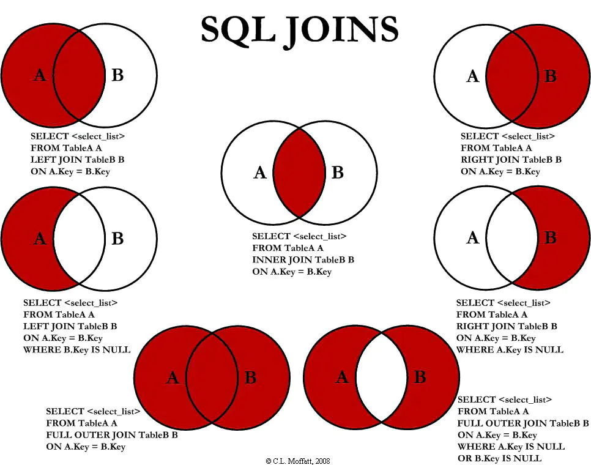

# mysql高级

## 一，mysql的架构介绍

### 1，MySQL简介

> 高级mysql

- mysql内核
- SQL优化工程师
- mysql服务器的优化
- 各种参数常量设定
- 查询语句优化
- 主从复制
- 软硬件升级
- 容灾备份
- sql编程

### 2，MySQL配置文件

#### (1)二进制文件log-bin

- 主要用于主从复制

#### (2)错误日志文件log-error

- 默认是关闭的，记录严重的警告和错误信息，每次启动和关闭的详细信息等

#### (3)查询日志log

- 默认关闭，记录查询的SQL语句，如果开启会减低mysql的整体性能，因为记录日志需要消耗系统资源

#### (4)数据文件

- data下的文件
- frm文件
  - 存放表结构
- myd文件
  - 存放表数据
- myi文件
  - 存放表索引

#### (5)如何配置

在my.ini文件中，添加相应的参数，重启mysql

~~~ini
log-error="目录/error.log"  
log="目录/mysql.log"  
long_query_time=2  
log-slow-queries= "目录/slowquery.log"  
~~~

### 3，MySQL逻辑架构介绍

> 连接层

最上层是一些客户端和连接服务，包含本地sock通信和大多数基于客户端/服务端工具实现的类似于tcp/ip的通信。主要完成一- 些类似于连接处理、授权认证、及相关的安全方案。在该层上引入了线程池的概念，为通过认证安全接入的客户端提供线程。同样在该层上可以实现基于SSL的安全链接。服务器也会为安全接入的每个客户端验证它所具有的操作权限。

> 服务层

第二层架构主要完成大多少的核心服务功能，如SQL接口，并完成缓存的查询，SQL的分析和优化及部分内置函数的执行。所有跨存储引擎的功能也在这一层实现，如过程、函数等。在该层，服务器会解析查询并创建相应的内部解析树，并对其完成相应的优化如确定查询表的顺序，是否利用索引等，最后生成相应的执行操作。如果是select语句，服务器还会查询内部的缓存。如果缓存空间足够大，这样在解决大量读操作的环境中能够很好的提升系统的性能。

> 引擎层

存储引擎层，存储引擎真正的负责了MySQL中数据的存储和提取，服务器通过API与存储引擎进行通信。不同的存储引擎具有的功能不同，这样我们可以根据自己的实际需要进行选取。后面介绍MyISAM和InnoDB

> 存储层

数据存储层，主要是将数据存储在运行于裸设备的文件系统之.上，并完成与存储引擎的交互。

### 4，MySQL存储引擎

>如何用命令查看

~~~shell
#看你的mysql现在已提供什么存储引擎:
mysq|> show engines;
#看你的mysq|当前默认的存储引擎:
mysq|> show variables like "%storage_ engine%';
~~~

| 对比项   | MyISAM                                                   | InnoDB                                                       |
| -------- | -------------------------------------------------------- | ------------------------------------------------------------ |
| 主外键   | 不支持                                                   | 支持                                                         |
| 事务     | 不支持                                                   | 支持                                                         |
| 行表锁   | 表锁，即使操作一条记录也会锁住整个表，不适合高并发的操作 | 行锁，操作时只锁住某一行，不对其他行有影响，适合高并发的操作 |
| 缓存     | 只缓存索引，不缓存真实数据                               | 不仅缓存索引还要缓存真实数据，对内存要求较高，而且内存大小对性能有决定性的作用 |
| 表空间   | 小                                                       | 大                                                           |
| 关注点   | 性能                                                     | 事务                                                         |
| 默认安装 | Y                                                        | Y                                                            |

- Percona为MySQL数据库服务器进行了改进，在功能和性能上较MySQL有着很显著的提升。该版本提升了在高负载情况下的InnoDB的性能、为DBA提供一些非常有用的性能诊断工具;另外有更多的参数和命令来控制服务器行为。
- 该公司新建了一款存 储引擎叫xtradb完全可以替代innodb,并且在性能和并发上做得更好，
- 阿里巴巴大部分mysq|数据库其实使用的percona的原型加以修改。
- AliSql+AliRedis

## 二，索引优化分析

### 1，性能下降SQL慢

> 执行时间长
>
> 等待时间长

> 原因

- 查询语句效率低

- 索引失效

  - 单值

    ~~~sql
    create index inx_user_name on user(name)
     -- 一般认为是在user表的name字段上加名字为inx_user_name的索引
    ~~~

  - 复合

    ~~~sql
    create index inx_user_nameEmail on user(name,email)
    -- 一般认为是在user表的name字段和email字段上加名字为inx_user_nameEmail的索引
    ~~~

    

    

- 关联查询太多join(设计缺陷或不得已的需求)

- 服务器调优及各个参数设置（缓冲，线程数等）

### 2，常见通用的Join查询

#### (1) join图

#### (2) 7中join

### 3，索引简介

#### (1) 是什么

- 索引(Index) 是帮助MySQL高效获取数据的数据结构。
- 可以得到索引的本质:索引是数据结构。
- **==排好序的快速查找数据结构==**
  - 在数据之外，数据库系统还维护着满足特定查找算法的数据结构，这些数据结构以某种方法引用（指向）数据
  - 这样就可以在这些数据结构上实现高级查找算法，这中种数据结构就是索引
- 一般来说索引本身也很大，不可能全部存储在内存中，因此索引往往以索引文件的形式存储的磁盘上
- 对查找和排序有影响
- 我们平常所说的索引，如果没有特别指明，都是指B树(多路搜索树，并不一定是二叉的)结构组织的索引。其中聚集索引，次要索引，覆盖索引，复合索引，前缀索引，唯一索引默认都是使用B+树索引，统称索引。当然，除了B+树这种类型的索引之外，还有哈稀索引(hashindex)等

#### (2) 优势

- 提高了数据检索的效率，降低了数据库的IO成本
- 通过索引对数据进行排序，降低了数据排序的成本，降低了CPU的消耗

#### (3) 劣势

- 实际上索引也是一张表，该表保存了主键与索引字段，并指向实体表的记录，所以索引列也是要占用空间的
- 虽然索引大大提高了查询速度，同时却会降低更新表的速度，如对表进行INSERT、UPDATE和DELETE。因为更新表时，MySQL不仅 要保存数据，还要保存一下索引文件每次更新添加了索引列的字段，都会调整因为更新所带来的键值变化后的索引信息
- 索引只是提高效率的一个因素，如果你的MySQL有大数据量的表，就需要花时间研究建立最优秀的索引，或优化查询语句

#### (4) mysql索引分类

##### 1)，单值索引

- 即一个索引只包含单个列，一个表可以有多个单列索引

##### 2)，唯一索引

- 索引的值必须唯一，但允许有空值

##### 3)，复合索引

- 即一个索引包含多个列

##### 4)，基本语法

- 创建
  - CREATE [UNIQUE ] INDEX indexName ON mytable(columnname(length);
  - ALERT mytable ADD [UNIQUE] INDEX [indexName] ON (columnname(length));
- 删除
  - DROP INDEX [indexName] ON mytable;
- 查看
  - SHOW INDEX FROM table_name\G
- 使用ALTER命令
  - ALTER TABLE tbl \_name ADD PRIMARY KEY (column\_list) 该语句添加一个主键，这意味着索引值必须是唯一的， 且不能为NULL。
  - ALTER TABLE tbl\_name ADD UNIQUE index_name (column\_list) 这条语句创建索引的值必须是唯一的(除了NULL外，NULL可能会出现多次)。
  - ALTER TABLE tbl\_name ADD INDEX index_ name (column_list); 添加普通索引，索引值可出现多次。
  - ALTER TABLE tbl\_name ADD FULLTEXT index_name (column\_ list)该语句指定了索引为FULLTEXT,用于全文索引。

#### (5) mysql索引结构

- BTree索引

  > 检索原理

- Hash索引

- full-text全文索引

- R-Tree索引

#### (6) 那些情况需要创建索引

1. 主键自动建立唯一索引
2. 频繁作为查询条件的字段应该创建索引
3. 查询中与其他表关联的字段，外键关系建立索引
4. 频繁更新的字段不适合创建索引，因为每次更新不单单是更新了字段还会更新索引
5. where条件里用不到的字段不创建索引
6. 单键/组合索引的选择问题，在高并发下倾向创建组合索引
7. 查询中排序的字段，排序字段若通过索引去访问将大大提高排序速度
8. 查询中统计或者分组字段

#### (7) 那些情况不需要创建索引

1. 表记录太少
2. 经常增删改的表
3. 数据重复且分布平均的表字段，因此应该只为最经常查询和最经常排序的数据列建立索引，注意：如果某个数据列包括许多重复的内容，为它建立索引就没有太大的实际效果

### 4，性能分析

#### (1),MySql Query Optimizer

#### (2),MySQL常见瓶颈

- CPU:CPU在饱和的时候一般发生在数据装入内存或从磁盘上读取的时候
- IO:磁盘I/O瓶颈发生在装入数据远大于内存容量的时候
- 服务器硬件的性能瓶颈:top，free，iostat和vmstat来查看系统的性能状态

#### (3),Explain

##### 1),是什么？----(查看执行计划)

- 使用explain关键字可以模拟优化器执行SQL查询语句，从而知道mysql是如何处理你的SQL语句的，分析你的查询语句或是表结构的性能瓶颈

##### 2),能干什么？

- 表的读取顺序
- 数据读取操作的操作类型
- 哪些索引可以使用
- 哪些索引被实际使用
- 表之间的引用
- 每张表有多少行被优化器查询

##### 3),怎么使用

- explain+SQL语句
- 执行计划包含的信息

##### 4),各字段解释

- id

  - select查询的序列号，包含一组数字，表示查询中执行select子句或操作表的顺序
  - 三种情况
    - id相同，执行顺序由上至下
    - 不同，如果子查询，id的序列号会递增，id值越大优先级越高，越先被执行
    - id相同不同，同时存在
    - id如果相同，可以认为是一组，从上往下顺序执行;在所有组中，id值越大，优先级越高，越先执行

- select_type

  - 有哪些？

    - | id   | select_type                          |
      | ---- | ------------------------------------ |
      | 1    | SIMPLE(simple)普通                   |
      | 2    | PRIMARY(primary)主键                 |
      | 3    | SUBQUEKY(subqueky)子查询             |
      | 4    | DERIVED(derived)派生                 |
      | 5    | UNION(union)联合查询                 |
      | 6    | UNION RESULT(union result)联合的结果 |

  - 查询的类型，主要是用于区别普通查询，联合查询，子查询等的复杂查询

    - SIMPLE
      - 简单的select查询，查询中不包含子查询或者union
    - PRIMARY
      - 查询中若包含任何复杂的子部分，最外层查询则被标记为PRIMARY
    - SUBQUEKY
      - 在select或where列表中包含了子查询
    - DERIVED
      - 在from列表中包含的子查询被标记为DERIVED(衍生)
      - MySql会递归执行这些子查询，把结果放在临时表里
    - UNION
      - 若第二个select出现在union之后，则被标记为union；
      - 若union包含from子句的子查询中，外层select将被标记为：UNION
    - UNION RESULT
      - 从union表获取结果的select

- table

  - 显示这一行的数据是关于那张表的

- type

  - 有哪些

    - ALL

      - Full Index Scan，将遍历全表以找到匹配的行

    - index

      - Full Index Scan，index与ALL的区别为index类型只遍历索引树，这通常比ALL快，因为索引文件通常比数据文件小
      - 也就是说all和index都是读全表，但index是从索引中读取，而all是从硬盘中读的

    - range

      - 只检索给定范围的行，使用一个索引来选择行，key类列显然使用了那个索引
      - 一般就是在你的where语句中出现between，<，>，in等的查询
      - 这种范围扫描索引扫描比全表扫描要好，因为它只需要开始于索引的某一点，而结束于另一点，不用扫描全部索引

    - ref

      - 非唯一性索引扫描，返回匹配某个单独值的所有行。

      - 本质上也是一种索引访问，它返回所有匹配某个单独值的行，然而，它可能会找到多个符合条件的行，所以它应该属于查找和扫描的混合体

      - ~~~sql
        create index idx_username_education on users(username,education)
        
        show index from users 
        
        SELECT count(DISTINCT education) from users
        
        explain SELECT * from users where username = 'name'
        ~~~

    - eq_ref

      - 唯一性索引扫描，对于每个索引键，表中只有一条记录与之匹配，常见于主键或唯一索引扫描
      - explain select * from table1,table2 where table1.id =  table2.id

    - const

      - 表示通过索引一次就找到了，const用于比较primary key或者unique，因为只匹配一行数据，所以很快，如将主键置于where列表中，mysql就能将该查询转换为一个常量
      - explain select * from table where t_id = 1

    - system

      - 表只有一行记录(等于系统表)，平时不会出现，这个也可以忽略不计

    - NULL

  - 访问类型排序

  - 显示查询使用了何种类型

  - 从最好到最差依次是

    system>const>eq_ref>ref>range>index>ALL

  - 一般来说，得保证查询至少达到range级别，最好能达到ref

- possible_keys

  - 显示可能应用在这张表中的索引，一个或多个，查询涉及到的字段若存在索引，则该索引将被列出，但不一定被查询实际使用

- key

  - 实际使用的索引，如果为null，则没有使用索引
  - 查询中若使用了覆盖索引，则该索引仅出现在key列表中

- key_len

  - 表示索引中使用的字节数，可通过该列计算查询中使用的索引长度，在不损失精确性的情况下，长度越短越好
  - key_len显示的值为索引字段的最大可能长度，并非实际使用长度，即key_len是根据表定义计算而得，不是通过表内检索出的

- ref

  - 显示索引的那一列被使用了，如果可能的话，是一个常数，哪些列或常量被用于查找索引列上的值

- rows

  - 根据表统计信息及索引选用情况，大致估算出找到所需记录所需要读取的行数

- filtered

  - 显示了通过条件过滤出的行数的百分比估计值。

- Extra

  - 包含不适合在其他列中显示但十分重要的额外信息
    1. ==Using filesort==：
       - 说明mysql会对数据使用一个外部所以顺序，而不是按照表内的索引顺序进行读取。mysql中无法利用索引完完成的排序操作称为"文件排序"
    2. ==Using temporary==：
       - 使了用临时表保存中间结果,MySQL在对查询结果排序时使用临时表。常见于排序order by和分组查询group by
    3. ==USING index==：
       - 表示相应的select操作中使用了覆盖索引(Covering Index)， 避免访问了表的数据行，效率不错
       - 如果同时出现usingwhere，表明索引被用来执行索引键值的查找;
       - 如果没有同时出现usingwhere，表明索引用来读取数据而非执行查找动作。
       - 覆盖索引（CoveringIndex）
    4. **Using where**：表明使用了where过滤
    5. **using join buffer** ：使用了连续缓存
    6. **impossible where** ：
       - where子句的值总是false，不能用来获取任何元组
    7. **select tables optimized away**：
       - 在没有GROUPBY子句的情况下，基于索引优化MIN/MAX操作或者对于MyISAM存储引擎优化CQUNT(*)操作，不必等到执行阶段再进行计算，查询执行计划生成的阶段即完成优化。
    8. **distinct**：
       - 优化distinct操作，在找到第一匹配的元组后即停止找同样值的动作

### 5，索引优化

#### (1),防止索引失效

##### 1),全值匹配

##### 2),最佳左前缀法则

##### 3),不在索引列上做任何操作(计算、函数、(自动or手动)类型转换)，会导致索引失效而转向全表扫描

##### 4),存储引擎不能使用索引中范围条件右边的列

##### 5),尽量使用覆盖索引(只访问索引的查询(索引列和查询列一致))，减少select*

##### 6),mysql在使用不等于(!=或者<> )的时候无法使用索引会导致全表扫描

##### 7),is null,is not null也无法使用索引

##### 8),like以通配符开头('%ab...)mysq|索引失效会变成全表扫描的操作

##### 9),字符串不加单引号索引失效

##### 10),少用or,用它来连接时会索引失效

#### (2),定值，范围还是排序，一般order by是给个范围，group by基本上都需要排序，会有临时表产生

#### (3),一般性建议

- 对于单值索引，尽量选择针对当前query过滤性更好的索引
- 在选择组合索引的时候，当前query中过滤性最好的字段在索引字段顺序中，位置越靠前越好
- 在选择组合索引的时候，尽量选择可以能够包含当前query的where子句中更多字段的索引
- 今可能通过分析统计信息和调整query的写法来达到选择合适索引的目的

## 三，查询截取分析

### 1，查询优化

#### (1),永远小表驱大表

类似嵌套循环Nested Loop，即小的数据集驱动大的数据集

#### (2),order by关键字优化

##### 1),order by 子句，尽量使用index方式排序，避免使用fileSort方式排序

- MySQL支持两种方式的排序，filesort和index，index效率高，它指mysql扫描索引本身完成排序，filesort方式效率较低
- order by满足两种情况时，会使用index方式排序
  1. order by语句使用索引最左前列
  2. 使用where子句与order by子句条件列组合满足索引最左前列
- 尽可能在索引列上完成排序操作，遵照索引建的最左前缀

- 如果不在索引列上，filesort有两种算法：mysql就要启动双路排序和单路排序
  - 双路排序
    1. MySQL 4.1之前是使用双路排序,字面意思就是两次扫描磁盘，最终得到数据，读取行指针和orderby列，对他们进行排序，然后扫描已经排序好的列表，按照列表中的值重新从列表中读取对应的数据输出
    2. 从磁盘取排序字段，在buffer进行排序， 再从磁盘取其他字段。
  - 单路排序
    1. 从磁盘读取查询需要的所有列，按照orderby列在buffer对它们进行排序，然后扫描排序后的列表进行输出，它的效率更快一些， 避免宁第二次读取数据。并且把随机IO变成了顺序IO,但是它会使用更多的空间，因为它把每一行都保存在内存中了。

##### 2),优化策略

- 增大sort_ buffer_ size 参数的设置
- 增大max_ length_ for_ sort_ data 参数的设置

##### 3),为排序使用索引

- MySq|两种排序方式:文件排序或扫描有序索引排序
- MySq|能为排序与查询使用相同的索引

#### (2),group by

- groupby实质是先排序后进行分组，遵照索引建的最佳左前缀
- 当无法使用索引列，增大max_length_for_sort_data 参数的设置+增大sort_buffer_size 参数的设置
- where高于having，能写在where限定的条件就不要去having限定了。

#### (3),总结

　　1. 如果GROUP BY 的列没有索引,产生临时表.
　　2. 如果GROUP BY时,SELECT的列不止GROUP BY列一个,并且GROUP BY的列不是主键 ,产生临时表.
　　3. 如果GROUP BY的列有索引,ORDER BY的列没索引.产生临时表.
　　4. 如果GROUP BY的列和ORDER BY的列不一样,即使都有索引也会产生临时表.
　　5. 如果GROUP BY或ORDER BY的列不是来自JOIN语句第一个表.会产生临时表.
  　　6. 如果DISTINCT 和 ORDER BY的列没有索引,产生临时表.

### 2，慢查询日志

#### (1),是什么

1. MySQL的慢查询日志是MySQL提供的一种日志记录，它用来记录在MySQL中响应时间超过阀值的语句，具体指运行时间超过long_query_time值的SQL，会被记录到慢查询日志中。
2. 具体指运行时间超过long_query_time值的SQL，则会被记录到慢查询日志中。long_query_time的默认值为
   10，意思是运行10秒以上的语句。
3. 由他来查看哪些SQL超出了我们的最大忍耐时间值，比如一条sql执行超过5秒钟，我们就算慢SQL,希望能
   收集超过5秒的sql,结合之前explain进行全面分析。

#### (2),怎么使用

##### 1),说明

- 默认情况下，MySQL数据库没有开启慢查询日恋，需要我们手动来设置这个参数。
- 当然，如果不是调优需要的话，-般不建议启动该参数，因为开启慢查询日志会或多或少带来一定的性能影响。慢查询日志支持将日志记录写入文件

##### 2),查看是否开启及如何开启

- 默认：show variables like '%slow_query_log%';

- 开启：set global slow_query_log=1; 

- ~~~sql
  Show variables like '%slow_query%'; -- 可以用这个查询所有的变量
  
  -- 第一步
  set global log_output='TABLE'; -- 开启慢日志,纪录到 mysql.slow_log 表
  set global long_query_time=2; -- 设置超过2秒的查询为慢查询
  set global slow_query_log='ON';-- 打开慢日志记录
  
  -- 第二步 运行一下比较慢的功能,执行下面的语句
  select convert(sql_text using utf8) sql_text from mysql.slow_log -- 查询慢sql的 日志
  -- 第三步 记得关上日志
  set global slow_query_log='OFF'; -- 如果不用了记得关上日志
  ~~~

##### 3),那些会记录

- 这个是由参数long_query_time控制，默认情况下long_query_time的值为10秒，
- 命令：show variables like 'long_query_time%';
- 运行时间大于他的会被记录下来
- 设置超过2秒的查询为慢查询，long_query_time=2; 
- 如果看不到变化，需要重新开启一个窗口会话才可以看到

##### 4),日志分析工具mysqldumpslow（windows需要安装）

- 命令：mysqldumpslow --help

- 得到返回记录集最多的10个SQL
  mysqldumpslow -s -r -t 10 慢查询日志文件目录

- 得到访问次数最多的10个SQL
  mysqldumpslow -s c -t 10 慢查询日志文件目录

- 得到按照时间排序的前10条里面含有车连接的查询语句
  mysqldumpslow -s t -t 10 -g "left join" 慢查询日志文件目录

- 另外建议在使用这些命令时结合|和more使用，否则有可能出现爆屏情况
  mysqldumpslow -s r -t 10 慢查询日志文件目录| more

- ~~~txt
  s: 是表示按照何种方式排序;
  c: 访问次数
  l: 锁定时间
  r: 返回记录
  t: 查询时间
  al: 平均锁定时间
  ar: 平均返回记录数
  at: 平均查询时间
  t: 即为返回前面多少条的数据;
  g: 后边搭配一个正则匹配模式，大小写不敏感的;
  ~~~

### 3，批量数据脚本

- 函数有返回值

- 存储结构没有返回值

- ~~~sql
  创建函数，假如报错: This function has none of DETERMINISTI.....
  -- 由于开启过慢查询日志，因为我们开启了bin-log, 我们就必须为我们的function指定一个参数。
  show variables like 'log_bin_trust_function_creators';
  set global log_bin_trust_function_creators=1;
  -- 这样添加了参数以后，如果mysqld重启，上述参数又会消失， 永久方法:
  windows下my.ini[mysqld]加上log_bin_trust_function creators=1
  linux下/etc/my.cnf 下my.cnf[mysqld]加上log_bin_trust_function_creators=1
  ~~~

- ~~~sql
  -- 函数
  -- 随机获得一个字符串
  delimiter $$
  create function rand_string(n int) returns varchar(255)
  begin
  	declare chars_str varchar(100) default 'abcdefghijklmnopqrstuvwxyzABCDEFGHIJKLMNOPQRSTUVWXYZ';
  	declare return_str varchar(255) default '';
  	declare i int default 0;
  	while i < n do
  	set return_str = concat(return_str,substring(chars_str,floor(1+rand()*52),1));
      set i = i + 1;
      end while;
  	return return_str;
  end $$
  ~~~

- ~~~sql
  -- 随机获得一个数字
  delimiter $$
  create function rand_num( ) returns INT (5)
  begin
  	declare i int default 0;
  	set i = floor(100+rand()*10);
  return i;
  END $$
  ~~~

- ~~~sql
  -- 存储过程
  DELIMITER $$
  CREATE PROCEDURE insert_emp(IN START INT(10),IN max_num INT(10))
  BEGIN
  DECLARE i INT DEFAULT 0;
  -- set autocommit =0把autocommit设置成0
  SET autocommit = 0;
  REPEAT
  SET i = i + 1;
  INSERT INTO emp (empno, ename ,job ,mgr ,hiredate ,sal ,comm ,deptno ) VALUES ((START+i)
  ,rand_string(6),'SALESMAN',0001,CURDATE(),2000, 400,rand_num());
  UNTIL i = max_num
  END REPEAT;
  COMMIT; 
  END $$
  
  ~~~

- ~~~sql
  -- 执行存储过程，往dept表添 加随机数据
  DELIMITER $$
  CREATE PROCEDURE insert_dept(IN START INT(10),IN max_num INT(10))
  BEGIN
  DECLARE i INT DEFAULT 0;
  SET autocommit= 0; 
  REPEAT
  SET i = i + 1;
  INSERT INTO dept (deptno ,dname,loc ) VALUES ((START+i), rand_string(10),rand_string(8));
  UNTIL i= max_num
  END REPEAT;
  COMMIT;
  END $$
  ~~~

- ~~~sql
  DELIMITER ;
  CALL insert_dept(100,10);
  call insert_emp(100001,500000);
  ~~~

### 4，Show Profile

#### (1),是什么

- 是mysql提供可以用来分析当前会话中语句执行资源消耗情况，可以用于sql的调优的测量
- 默认情况下，参数处于关闭状态，并保存最近15次的运行结果

#### (2),官网

https://dev.mysql.com/doc/refman/5.5/en/show-profile.html

#### (3),分析步骤

##### 1),是否支持，查看当前mysql版本是否支持

- 命令 show variables like 'profiling';

##### 2),开启功能，默认是关闭的，使用前需要开启

- 命令 set profiling = on

##### 3),运行sql

1. select * from emp group by id%10 limit 150000
2. select * from emp group by id%20 order by 5

##### 4),查看结果 show profiles；

##### 5),诊断SQL，show profile cpu,block io for query 上一步前面的问题sql的号码

~~~txt
type:
| ALL -显示所有的开销信息
| BLOCK I0 -显示块IO相关开销
| CONTEXT SWITCHES-上下文切换相关开销
| CPU -显示CPU相关开销信息
| IPC -显示发送和接收相关开销信息
| MEMORY -显示内存相关开销信息
| PAGE FAULTS -显示页面错误相关开销信息
| SOURCE -显示和Source_function, Source_file， Source_line相关的开销信息
| SWAPS -显示交换次数相关开销的信息
~~~

##### 6),日常开发需要注意的结论

- converting HEAP to MyISAM查询结果太大，内存都不够用了往磁盘上搬了。
- Creating tmp table创建临时表
  - 拷贝数据到临时表
  - 用完再删除
- Copying to tmp table on disk把内存中临时表复制到磁盘，危险! 
- locked

### 5，全局查询日志（生产环境下不要开启）

#### (1)配置启用

#### (2)编码启用

- set global general_log=1;
- set global log_output='TABLE';
- 此后，你所编写的sql语句， 将会记录到mysql库里的general_log表，可以用下面的命令查看
- select * from mysql.general_log;

## 四，MySQLl锁机制

### 1，表锁(偏读)

### 2，行锁(偏写)

### 3，页锁

## 五，主从复制

### 1，

### 2，复制的基本原则

### 3，复制的最大问题

### 4，一主一从常见配置