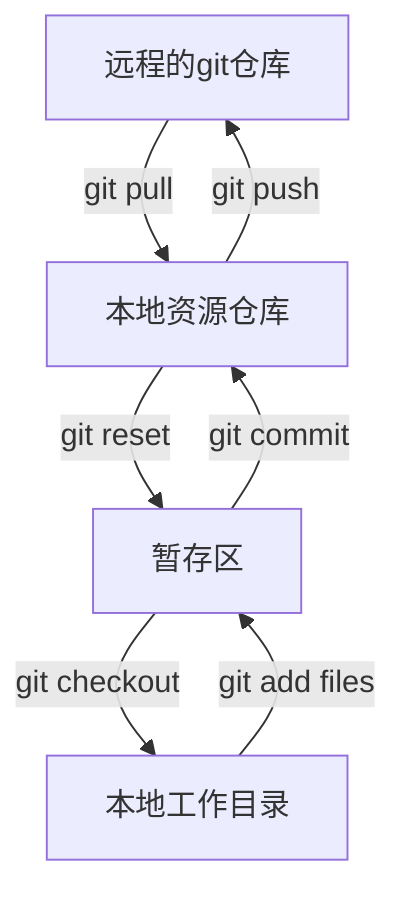

# Git的基本操作

## 一，版本控制

> 版本管理器

版本控制( Revision control)是-一种在开发的过程中用于管理我们对文件、目录或工程等内容的惨改历史,方便查看更改历史记
录。备份以便恢与以前的版本的软件T程技术，

- 实现跨区域多人协同开发
- 追踪和记载-一个或者多个文件的历史记录
- 组织和保护你的源代码和文档
- 统计工作量
- 并行开发、提高开发效率
- 跟踪记录整个软件的开发过程
- 减轻开发人员的负担。节省时间。同时降低人为错误

简单的说就是用于管理多人协同开发项目的技术

> 常见的版本控制工具

- Git
- SVN
- CVS
- VSS
- TFS
- VS online

### 1，本地版本控制

### 2，集中版本控制

所有的版本数据都保存在服务器上,协同开发者从服务器上同步更新或上传自己的惨改

所有的版本数据都存在服务器上,用户的本地只有自己以前所同步的版本。如果不连网的话，用户就看不到历史版本,也无法切换版本验证问题,或在不同分支工作。而且,所有数据都保存在单-的服务器上,有很大的风险这个服务器会损坏,这样就会丢失所有的数据，当然可以定期备份。代表产品: SVN. CVS. VSS

### 3，分布式版本控制

每个人都拥有全部的代码

所有版本信息仓库全部同步到本地的每个用户,这样就可以在本地查看所有版本历史.可以离线在本地提交,只需在连网时push到相应的服务器或其他用户那里。由于每个用户那里保存的都是所有的版本数据.只要有一个用户的设备没有问题就可以恢复所有的数据。但这增加了本地存储空间的占用。

不会因为服务器损坏，或者网络问题，造成不能工作的情况

> Git和SVN的区别

SVN是集中式版本控制系统,版本库是集中放在中央服务器的,而工作的时候,用的都是自己的电脑,所以首先要从中央服务器得到最新的版本。然后工作。完成工作后,需要把自己做完的活推送到中央服务器。集中式版本控制系统是必须联网才能工作.对网络带宽要求较高。

Git是分布式版本控制系统,没有中央服务器。每个人的电脑就是-个完整的版本库,工作的时候不需要联网了。因为版本都在自己电脑上。协同的方法是这样的:比如说自己在电脑上改了文件A.其他人也在电脑上改了文件A.这时,你们两之间只需把各自的修改推送给对方,就可以互相看到对方的修改了。

## 二，Git的历史

==**Git是目前世界上最先进的分布式版本控制系统**==

## 三，Git环境配置

打开[git官网] https://git-scm.com/。下载git对应操作系统的版本。官网下载太慢。我们可以使用淘宝镜像下载: http://npm.taobao.org/mirrors/git-for-windows/

> Git配置

所有的配置文件都保存在本地

查看配置 `git config -l`

只查看系统配置 `git config --system --list`

只查看当前用户的配置 `git config --global --list`

##### Git相关的配置文件:

1. Git\etc\gitconfig : Git 安装目录下的gitconfig --system 系统级
2. C:\Users\Lenov\\.gitconfig只适用于当前登录用户的配置 -global 全局

这里可以直接编辑配置文件,通过命令设置后会响应到这里。

> 配置
>
> git config --global user.name "shidacaizi"
>
> git config --global user.email "2335715300@qq.com"

## 四，Git基本理论(核心)

> 工作区域

Git本地有三个工作区域:工作目录( Working Directory).暂存区(Stage/Index).资源库(Repository或Git Directory).如果在加上远程的git仓库(Remote Directory)就可以分为四个工作区域。文件在这四个区域之间的转换关系如下:

- Workspace :工作区.就是你平时存放项目代码的地方
- Index/Stage:暂存区.用于时存放你的改动.事实上它只是一个文件.保存即将提交到文件列表信息
- Repository:仓库区(或本地仓库) .就是安全存故数据的位置.这里面有你提交到所有版本的数据。其中HEAD指向最新放
  入仓库的版本
- Remote :远程仓库。托管代码的服务器,可以简单的认为是你项目组中的一台电脑用于远程数据交换

>工作流程

git的工作流程-般是这样的:

1. 在工作目录中添加、修改文件;
2. 将需要进行版本管理的文件放入暂存区域;
3. 将暂存区域的文件提交到git仓库。

因此,git管理的文件有三种状态:已修改( modified ) ,已暂存( staged ) .已提交(comitted)

## 五，Git项目搭建

> 本地仓库搭建

初始化项目

创建全新的仓库

- 在文件加目录下执行命令：`git init`,即在当前目录新建一个Git代码库
- 执行后可以看到多出了一个.git目录

克隆远程仓库

- `git clone [url]` 克隆一个项目和它的整个代码历史
- 可以去gitee或者github上克隆

## 六，Git文件操作

> 文件4种状态

版本控制就是对文件的版本控制,要对文件进行修改.提交等操作,首先要知道文件当前在什么状态,不然可能会提交了现在还不想提交的文件,或者要提交的文件没提交上。

- Untracked:未跟踪,此文件在文件夹中,但并没有加入到git库,不参与版本控制通过`git add`状态变为`staged`
- Unmodify: 文件已经入库,未修改,即版本库中的文件快照内容与文件夹中完全-致. 这种类型的文件有两种去处,如果它被修
  改,而变为`Modified`. 如果使用`git rm`移出版本库,则成为
  `Untracked`文件
- Modified: 文件已修改,仅仅是修改,并没有进行其他的操作.这个文件也有两个去处，通过`git add`可进入暂存`staged`状态使用`git checkout`则丢弃修改过, 返回到`unmodify`状态,这个`git checkout` 即从库中取出文件,覆盖当前修改!
- Staged: 暂存状态.执行`git Commit`则将修改同步到库中,这时库中的文件和本地文件又变为-致, 文件为`Unmodify`状态执行`git reset HEAD filename`取消暂存,文件状态为`Modified`

> 查看文件状态

~~~bash
# 查看指定文件状态
git status [filename]

# 查看所有文件状态
git status

# git add 添加所有文件到暂存区
git commit -m "消息内容" # 提交暂存区的内容到本地仓库
~~~

> 忽略文件

有些时候我们不想把某些文件纳入版本控制中,比如数据库文件,临时文件,设计文件等

在主目录下建立".gitignore"文件,此文件有如下规则:

1. 忽略文件中的空行或以井号( # )开始的行将会被忽略。
2. 可以使用Linux通配符。例如:星号(\*)代表任意多个字符,问号( ? )代表-一个字符,方括号( [abC])代表可选字符范围，大括号( {tring.ring.... )代表可选的字符串等。
3. 如果名称的最前面有-一个感叹号(!) , 表示例外规则,将不被忽略。
4. 如果名称的最前而是一个路径分隔符(/) , 表示要忽略的文件在此目录下,而子目录中的文件不忽略。
5. 如果名称的最后面是一个路径分隔符(/) , 表示要忽略的是此目录下该名称的子目录,而非文件(默认文件或目录都忽略).

~~~bash
#为注释
*.txt #忽略所有. txt结尾的文件,这样的话上:传就不会被选中! |
!1ib. txt #但1ib. txt除外
/temp #仅忽略项目根目录下的TODO文件,不包括其它目录temp
build/ #忽略bui1d/目录下的所有文件
doc/*.txt #会忽略doc/notes.txt但不包括doc/server/arch.txt
~~~

## 七，使用GitHub

## 八，IDEA中集中Git

## 九，说明：Git分支

> git分支常用命令

~~~bash
git branch #列出所有本地分支

git branch一r #列出所有远程分支

git branch [branch-name] #单新建一个分支，但依然停留在当前分支

git checkout -b [branch] #新建一个分支，并切换到该分支

$ git merge [branch]#合并指定分支到当前分支

$ git branch -d [branch-name]#删除分支

#删除远程分支
$ git push origin --delete [branch-nare]
$ git branch -dr [remote/branch]
~~~

如果同一个文件在合并分支时都被修改了则会引起冲突:解决的办法是我们可以修改冲突文件后重新提交!

master主分支应该非常稳定.用来发布新版本, -般情况下不允许在上面工作.工作-般情况下在新建的dev分支上工作,工作完后,比如上要发布,或者说dev分支代码稳定后可以合并到主分支master上来。