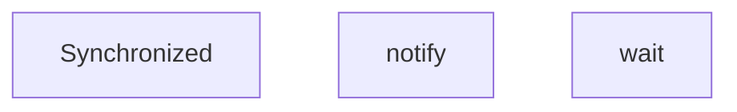
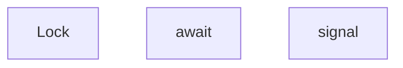

## 一：synchronized、wait和notify

~~~java
public class Makers {
    //    synchronized 版
    public static void main(String[] args) {
        Data data = new Data();
        new Thread(() -> {
            try {
                for (int i = 0; i < 20; i++) {
                    data.increment();
                }
            } catch (InterruptedException e) {
                e.printStackTrace();
            }
        }, "a").start();

        new Thread(() -> {
            try {
                for (int i = 0; i < 20; i++) {
                    data.decrement();
                }
            } catch (InterruptedException e) {
                e.printStackTrace();
            }
        }, "b").start();
        new Thread(() -> {
            try {
                for (int i = 0; i < 20; i++) {
                    data.increment();
                }
            } catch (InterruptedException e) {
                e.printStackTrace();
            }
        }, "c").start();

        new Thread(() -> {
            try {
                for (int i = 0; i < 20; i++) {
                    data.decrement();
                }
            } catch (InterruptedException e) {
                e.printStackTrace();
            }
        }, "d").start();
    }
}

// 判断等待，业务，通知
class Data {
    private int number = 0;

    //+1
    public synchronized void increment() throws InterruptedException {
        // 防止虚假唤醒，不要用if判断
        while (number != 0) {
            //            等待
            this.wait();
        }
        number++;
        System.out.println(Thread.currentThread().getName() + "=>" + number);
        //         通知其他线程 +1完毕
        this.notifyAll();
    }

    //-1
    public synchronized void decrement() throws InterruptedException {
        while (number == 0) {
            //            等待
            this.wait();
        }
        number--;
        System.out.println(Thread.currentThread().getName() + "=>" + number);
        //        通知其他线程 -1完毕
        this.notifyAll();
    }
}

~~~

## 二：lock和condition的await、signalAll

~~~java
public class Makeres {
    //    lock锁 版
    public static void main(String[] args) {
        Dataes data = new Dataes();
        new Thread(() -> {
            try {
                for (int i = 0; i < 20; i++) {
                    data.increment();
                }
            } catch (InterruptedException e) {
                e.printStackTrace();
            }
        }, "a").start();

        new Thread(() -> {
            try {
                for (int i = 0; i < 20; i++) {
                    data.decrement();
                }
            } catch (InterruptedException e) {
                e.printStackTrace();
            }
        }, "b").start();
        new Thread(() -> {
            try {
                for (int i = 0; i < 20; i++) {
                    data.increment();
                }
            } catch (InterruptedException e) {
                e.printStackTrace();
            }
        }, "c").start();

        new Thread(() -> {
            try {
                for (int i = 0; i < 20; i++) {
                    data.decrement();
                }
            } catch (InterruptedException e) {
                e.printStackTrace();
            }
        }, "d").start();
    }
}

// 判断等待，业务，通知
class Dataes {
    // 使用lock锁实现
    Lock lock = new ReentrantLock();
    Condition condition = lock.newCondition();
    private int number = 0;

    //condition.await();
    //condition.signalAll();
    //+1
    public void increment() throws InterruptedException {
        lock.lock();
        try {
            // 业务代码
            // 防止虚假唤醒，不要用if判断
            while (number != 0) {
//            等待
                condition.await();
            }
            number++;
            System.out.println(Thread.currentThread().getName() + "=>" + number);
//         通知其他线程 +1完毕
            condition.signalAll();
        } catch (Exception e) {
            e.printStackTrace();
        } finally {
            lock.unlock();
        }
    }

    //-1
    public void decrement() throws InterruptedException {
        lock.lock();
        try {
            while (number == 0) {
//            等待
                condition.await();
            }
            number--;
            System.out.println(Thread.currentThread().getName() + "=>" + number);
//        通知其他线程 -1完毕
            condition.signalAll();
        } catch (Exception e) {
            e.printStackTrace();
        } finally {
            lock.unlock();
        }
    }
}
~~~

### 指定唤醒

 ~~~java
public class Makeress {
    //    lock 指定唤醒线程版 版
    public static void main(String[] args) {
        Dataess data = new Dataess();
        new Thread(() -> {
                for (int i = 0; i < 20; i++) {
                    data.printA();
                }
        }, "a").start();

        new Thread(() -> {
                for (int i = 0; i < 20; i++) {
                    data.printB();
                }
        }, "b").start();
        new Thread(() -> {
                for (int i = 0; i < 20; i++) {
                    data.printC();
                }
        }, "c").start();
    }
}

// 判断等待，业务，通知
class Dataess {
    // 使用lock锁实现
    Lock lock = new ReentrantLock();
    private Condition condition1 = lock.newCondition();
    private Condition condition2 = lock.newCondition();
    private Condition condition3 = lock.newCondition();
    private int number = 1;

    public void printA() {
        lock.lock();
        try {
            while (number != 1) {
                condition1.await();
            }
            number = 2;
            System.out.println(Thread.currentThread().getName() + "=>AAAAAAA");
            condition2.signalAll();
        } catch (Exception e) {
            e.printStackTrace();
        } finally {
            lock.unlock();
        }
    }
    public void printB() {
        lock.lock();
        try {
            while (number != 2) {
                condition2.await();
            }
            number = 3;
            System.out.println(Thread.currentThread().getName() + "=>BBBBBBB");
            condition3.signalAll();
        } catch (Exception e) {
            e.printStackTrace();
        } finally {
            lock.unlock();
        }
    }
    public void printC() {
        lock.lock();
        try {
            while (number != 3) {
                condition3.await();
            }
            number = 1;
            System.out.println(Thread.currentThread().getName() + "=>CCCCCCC");
            condition1.signalAll();
        } catch (Exception e) {
            e.printStackTrace();
        } finally {
            lock.unlock();
        }
    }

}

 ~~~

## 三：阻塞队列BlockingQueue

~~~java
public class PublicQueue<T> {

    private BlockingDeque<T> blockingDeque = new LinkedBlockingDeque<>(1);//缓冲区

    public void add(T msg) {

        try {
            blockingDeque.put(msg);
        } catch (InterruptedException e) {
            e.printStackTrace();
        }
        System.out.println("生产一个产品，当前商品角标为：" + "===文本为：" + msg);
    }

    public T remove() {

        T t = null;
        try {
            t = blockingDeque.take();
        } catch (InterruptedException e) {
            e.printStackTrace();
        }

        System.out.println("消费一个产品，当前商品角标为：" + "===文本为：" + t);
        return t;
    }

    public static void main(String[] args) {
        PublicQueue publicQueue = new PublicQueue();

        new Thread(()->{
            for (int i = 0; i < 20; i++) {
                publicQueue.add(i);
            }
        },"a").start();

        new Thread(()->{
            for (int i = 0; i < 20; i++) {
                publicQueue.remove();
            }
        },"b").start();

//        new Thread(()->{
//            for (int i = 0; i < 20; i++) {
//                publicQueue.add(i);
//            }
//        },"c").start();
//
//        new Thread(()->{
//            for (int i = 0; i < 20; i++) {
//                publicQueue.remove();
//            }
//        },"d").start();
    }
}
~~~

### Synchronized和Lock的区别

