# Redis

## 一，Redis初识

### 1，特点

1. 开源
2. 基于键值的存储服务系统(key-value)
3. 多种数据结构
4. 高性能，功能丰富

### 2，特性

1. 速度快

   将数据存放在内存中

2. 持久化

   Redis所有的数据保持在内存中，对数据的更新将异步地保存到磁盘上

3. 多种数据结构

   字符串，hash，list ，集合，有序集合，对象，位图(BitMaps),HyperLogLod(超小内存唯一值计数)，GEO(地理信息定位)

4. 支持多种编辑，多中客户端语言

5. 功能丰富

   发布订阅，Lua脚本，事务，pipeline

6. 简单、

   代码短小精悍，使用简单

   不依赖外部库

   单线程模型

7. 主从复制

8. 高可用，分布式

   Redis-Sentinel 支持高可用

   Redis-Cluster 支持分布式

### 3，典型使用场景

1. 缓存系统，提供缓存功能
2. 计数器，对业务进行计数
3. 消息队列系统，发布订阅
4. 排行榜功能
5. 社交网络
6. 实时系统

### 4，Redis安装

1. Redis安装

   1. 下载压缩包

      wget http://http://download.redis.io/releases/redis-5.0.4.tar.gz  (注意是否是自己想要的版本)

   2. 解压缩

      tar -xzf redis-5.0.4.tar.gz

   3. 建立软连接(可以没有)

      In -s redis-5.0.4.tar.gz redis

   4. 进入目录后

      make && make install

2. 可执行文件说明

   1. redis-server 启动Redis服务器 启动时指定配置文件
   2. redis-cli Redis 启动命令行客户端
   3. redis-benchmark Redis性能测试工具
   4. redis-check-aof AOF文件修复工具
   5. redis-check-dump RDB文件修复工具
   6. redis-sentinel 启动redis节点

3. 三种启动方法

   1. 最简启动

      redis-server 通过默认配置进行启动

      验证方法：

      1. ps -ef | grep redis 查看进程
      2. netstat -antpl | grep redis  查看端口
      3. redis-cli -h ip -p port 后使用 ping 直接查看

   2. 动态参数启动

      redis-server --port 6380

      改了端口 默认是6379

   3. 配置文件启动

      redis-server 配置文件路径

   4. 比较

      1. 生成环境选择配置启动 一台机器布置多个redis
      2. 单机多实例配置文件可以用端口区分开 

4. 简单的客户端连接

   1. redis-cli -h ip -p port 
   2. 执行ping命令 客户端会返回PONG

### 5，Redis常用配置

1. daemonzie  是否以守护进程的方式进行启动默认为no建议为yes
2. port 使用哪个端口进行启动 默认是6379
3. logfile Redis系统日志
4. dir Redis工作目录

## 二，Redis API的使用和理解

### 1，通用命令

#### 1，通用命令

1. keys* 遍历所有的键 一般不在生产环境中使用

2. dbsize 计算key的总数

3. exists key 判断key是否存在

   存在返回1，不存在返回0

4. del key[key....] 删除key

   删除成功返回1，删除失败返回0

5. expire key seconds 设置key的过期时间

   expire key 30 设置30秒后过期

   ttl key 查询key的剩余时间

   ​	-2 表示key已经不存在了

   ​	-1表示key没有过期时间

   persist key 去掉key的过期时间，永不过期

6. type key 查看key的类型

#### 2，数据结构和内部编码

**key**

1. string
   1. raw
   2. int
   3. embstr
2. hash
   1. hashtable
   2. ziplist 
3. list
   1. linkedlist
   2. ziplist
4. set
   1. hashtable
   2. intset
5. zset
   1. skiplist
   2. ziplist

#### 3，单线程架构

命令必须单个执行，当执行其中一个时，其他命令等待

**单线程为什么这么快**

1. 纯内存存储   
2. 非阻塞IO
3. 避免线程切换和竞态消耗

##### 1,一次只运行一条命令

##### 2,拒接长慢命令

keys,flushall,flushdb,slow,lua,script,mutil/exec,operate,big,value

### 2,字符串

#### 1，字符串键值结构

key-value   value可以是字符串 整型数字 二进制 对象

#### 2，场景

缓存 计数器 分布式锁

#### 3，命令

1. get key  查看一个key
2. set key value  设置存储一个key
3. del key [key...] 删除
4. incr key 自增一，不存在的话 从0开始 自增后get key = 1 
5. decr key 自减一，不存在的话 从0开始 自减后get key = -1
6. incrby key k 自增k，不存在的话 从0开始 自增后get key = k
7. decrby key k 自减k，不存在的话 从0开始 自减后get key = -k
8. set key value 不管key是否存在，都设置
9. setnx key value key不存在，才设置
10. set key value xx   key存在  才设置
11. mget key1 key2 kety3 批量获取key
12. mset key1 vlaue1 key2 value2 批量设置
13. getset key newvalue 为key设置一个新的值并返回旧的vlaue
14. append key value   将value追加到旧的value
15. strlen key 返回字符串的长度  注意中文
16. incrbyfloat key float(3.5)  增加key对应的值3.5
17. getrange key start end 获取字符串指定下标所有的值
18. setrange key index value 设置指定下标所有对应的值

### 3，哈希Hash

#### 1，结构

key(如 user:1:info,liu)  field(属性值 如 name，age，date)  value(值)

#### 2，特点

field不能相同 value可以相同

#### 3，命令

1. hget key field 获取hash key对应的field的value
2. hset key field value 设置hash key对应的field的value
3. hdel key field 删除hash key对应的field的value
4. hexists 判断hash key是否有field
5. hlen 获取hash key field的数量
6. hmget key1 field1 field2 field3。。。 批量获取hash key的一批field对应的值
7. hmset key1 field1 value1 field2 value2。。。批量设置hash key的一批field和vlaue
8. hgetall 返回hash key对应所有的field和value 都有
9. hvals key 返回hash key对应所有的field和value 只有value
10. hkeys key 返回hash key对应的所有field 只有field

### 4，列表 list

#### 1,结构

key  elements (a,b,c,d,e)

#### 2，特点

1. 有序
2. 可以重复
3. 左右两边插入弹出

#### 3，命令

1. rpush key value1 vaiue2 。。。。 从列表右端插入值可以是多个
2. lpush key value1 vaiue2 。。。。 从列表左 端插入值可以是多个
3. linsert key before|after value newValue 在list指定的值前|后插入newValue 需要遍历整个列表
4. lpop key 从列表左边弹出一个item
5. rpop key 从列表右边弹出一个item
6. lrem key count value 根据count的值删除所有和vlaue相等的项
   1. count>0 从左到右，删除最多count个value相等的项
   2. count<0 从右到左，删除最多Math.abs(count)个value相等的项
   3. count=0,删除所有和value相等的项
7. ltrim key start end 按照索引范围修建列表 start-end是下标索引，其范围内的元素保留
8. lrange key start end (包含end) 获取列表指定索引范围所有的item
9. lindex key index 获取列表指定索引的item
10. llen key 获取列表的长度
11. lset key index newValue 设置列表指定索引值为newValue 
12. blpop key timeout 这是lpop的阻塞版本，timeout是阻塞超时的时间,当timeout 为0 时为永远不阻塞 
13. brpop key timeout 这是rpop的阻塞版本，timeout是阻塞超时的时间,当timeout 为0 时为永远不阻塞

### 5，集合

#### 1，结构 

key(字符串)   values(不重复的属性)

#### 2，特点

1. 无序
2. 无重复
3. 支持集合间操作（交集并集等）

#### 3，命令

1. sadd key element 向集合key添加element(如果element已经存在,则会添加失败)
2. srem key element 将集合key中的element移除掉
3. scard key 计算集合大小
4. sismember key value 判断value是否在集合中存在 0为不存在，1为存在
5. srandmember key count 从集中随机的挑选count个元素，不会破坏集合的数据
6. spop key 从集合中随机弹出一个元素 弹出不会再存在于集合中
7. smembers key  获取集合中的所有元素
   1. 返回结果无需
   2. 返回所有元素 如果元素较多 要小心使用 
8. sdiff key1 key2 可以得到集合key1对集合key2的差集
9. sinter key1 key2 可以得到两个集合的交集
10. sunion key1 key2 可以得到两个集合的并集

### 6，有序集合

#### 1，结构

key(字符串)  score(分数，分值)   value(值)

#### 2，特点

| 集合set    | 有序集合zset  |
| ---------- | ------------- |
| 无重复元素 | 无重复元素    |
| 无序       | 有序          |
| element    | element+score |

| 列表list       | 有序集合zset  |
| -------------- | ------------- |
| 可以有重复元素 | 无重复元素    |
| 有序           | 有序          |
| element        | element+score |

#### 3，命令

1. zadd key scoreelement(可以是多对)，添加score和element 其中score可以是重复的但是element不能重复
2. zrem key element(可以是多个)  删除元素
3. zscore key element 返回元素的分数
4. zincrby key increScore element 增加或减少元素的分数  element可正可负
5. zcard key 返回总数的个数
6. zrange key start end[withscores] 返回指定索引范围内的升序元素 ,中括号内容为分值，填写后会打印分值
7. zrangebyscroe key minscore maxscore[withscores]返回指定分数范围内的升序元素 ,中括号内容为分值，填写后会打印分值
8. zcount key minscore maxscore 返回有序集合内在指定分数范围内的**个数**
9. zremrangebyrank key start end 删除指定排名内的升序元素
10. zremrangebyscore key minscore maxscore 删除指定分数内的升序元素

## 三，redis客户端

### 1，java客户端  Jedis

#### 1，Jedis是什么

类似于直接连接redis的redis-cli  可以通过它操作redis

#### 2，jedis直连

~~~xml
<!-- https://mvnrepository.com/artifact/redis.clients/jedis -->
<dependency>
    <groupId>redis.clients</groupId>
    <artifactId>jedis</artifactId>
    <version>3.0.1</version>
    <!--
	<type>jar</type>
	<scope>compile</scope>
	-->
</dependency>
~~~

#### 3，Jedis连接池

- 比较

|        | 优点                                                         | 缺点                                                         |
| ------ | ------------------------------------------------------------ | ------------------------------------------------------------ |
| 直连   | 1，连接方便。2，适用于少量长期连接的场景                     | 存在每次新建/关闭连接泄露的可能Jedis对象线程不安全           |
| 连接池 | Jedis预先生成，降低开销使用。连接池的形成保护和控制资源的使用 | 相对于直连，使用相对麻烦，尤其是在资源的管理上需要很多参数来保证，一旦规划不合理也会出现问题。 |

## 四，redis其他功能

### 1，慢查询

#### 1，生命周期

1. 发送命令
2. 排队
3. 执行命令
4. 返回结果

慢查询是redis数据中数据较多，在执行复杂度较大的命令式，反应过慢的情况

**其他**

- 慢查询发生在第三阶段   执行命令阶段
- 客户端超时不一定是慢查询，但慢查询是客户端超时的一个可能因素

#### 2，两个配置

##### 1，slowlog-max-len

1. 先进先出队列
2. 固定长度
3. 保存在内存中

##### 2，slowlog-log-slower-than

1. 慢查询阈值（单位是微秒）
2. slowlog-log-slower-than=0  记录所有命令
3. slowlog-log-slower-than<0  不记录所有命令

#### 3，配置方法

1. 默认值
   - config get slowlog-max-len = 128
   - config get  slowlog-log-slower-than = 10000
2. 修改配置文件重启
3. 动态配置
   - config set slowlog-max-len = 128
   - config set  slowlog-log-slower-than = 10000

#### 4，慢查询命令

1. slowlog get[n]   获取慢查询队列
2. slowlog len  获取慢查询队列长度

### 2，流水线（pipeline）

#### 1，什么是流水线

将客户端的众多命令进行打包，一次发送到服务器端，再由服务器端挨个执行，从而大大减少网络时间。

| 命令   | N个命令操作     | 1次pipeline（包含n个命令） |
| ------ | --------------- | -------------------------- |
| 时间   | n次网络+n次命令 | 1次网络+n次命令            |
| 数据量 | 1条命令         | n条命令                    |

#### 2，两点注意

1. Redis的命令是微秒级别，速度是非常快的。
2. pipeline每次条数要控制（网络）。

### 3，发布订阅

#### 1，角色

1. 发布者
2. 订阅者
3. 频道

#### 2，模型

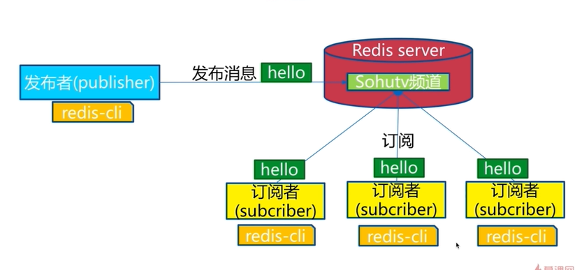

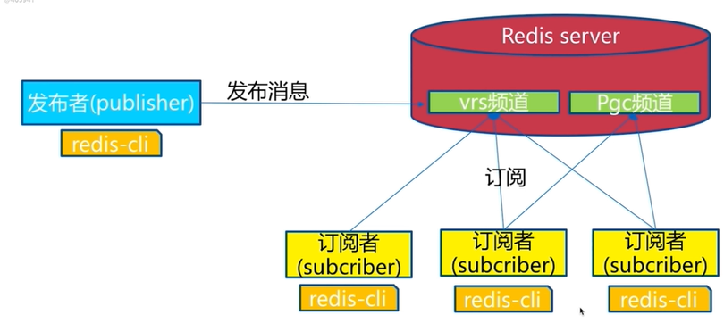

#### 3，命令

1. （发布消息） publish channel(频道)  message(消息)    返回订阅者个数
2. （取消订阅） unsubscribe [chnnel(频道)] 一个或多个 会取消订阅的频道
3. （频道订阅） subscribe [channel(频道)] 一个或多个 会返回订阅的频道，个数和该频道发布的信息 

#### 4，发布订阅和消息队列


### 4，位图 Bitmap

#### 1，位图

bit redis可以直接操纵value的位

如：b的二进制是01100010

可以通过命令直接取出其二进制的每一位

#### 2，命令

1. setbit key offset(第几位) value  给位图指定索引设置值
2. bitcount key [start end]   获取位图指定范围(start到end，单位为字节，如果不指定就是获取全部)位值为1的个数
3. bitop op destkey key [key...]  做多个Bitmap的and(交集)，not(并集)，xor(异或)操作并将结果保存在destkey中。
4. bitpos key targetBit [start] [end]  计算位图指定范围(start到end，单位为字节，如果不指定就是获取全部)第一个偏移量对应的值等于targetBit 的位置

### 5，GEO 

#### 1，geo是什么

GEO地理信息定位，存储经纬度，计算两地距离，范围计算等

#### 2，命令

1. geoadd  key longitude latitude member(标识) [longitude latitude member...]可以多个  增加地理位置信息
2. geopos key member [member] 获取地理位置信息
3. geodist key member1 member2[unit]  获取两个地理位置的距离  unit 单位   m米  km千米  mi英里  ft尺
4. 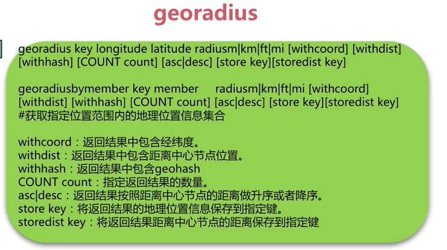

## 五，redis持久化的取舍和选择

### 1，持久化的作用

#### 1，什么是持久化

redis将所有数据保存在内存中，对数据的更新将异步地保存在磁盘上

#### 2，持久化的实现方式

1. 快照 某时某点的所有数据的完全备份
2. 写日志  数据库的数据更新写在日志时，将事务写在日志中，恢复数据库时将日志的内容走一遍

### 2，RDB

#### 1，什么是RDB

redis(存储在内存中)创建RDB文(二进制，存储在硬盘中)

redis数据恢复时启动载入RDB文件内容

#### 2，触发机制-主要三种方式

1. save （同步）

   直接执行save命令   会生成RDB文件 

   注意，在数据量较大时会造成阻塞

   **文件策略**

   如存在老的RDB文件会用新的文件替换老的文件

2. bgsave （异步）

   执行bgsave命令  

   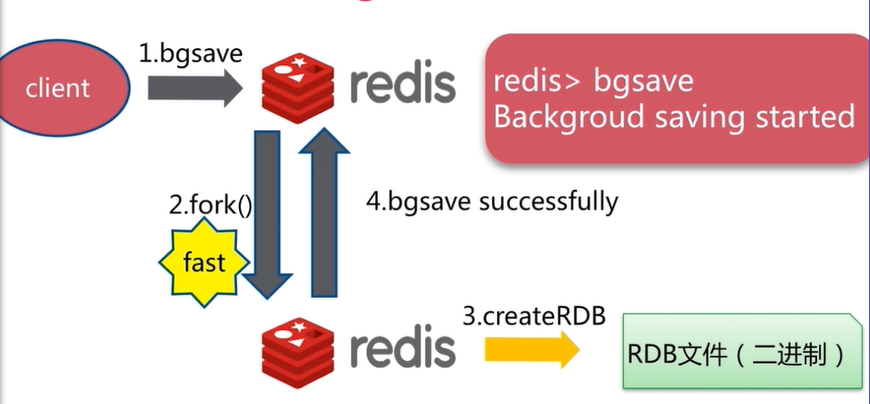

   如果fork()函数比较慢时也会阻塞redis

   **文件策略**

   如存在老的RDB文件会用新的文件替换老的文件

   **save和bgsave的比较**

   | 命令     | save             | bgsave             |
   | -------- | ---------------- | ------------------ |
   | IO类型   | 同步             | 异步               |
   | 是否阻塞 | 是               | 是(阻塞发生在fork) |
   | 优点     | 不会消耗额外内存 | 不会阻塞客户端命令 |
   | 缺点     | 组上我客户端命令 | 需要fork，消耗内存 |

3. 自动

   RDB生成策略

### 3，AOF

#### 1，RDB的问题

1. 耗时，耗性能
2. 不可控，容易丢失数据

#### 2，AOF运行原理-恢复

在对redis数据库进行操作时，会将命令以日志的形式写入AOF文件中，当redis重启后再将AOF文件中的数据载入redis数据库

#### 3，三种策略

1. always

   redis将命令刷新到缓冲区，缓冲区再根据策略写入硬盘总的AOF文件 

   全部写入

2. everysec  通常会使用

   每秒把缓冲区的数据fsync到硬盘，不会把每条数据写入硬盘 是默认的

3. no

   根据操作系统决定 不需要用户考虑

| 命令 | always                              | everysec      | no     |
| ---- | ----------------------------------- | ------------- | ------ |
| 优点 | 不丢失数据                          | 每秒一次fsync | 不用管 |
| 缺点 | IO开销较大，一般的sata盘只有几百TPS | 丢一秒数据    | 不可控 |

**AOF重写**

把过期的无用的重复的可以优化命令化简为一个很小的AOF文件

**作用**

1. 减少硬盘占用量
2. 加速恢复速度

实现方式

1. bgrewriteaof

   直接执行bgrewriteaof命令

   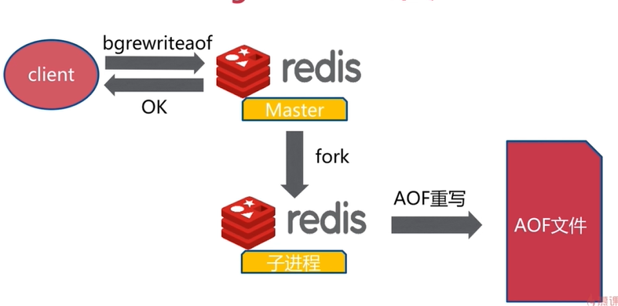

2. AOF重写配置

   **配置**

   | 配置名                      | 含义                  |
   | --------------------------- | --------------------- |
   | auto-aof-rewrite-min-size   | AOF文件重写需要的尺寸 |
   | auto-aof-rewrite-percentage | AOF文件增长率         |

   **统计**

   | 统计名           | 含义                                |
   | ---------------- | ----------------------------------- |
   | aof_current_size | AOF当前尺寸(单位：字节)             |
   | aof_base_size    | AOF上次启动和重写的尺寸(单位：字节) |

### 4，RDB和AOF的抉择

**优先级**

| 命令       | RDB    | AOF          |
| ---------- | ------ | ------------ |
| 启动优先级 | 低     | 高           |
| 体积       | 小     | 大           |
| 恢复速度   | 快     | 慢           |
| 数据安全性 | 丢数据 | 根据策略决定 |
| 轻重       | 重     | 轻           |

## 六，Redis开发和运维常见问题

### 1，fork操作

1. 同步操作
2. 与内存量息息相关：内存越大，耗时越长(与机器类型有关)
3. info:latest_fork_usec  查看上一次fork的执行时间 单位是毫秒数

**改善fork**

1. 优化使用物理机或者高效支持fork操作的虚拟化技术
2. 控制Redis实例最大可用内存：maxmemory
3. 合理配置Linux内存分配策略：vm.overcommit_memory=1
4. 降低fork频率：例如放宽AOF重写自动触发时机，不必要的全量复制

### 2，进程外开销

1. CPU
   - 开销：RDB和AOF文件生成，属于CPU密集型
   - 优化：不做CPU绑定，不和CPU密集型部署
2. 内存
   - 开销：fork内存开销，copy-on-write
   - 优化：echo never > /sys/kernel/mm/transparent_hugepage/enabled
3. 硬盘
   - 开销：AOF和RDB文件写入，可以结合iostat，iotop分析
   - 优化：
     - 不要和高硬盘负载服务部署一起：存储服务，消息队列等
     - no-appendfsync-on-rewrite = yes
     - 根据写入量决定磁盘类型：例如ssd
     - 单机多实例持久化文件目录可以考虑分盘

## 七，Redis复制的原理与优化

### 1，什么是主从复制

可以达到备份的效果

主从复制除了一主一从之外还有一主多从

1. 一个master可以有多个slave
2. 一个slave只能有一个master
3. 数据流向是单向的，master到slave

### 2，复制的配置

两种实现方式：

1. slaveof命令

   - 在主redis数据库执行命令  slaveof ip:port  异步执行
   - 取消 slaveof no none  在从redis数据库执行 并不会清除之前的数据，无法复制之后的数据

2. 配置文件

   修改配置

   slaveof ip port #希望成为某一个ip的从节点

   slave-read-only yes #设置从节点只读

**比较**

| 方式 | 命令       | 配置     |
| ---- | ---------- | -------- |
| 优点 | 无需重启   | 统一配置 |
| 缺点 | 不便于管理 | 需要重启 |

### 3，全量复制和部分复制

#### 1，全量复制

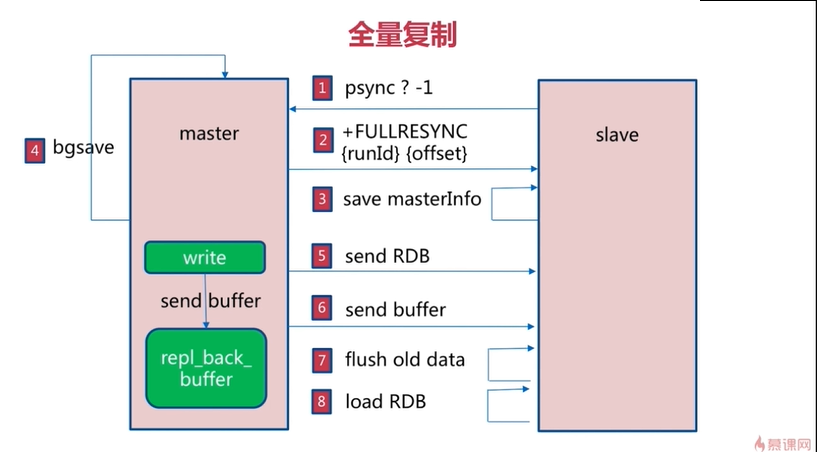

开销：

1. basave时间
2. RDB文件网络传输时间
3. 从节点清空数据时间
4. 从节点加载RDB的时间
5. 可能的AOF重写时间

#### 2，部分复制

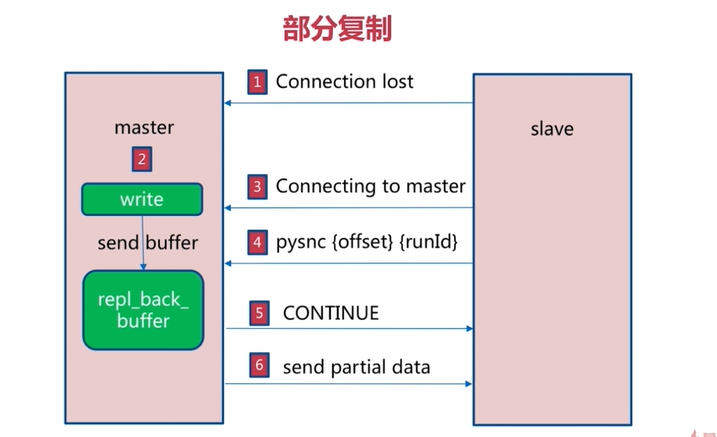

### 4，故障处理

**主从结构-故障转移**

1. slave故障

   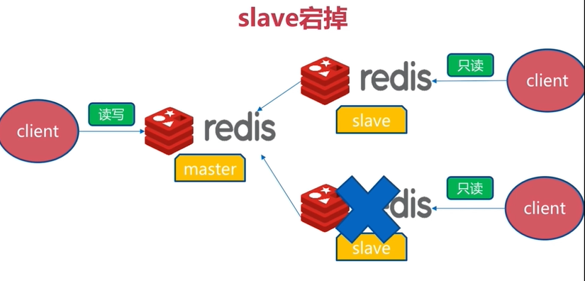

   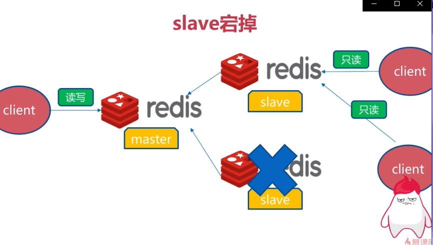

2. master故障

   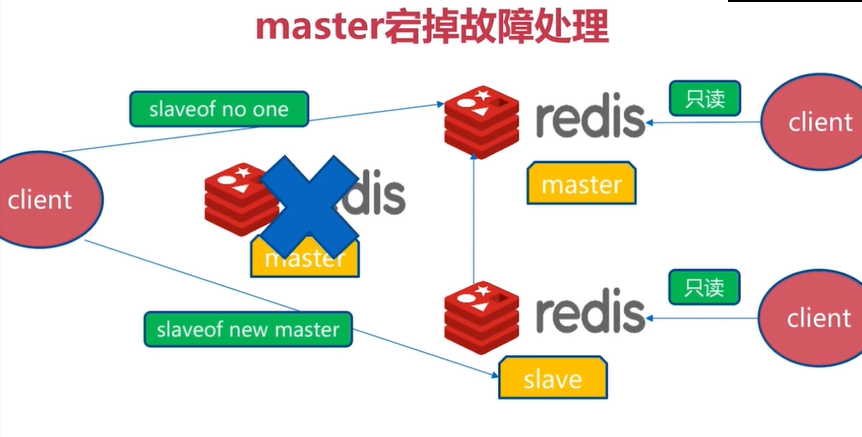

主从复制并没有实现故障的自动转移

### 5，开发运维常见问题

1. 读写分离

   读流量分摊到从节点

2. 主从配置不一致

   1. 例如maxmemory不一致：丢失数据
   2. 例如数据结构优化参数(例如hash-max-ziplist-entries)：内存不一致

3. 规避全量复制

   1. 第一次全量赋值
      - 第一次不可避免
      - 小主节点，低峰
   2. 节点运行ID不匹配
      - 主节点重启（运行ID变化）
      - 故障转移，例如哨兵或集群
   3. 复制积压缓冲区不足
      - 网络中断，部分复制无法满足
      - 增大复制缓冲区配置rel_backlog_size,网络“增强”。

4. 规避复制风暴

   - 单主节点复制风暴
     - 问题：主节点重启，多从节点复制
     - 解决：更换复制拓扑
   - 单机器复制风暴
     - 机器故障后，大量全量复制

## 八，Redis Sentinel

### 1，主从复制问题

1. 手动故障转移

   出现故障后，需要手动处理，无法做到自动处理故障转移

2. 写能力和存储能力受限

### 2，Redis Sentinel架构 

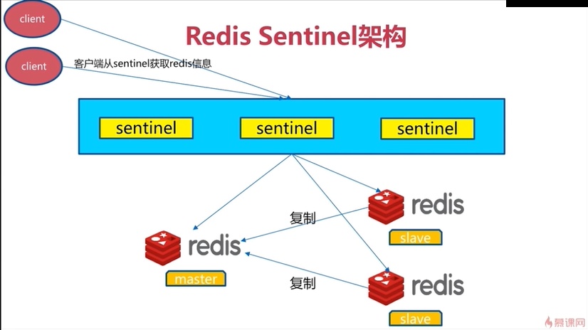

用户不会直接在redis获取信息，而是通过Sentinel获取

**故障自动转移**

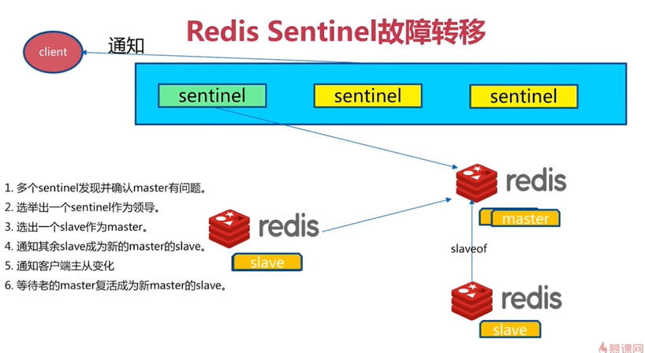

### 3，安装和配置 

#### 一、一主二从

### 1.redis 安装

　　**安装教程：**https://www.cnblogs.com/zwcry/p/9505949.html

##### 2.redis主从

###### 　　1）创建主从目录

　　　　mkdir /usr/local/redis-ms

　　　　cd /usr/local/redis-ms/

　　　　mkdir 6381

　　　　mkdir 6382

　　　　mkdir 6382

###### 　　**2）复制redis.conf到主从目录**

　　　　cp /usr/local/redis/redis.conf ./6381/

　　　　cp /usr/local/redis/redis.conf ./6382/

　　　　cp /usr/local/redis/redis.conf ./6383/

###### 　　**3）修改主./6381/redis.conf**

　　　　vim ./6381/redis.conf

　　　　#修改如下key的值

　　　　bind 0.0.0.0#任意ip都可以连接

　　　　protected-mode no#关闭保护，允许非本地连接

　　　　port 6381#端口号

　　　　daemonize yes#后台运行

　　　　pidfile /var/run/redis_6381.pid#进程守护文件，就是存放该进程号相关信息的地方

　　　　dir /usr/local/redis-ms/6381/#db等相关目录位置

　　　　appendonly yes#开启日志形式

###### 　　**4）修改从./6382/redis.conf**

　　　　vim ./6382/redis.conf

　　　　#修改如下key的值

　　　　bind 0.0.0.0#任意ip都可以连接

　　　　protected-mode no#关闭保护，允许非本地连接

　　　　port 6382#端口号

　　　　daemonize yes#后台运行

　　　　pidfile /var/run/redis_6382.pid#进程守护文件，就是存放该进程号相关信息的地方

　　　　dir /usr/local/redis-ms/6382/#db等相关目录位置

　　　　slaveof 192.168.194.131 6381#主信息

　　　　appendonly yes#开启日志形式

###### 　　**5）修改从./6383/redis.conf**

　　　　vim ./6383/redis.conf 

　　　　#修改如下key的值

　　　　bind 0.0.0.0#任意ip都可以连接

　　　　protected-mode no#关闭保护，允许非本地连接

　　　　port 6383#端口号

　　　　daemonize yes#后台运行

　　　　pidfile /var/run/redis_6383.pid#进程守护文件，就是存放该进程号相关信息的地方

　　　　dir /usr/local/redis-ms/6383/#db等相关目录位置

　　　　slaveof 192.168.194.131 6381#主信息

　　　　appendonly yes#开启日志形式

##### 3.启动测试

###### 　　1）启动

　　　　cd /usr/local/redis-ms/

　　　　/usr/local/redis/src/redis-server ./6381/redis.conf

　　　　/usr/local/redis/src/redis-server ./6382/redis.conf

　　　　/usr/local/redis/src/redis-server ./6383/redis.conf

　　　　ps -ef|grep redis

　　　　

　　　　#查看主从是否搭建成功

　　　　/usr/local/redis/src/redis-cli -p 6381

　　　　info

　　　　如图：

　　　　

###### 　　2）测试

　　　　/usr/local/redis/src/redis-cli -p 6381 --raw

　　　　set name '丁洁'

　　　　get name

　　　　

　　　　/usr/local/redis/src/redis-cli -p 6382 --raw

　　　　get name

　　　　

　　　　  /usr/local/redis/src/redis-cli -p 6382 --raw

　　　　get name

　　　　

　　　　注：

　　　　--raw 中文显示

　　　　主6381设置name值，可以在从6382、6383取到，但是从不能设置值。

##### 4.开机自启服务

　　mkdir /usr/local/redis-ms/script

　　cd /usr/local/redis-ms/script/

###### 　　1）start.sh启动脚本

　　　　vim ./start.sh

```
#!/bin/sh
/usr/local/redis/src/redis-server /usr/local/redis-ms/6381/redis.conf
/usr/local/redis/src/redis-server /usr/local/redis-ms/6382/redis.conf
/usr/local/redis/src/redis-server /usr/local/redis-ms/6383/redis.conf
```

 

###### 　　2）stop.sh停止脚本

　　　　vim ./stop.sh　　　　

```
#!/bin/sh
/usr/local/redis/src/redis-cli -p 6381 shutdown
/usr/local/redis/src/redis-cli -p 6382 shutdown
/usr/local/redis/src/redis-cli -p 6383 shutdown
```

 

###### 　　3）restart.sh重启脚本

　　　　vim ./restart.sh

```
#!/bin/sh
systemctl stop redis-ms
systemctl start redis-ms
```

###### 　　4）改变权限

　　　　chmod 777 ./*

　　　　

###### 　　5）编写开机服务

　　　　cd /usr/lib/systemd/system/

　　　　vim redis-ms.service

[](javascript:void(0);)

```
[Unit]
Description=redis-ms
After=network.target remote-fs.target nss-lookup.target
[Service]
Type=forking
ExecStart=/usr/local/redis-ms/script/start.sh
ExecStop=/usr/local/redis-ms/script/stop.sh
ExecReload=/usr/local/redis-ms/script/restart.sh
[Install]
WantedBy=multi-user.target　
```

[](javascript:void(0);)

　　　　改变权限

　　　　　　chmod 777 redis-ms.service

　　　　进程服务重加载

　　　　　　systemctl daemon-reload

　　　　开机启动主从

　　　　　　systemctl enable redis-ms.service

　　　　启动主从

　　　　　　systemctl start redis-ms.service

　　　　关闭主从

　　　　　　systemctl stop redis-ms.service

　　　　重启主从

　　　　　　systemctl restart redis-ms.service

#### 二、哨兵配置(sentinel.conf)

　　cd /usr/local/redis-ms/　　

##### 　　1.创建哨兵目录

　　　　mkdir -p ./sentinel/26001/tmp

　　　　cp /usr/local/redis/sentinel.conf ./sentinel/26001/

##### 　　2.修改./sentinel/.conf

　　　　cd /usr/local/redis-ms/sentinel/

　　　　vim ./26001/sentinel.conf

　　　　**#修改如下键值对**

​				bind 127.0.0.1 192.168.1.1#注释掉或者值为0.0.0.0

　　　　protected-mode no#关闭保护模式

　　　　port 26001#端口号

　　　　daemonize yes#后台运行

　　　　dir /usr/local/redis-ms/sentinel/26001/tmp#解除挂载信息目录

　　　　sentinel monitor mymaster 192.168.194.131 6381 1#设置 主名称 ip地址 端口号 参入选举的哨兵数

　　　　sentinel down-after-milliseconds mymaster 3000#sentinel心跳检测主3秒内无响应，视为挂掉，开始切换其他从为主

　　　　sentinel parallel-syncs mymaster 1#每次最多可以有1个从同步主。一个从同步结束，另一个从开始同步。

　　　　sentinel failover-timeout mymaster 18000#主从切换超时时间

#### 三、启动哨兵配置

　　**1.先启主从redis**

　　　　/usr/local/redis/src/redis-server /usr/local/redis-ms/6381/redis.conf

　　　　/usr/local/redis/src/redis-server /usr/local/redis-ms/6382/redis.conf

　　　　/usr/local/redis/src/redis-server /usr/local/redis-ms/6383/redis.conf

　　　　ps -ef|grep redis

　　　　如图已经启动

　　　　

　　　　且信息正确

　　　　/usr/local/redis/src/redis-cli -p 6381

　　　　info

　　　　

 　　**2.启动哨兵**

　　　　/usr/local/redis/src/redis-sentinel /usr/local/redis-ms/sentinel/26001/sentinel.conf 

　　　　ps -ef|grep redis

　　　　如图已经启动

　　　　

　　　　且信息正确

　　　　/usr/local/redis/src/redis-cli -p 26001

　　　　info

 　　　　

　　**3.测试**

###### 　　　　1）主6381停掉后变成从，原有的两个从，有一个升级为主。

　　　　　　/usr/local/redis/src/redis-cli -p 6381 shutdown

　　　　　　/usr/local/redis/src/redis-cli -p 26001

　　　　　　info

　　　　　　

###### 　　　　2）6381再次启动后，依然是从

　　　　　　/usr/local/redis/src/redis-server /usr/local/redis-ms/6381/redis.conf

　　　　　　/usr/local/redis/src/redis-cli -p 6381

　　　　　　info

　　　　　　

#### 五、哨兵集群

　　cd /usr/local/redis-ms/sentinel/

##### 　　1.复制26001

　　　　cp -r 26001 26002

##### 　　2.修改26002/sentinel.conf 

　　　　vim 26002/sentinel.conf

　　　　#将文本中26001替换为26002

　　　　:%s/26001/26002/g

##### 　　3.启动

　　　　/usr/local/redis/src/redis-sentinel /usr/local/redis-ms/sentinel/26002/sentinel.conf

　　　　info

　　　　/usr/local/redis/src/redis-cli -p 26002

　　　　

 

#### 6.哨兵开机启动

　　注：redis开机启动参照https://www.cnblogs.com/zwcry/p/9046207.html　　

##### 　　1.创建sh脚本目录

　　　　mkdir /usr/local/redis-ms/sentinel/script

　　　　cd /usr/local/redis-ms/sentinel/script/

##### 　　2.编辑start.sh

　　　　vim start.sh　　　

```
#!/bin/sh
/usr/local/redis/src/redis-sentinel /usr/local/redis-ms/sentinel/26001/sentinel.conf
/usr/local/redis/src/redis-sentinel /usr/local/redis-ms/sentinel/26002/sentinel.conf
```

##### 　　3.编辑stop.sh

　　　　vim stop.sh

```
#!/bin/sh
/usr/local/redis/src/redis-cli -p 26001 shutdown
/usr/local/redis/src/redis-cli -p 26002 shutdown
```

##### 　　4.编辑restart.sh

　　　　vim restart.sh　　　

```
#!/bin/sh
systemctl stop redis-sentinel
systemctl start redis-sentinel
```

##### 　　5.编写redis-sentinel.service

　　　　cd /usr/lib/systemd/system/

　　　　vim redis-sentinel.service

[](javascript:void(0);)

```
[Unit]
Description=redis-sentinel
After=redis-ms.service
[Service]
Type=forking
ExecStart=/usr/local/redis-ms/sentinel/script/start.sh
ExecStop=/usr/local/redis-ms/sentinel/script/stop.sh
ExecReload=/usr/local/redis-ms/sentinel/script/restart.sh
[Install]
WantedBy=multi-user.target
```

[](javascript:void(0);)

　　　　#建议启动redis服务后，再启动哨兵　　

##### 　　6.命令行

　　　　改变权限

　　　　　　chmod 777 redis-sentinel.service

　　　　　　chmod 777 /usr/local/redis-ms/sentinel/script/*

　　　　进程服务重加载

　　　　　　systemctl daemon-reload

　　　　开机启动哨兵

　　　　　　systemctl enable redis-sentinel.service

　　　　启动哨兵

　　　　　　systemctl start redis-sentinel.service

　　　　关闭哨兵

　　　　　　systemctl stop redis-sentinel.service

　　　　重启哨兵

　　　　　　systemctl restart redis-sentinel.service

**备注：哨兵集群服务自主关联响应，如果需要更多哨兵集群，按照26002的方式复制26003...26006即可**

### 4，spring boot 连接redis

**配置application.properties**

```properties
##单服务器
spring.redis.host=39.107.119.256
##单端口
spring.redis.port=6381
## 连接池最大连接数（使用负值表示没有限制） 
spring.redis.pool.max-active=300
## Redis数据库索引(默认为0) 
spring.redis.database=0
## 连接池最大阻塞等待时间（使用负值表示没有限制） 
spring.redis.pool.max-wait=-1
## 连接池中的最大空闲连接 
spring.redis.pool.max-idle=100
## 连接池中的最小空闲连接 
spring.redis.pool.min-idle=20
## 连接超时时间（毫秒） 
spring.redis.timeout=60000

#哨兵的配置列表  
spring.redis.sentinel.master=mymaster
spring.redis.sentinel.nodes=39.107.119.256:26379##哨兵集群#spring.redis.sentinel.nodes=39.107.119.254:26379,39.107.119.254:26380
```

多个哨兵配置

```properties
##单服务器
spring.redis.host=39.107.119.256
##单端口
spring.redis.port=6381
## 连接池最大连接数（使用负值表示没有限制） 
spring.redis.pool.max-active=300
## Redis数据库索引(默认为0) 
spring.redis.database=0
## 连接池最大阻塞等待时间（使用负值表示没有限制） 
spring.redis.pool.max-wait=-1
## 连接池中的最大空闲连接 
spring.redis.pool.max-idle=100
## 连接池中的最小空闲连接 
spring.redis.pool.min-idle=20
## 连接超时时间（毫秒） 
spring.redis.timeout=60000

#哨兵的配置列表  
spring.redis.sentinel.master=mymaster
spring.redis.sentinel.nodes=39.107.119.256:26379,39.107.119.256:26380
```

## 九，Redis Culster

### 1，呼唤集群

为什么呼唤集群-------->分布式

1. 并发量，业务需要更高级别的并发量，单个redis数据库无法做到
2. 数据量，业务需要的数据量越来越大，一台机器很难实现数据的储存

### 2，数据分布

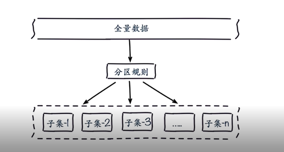

1. 顺序分区：

   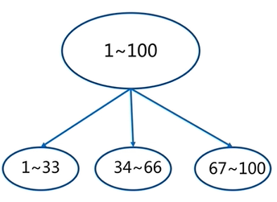

2. 哈希分布  通过哈希函数

   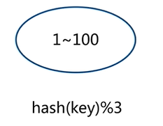

对比：

| 分布方式 | 特点                                                       | 典型产品                                      |
| -------- | ---------------------------------------------------------- | --------------------------------------------- |
| 哈希分布 | 数据分散度高，键值分布业务无关，无法顺序访问，支持批量操作 | 一致性哈希Memcache Redis Cluster 其他缓存产品 |
| 顺序分布 | 数据分散度易倾斜，键值业务相关，可顺序访问，支持批量操作   | Big Table HBase                               |

### 3，集群原理

**Redis Cluster架构**

1. 节点

   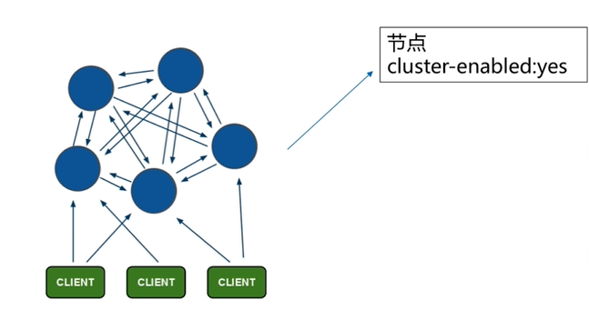

   cluster-enabled：yes

2. meet

   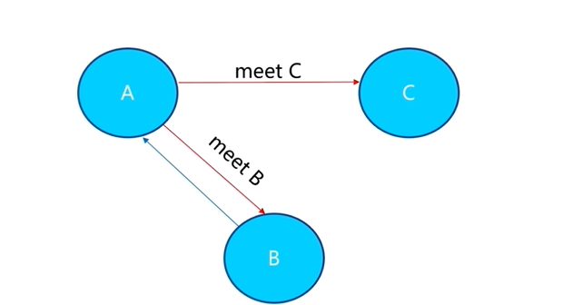

   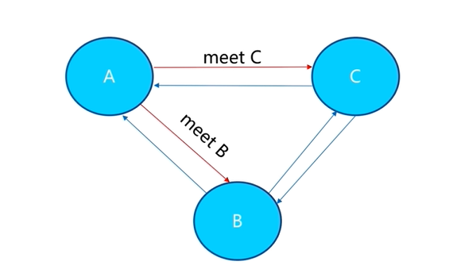

   

3. 指派槽

   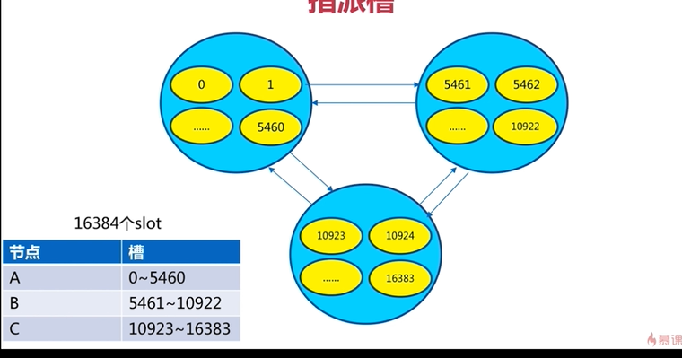

   

   Redis Cluster特性

   1. 复制
   2. 高可用
   3. 分片

#### Redis cluster安装与配置

1. 原生命令安装

   - 配置开启节点

     - port ${port} 端口
     - daemonize yes  是否使用守护进程的方式启动
     - dir "/opt/redis-5.0.5/data"  数据目录
     - dbfilename "dump-${port}.rdb" rdb文件
     - logfile "${port}.log"  日志文件
     - cluster-enabled yes  当前节点是cluster节点
     - cluster-config-file nodes-${port}.conf  为cluster节点添加配置
     - redis-server redis-6379.conf 开启节点  6379为端口号  开启多个

   - meet

     命令 cluster meet ip  port  和另一个ip 的节点建立连接

     redis -cli -h 127.0.0.1 -p 6379 cluster meet 127.0.0.1 6380  多个

   - cluster节点重要配置

     cluster-enabled yes

     cluster-node-timeout 15000  节点超时的时间  故障转移的时间

     cluster-config-file "nodes.conf"

     cluster-require-full-coverage yes

   - 指派槽(分配槽)

     cluster addslots slot[slot...]

     redis-cli -h 127.0.0.1 -p 6379 cluster addslots {0...5641}

     redis-cli -h 127.0.0.1 -p 6379 cluster addslots {5642...10922}

     redis-cli -h 127.0.0.1 -p 6379 cluster addslots {10923...16383} 

     将所有的槽分配完成

   - 主从关系分配

     **设置主从**

     cluster replicate node-id

     redis-cli -h 127.0.0.1 -p 6379 cluster replicate ${node-id-6380} 多个

2. 官方命令安装

   Ruby环境准备

   - 下载编译安装Ruby
     - wget https://cache.ruby-lang.org/pub/ruby/2.3/ruby-2.3.1.tar.gz
     - tar -xvf ruby-2.3.1.tar.gz
     - ./configure -prefix=/usr/local/ruby
     - make 
     - make install
     - cd /usr/local/ruby
     - cp bin/ruby/usr/local/bin 
   - 安装rubygem redis
     - wget https://rubygems.org/downloads/redis-3.3.0.gem
     - gem install -l redis-3.3.0.gem
     - gem list --check redis gem
   - 安装redis-trib.rb
     - cp ${REDIS_HOME}/src/redis-trib.rb/usr/local/bin

