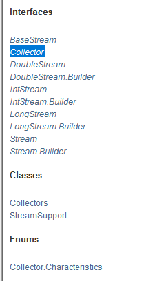

# stream探究

## 一，总览

## 二，介绍

Stream是一种对象引用流，用于流式计算，在源数据和终止操作中间可能有很多个中间操作

1. 源数据
2. 中间操作
3. 终止操作

这里的中间操作属于惰性求值，而终止操作属于及早求值。

比如：Stream.aaa().bbb().ccc().count();

aaa,bbb,ccc方法为Stream的中间操作。在最的一个count未被调用时，这些中间操作是不会被执行的，这意味这count是一个终止操作。

##### 实例：

题目要求，一分钟内完成此题，只能用一行代码实现!
现在有5个用户! 筛选:

1. ID必须是偶数
2. 年龄必须大于23岁
3. 用户名转为大写字母
4. 用户名字母倒着排序
5. 只输出一个用户!

~~~java
public class TestDome01 {
    public static void main(String[] args) {
        User u1 = new User(1,"u1",21);
        User u2 = new User(2,"u2",22);
        User u3 = new User(3,"u3",23);
        User u4 = new User(4,"u4",24);
        User u5 = new User(5,"u5",25);
        User u6 = new User(6,"u6",26);
        //集合就是存储
        List<User> list = Arrays.asList(u1,u2,u3,u4,u5,u6);

        //计算交给Stream流
        list.stream()
            //过滤，过滤出满足要求的
            .filter(u -> {return u.getId()%2==0;})
            .filter(u -> {return u.getAge() > 23;})
            //对象的操作
            .map(u -> {return u.getName().toUpperCase();})
            //排序
            .sorted((usr1,usr2) -> {return usr2.compareTo(usr1);})
            //限制个数
            .limit(1)
            .forEach(System.out :: println);
    }
}

class User{
    private Integer Id;
    private String name;
    private Integer age;

    public User(Integer id, String name, Integer age) {
        Id = id;
        this.name = name;
        this.age = age;
    }

    public Integer getId() {
        return Id;
    }

    public void setId(Integer id) {
        Id = id;
    }

    public String getName() {
        return name;
    }

    public void setName(String name) {
        this.name = name;
    }

    public Integer getAge() {
        return age;
    }

    public void setAge(Integer age) {
        this.age = age;
    }
}
~~~

~~~java
public static void test3() {
    long sum = LongStream.rangeClosed(0L, 10_0000_0000L)
        .parallel()
        .reduce(0, Long::sum);
//并行流计算
}
~~~

