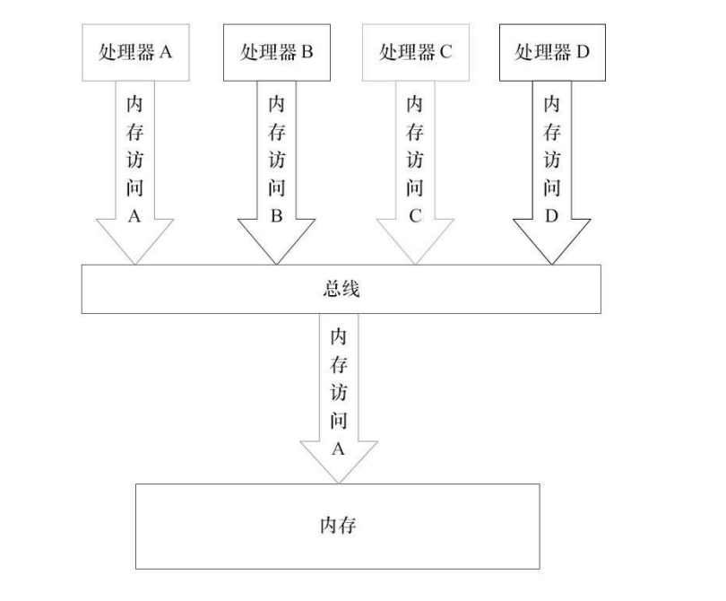
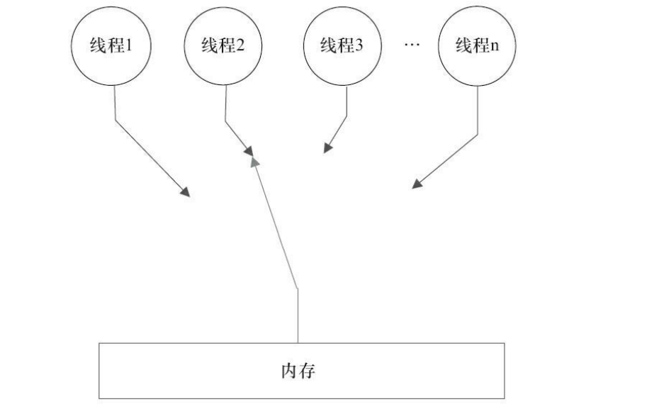
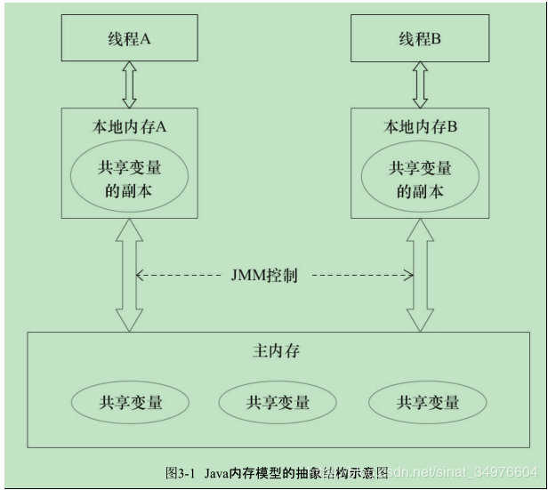
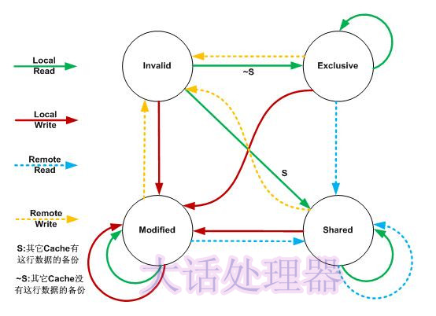
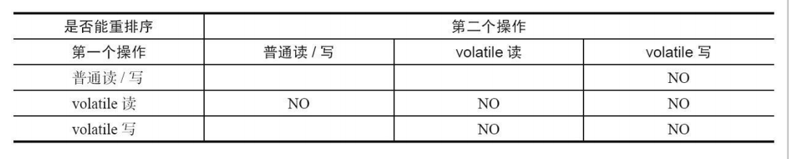
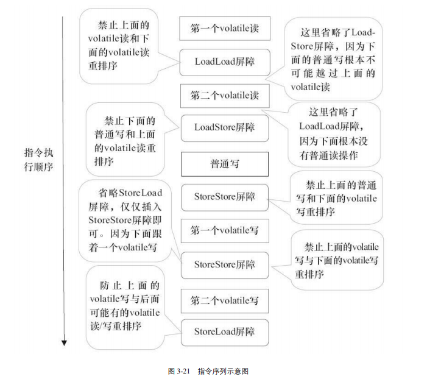

### 一，内存模型

##### 什么是内存模型？

简单是说内存模型是一个规范，规定了再多核多线程情况下，各种不同的CPU是如何以一种统一的方式与内存来交互的。包括针对内存读写操作的重排序规则，可见性规则。

##### 顺序一致性内存模型

顺序一致性内存模型是一个理论参考模型，为程序员提供了极强的内存可见性保证

> 特点

- 一个程序中的所有操作必须按照程序的顺序来执行
- 所有线程都只能看到一个单一的操作执行顺序，在顺序一致性内存模型中，每个操作都必须原子执行且立刻对所有线程可见

顺序一致性模型有一个单一的全局内存，这个内存可以通过自动或被动的控制连接到任意一个线程，同时每一个线程必须按照程序的顺序来执行内存读/写操作

在任意时间点最多只能有一个线程可以连接到内存，当所线程并发执行时，对于连接内存这个操作也是会被串行化的

> 举例

有两个线程A 和 B并发执行，A中存在三个操作 其顺序为A1,A2,A3；B中也存在三个操作 顺序为B1,B2,B3，现在将两个线程进行同步，也就是线程A执行时获取锁，执行完释放锁， 之后线程B获取同一把锁

那么这个程序在顺序一致性模型中的执行顺序就是

`A1->A2->A3->B1->B2->B3`

操作的执行整体有序，对于线程A和线程B或是其他的线程，所能看到的运行顺序都是这个

如果两个线程没有进行线程同步，那么他的执行顺序就不得而知了，下面列举一种情况

`B1->A1->A2->B2->A3->B3`

可以看到，这个操作的整体上是无序的，但是对于单个线程的执行还是有序的，同样，对于线程A和线程B或是其他的线程，所能看到的运行顺序都是这个

**顺序一致性内存模型中 的每个操作必须立即对任意线程可见**

##### java内存模型 JMM

> 在正确同步的多线程程序中

顺序一致性模型中，所有的操作必须完全按照程序的顺序串行执行，这就导致了在顺序一致性模型之下编译器和处理器对程序的优化时非常有限的。

在JMM中临界区内的代码可以再不改变程序的运行结果的范围内进行重排序，比如上面那个例子，线程A中如果出现了重排序，对于线程B是不可见的。

临界区 ： 访问公共资源的程序片段，任何时刻临界区中的线程只能有一个

> 在未同步的多线程程序中

这种情况下JMM只提供最小的安全性： 即线程执行的时候读取到的值要么是之前某个线程写入的值，要么是默认的值。线程读取到的值不会无中生有的冒出来

为了实现这一点，jvm在堆上分配对象时，首先会对内存空间进行清零，然后才会在上面分配对象，以上两个步骤会在jvm内部同步进行

在未同步的多线程程序中，JMM不保证该程序的执行结果和该程序在顺序一致性模型中的执行结果一致，如果想要保证执行结果一致，JMM需要禁止大量的处理器和编译器的优化，会对执行性能产生很大的影响

所以未同步的多线程程序在JMM中执行的时候，整体上是无序的，结果也是无法预知的

##### 顺序一致性模型和JMM模型在未同步程序中的不同

- 顺序一致性模型保证单线程内的操作会按程序的顺序执行，而 JMM 不保证单线 程内的操作会按程序的顺序执行
- 顺序一致性模型保证所有线程只能看到一致的操作执行顺序，而 JMM 不保证所 有线程能看到一致的操作执行顺序
- JMM 不保证对 64 位的 long 型和 double 型变量的写操作具有原子性，而顺序一 致性模型保证对所有的内存读/写操作都具有原子性

在计算机中数据通过总线在处理器和内存之间传递，每次处理器和内存之间的数据传递都是通过一系列步骤来完成的，称为总线事务，总线事务包括读事务和写事务(read Transaction 和 write Transaction)，

- 读事务从内存传送数据到处理器，写事务从处理器传送数据到内存，每个事务会读/写内存中一个或者多个物理上连续的字
- 总线会同步试图并发使用总线的事务，在一个处理器执行总线事务期间，总线会禁止其他处理器和I/O设备执行内存的读写

上图就是总线的工作机制

总线的这些工作机制可以把所有处理器对内存的访问以串行化的方式来执行。在任 意时间点，最多只能有一个处理器可以访问内存。这个特性确保了单个总线事务之中的 内存读/写操作具有原子性。

顺序一致性模型视图：

JMM视图

### 二，volatile 

##### 特性

- 可见性，每次对volatile变量的读操作都能看到其他线程最近一次写入的值
- 有序性，对volatile变量的读写操作不会和其他volatile变量读写操作重排序
- 不保证原子性，对任意单个volatile变量的读/写具有原子性，但类似于volatile++ 这种复合操作不具有原子性

##### 特性原理

> 可见性

volatile保证了修饰的共享变量在转换为汇编语言时，会加上一个以Lock为前缀的命令，当CPU发现了这个指令的时候，会做两件事

- 将当前内核中线程工作内存中该共享变量刷新到主内存
- 通知其他内核里缓存了该共享变量的内存地址无效

这个过程是通过MESI协议完成的

MESI协议：缓存一致性协议

这个协议的表面含义 ： Modified修改，Exclusive 独占，Shared 共享，Invaild 无效

在MESI协议中，每个Cache line有4个状态，可用2个bit表示。

| 状态         | 描述                                                         |
| ------------ | ------------------------------------------------------------ |
| M(Modified)  | 这行数据有效，数据被修改了，和内存中的数据不一致，数据只存在于本Cache中。 |
| E(Exclusive) | 这行数据有效，数据和内存中的数据一致，数据只存在于本Cache中。 |
| S(Shared)    | 这行数据有效，数据和内存中的数据一致，数据存在于很多Cache中。 |
| I(Invalid)   | 这行数据无效。                                               |

在MESI协议中，每个Cache的Cache控制器不仅知道自己的读写操作，而且也监听(snoop)其它Cache的读写操作

如图：

1. 当前线程对数据write时会进入 M 修改 状态
2. 其他线程对数据read时会进入 S 共享 状态
3. 其他线程对数据write时会进入 I 失效状态
4. 当前线程对数据read时：
   - 如果当前状态是 I 失效 状态 ：
     - 其他线程如果有这个数据的备份(其他线程已经获取过这个数据)，会进入 S 共享 状态
     - 其他线程中没有这个数据的备份 会进入 E 独占状态
   - 如果当前状态不是 I 失效 状态 那么状态是不变的

虽然存在缓存一致性，但是并不能确保每个处理器核心每时每刻看到的数据都是一致的

1. store buffer (存储缓存)，对数据的修改会先缓存到store buffer中，同时给cpu发送消息，之后继续进行其他任务，等到收到其它cpu发过来的响应消息，再将数据从store buffer移到cache line。读取同理
2. invalidation queue(无效队列)  由于存在Invalidation queue，所以cache收到invalidate消息后并不会立即把自己的副本置为失效，因此导致读到旧的值，无效化的消息会被放入一个无效队列中，并在之后尽快处理。
3. 重排序

> 禁止指令重排，有序性

volatile的这个特性就是用来解决 store buffer， invalidation queue和重排序的，在适合的地方加入内存屏障，保证读取的一致性，防止重排序

##### 数据依赖性

程序中的某些数据之间可能存在一定的依赖性：

|  名称  |     示例      |             说明             |
| :----: | :-----------: | :--------------------------: |
| 写后读 | a=1; b=a; | 写一个变量之后，再读这个位置 |
| 写后写 | a=1; a=2; | 写一个变量之后，再写这个变量 |
| 读后写 | a=b; b=1; | 读一个变量之后，再写这个变量 |

上表中的几种情况下，如果出现了重排序，那么整个程序的执行结果就会发生改变，这种就叫做数据依赖性，编译器和处理器不会改变存在数据依赖关系的两个操作的执行顺序，这里只针对的单个处理器中执行的指令序列和单个线程中执行的操作，不同处理器之间和不同线程之间的数据依赖性不会被编译器和处理器考虑

**as-if-serial** 保护了单线程程序中的程序执行，他规定了单线程中存在数据依赖关系的操作不会被重排序，没有数据依赖的两个操作不做约束

##### happens-before 

happens-before规定了在多线程程序中禁止重排序和编译优化的场景，保证了并发编程的正确性

>定义

- 如果一个操作happens-before另一个操作，那么第一个操作的执行结果将对第二个操作可见，而且第一个操作的执行顺序排在第二个操作之前
- 两个操作之间存在happens-before关系，并不意味之java平台的具体实现必须要按照happens-before关系指定的顺序来执行，如果重排序之后的执行结果与按照happens-before 关系来执行的结果一致，那么这种重排序是被允许的

> 规则

- 程序顺序规则：一个线程中的每个操作，happens-before于线程中的任意后续操作，**写在前面的代码一定会在写在后面的代码之前运行**
- 监视器锁规则：对一个锁的解锁，happens-before于随后对这个锁的加锁，**如果一个锁已经被持有，那么对她的解锁一定在加锁之前**
- volatile变量规则：对一个volatile域的写，happens-before于任意后续对这个volatile域的读，
- 传递性：如果 A happens-before B，且 B happens-before C，那么 A happens-before C。
- start()规则：如果线程A执行操作ThreadB.start(),那么A线程的ThreadB.start()操作 happens-before 于线程 B 中的任意操作。根据传递性 happens-before ThreadB.start() 的操作也一定happens-before 线程B的任意操作
- join()规则：如果线程 A 执行操作 ThreadB.join()并成功返回，那么线程 B 中的任 意操作 happens-before 于线程 A 从 ThreadB.join()操作成功返回。线程B的任意操作 happens-before ThreadB.join() 及以后的操作

### 三，内存屏障

##### volatile的内存语义

- 线程 A 写一个 volatile 变量，实质上是线程 A 向接下来将要读这个 volatile 变量 的某个线程发出了（其对共享变量所做修改的）消息。 
-  线程 B 读一个 volatile 变量，实质上是线程 B 接收了之前某个线程发出的（在写 这个 volatile 变量之前对共享变量所做修改的）消息。 
- 线程 A 写一个 volatile 变量，随后线程 B 读这个 volatile 变量，这个过程实质上 是线程 A 通过主内存向线程 B 发送消息。

##### volatile内存语义的实现

- 当第二个操作是 volatile 写时，不管第一个操作是什么，都不能重排序。这个规 则确保 volatile 写之前的操作不会被编译器重排序到 volatile 写之后。 
- 当第一个操作是 volatile 读时，不管第二个操作是什么，都不能重排序。这个规 则确保 volatile 读之后的操作不会被编译器重排序到 volatile 读之前。
- 当第一个操作是 volatile 写，第二个操作是 volatile 读时，不能重排序。

为了实现上面表中的操作，编译器在生成字节码的时候，会在指令序列中插入内存屏障来禁止特定类型的处理器重排序

> 两个内存屏障指令

- Store：将处理器缓存的数据刷新到内存中。
- Load：将内存存储的数据拷贝到处理器的缓存中。

|      屏障类型       |         指令示例         |                             说明                             |
| :-----------------: | :----------------------: | :----------------------------------------------------------: |
|  LoadLoad Barriers  |   Load1;LoadLoad;Load2   | 该屏障确保Load1数据的装载先于Load2及其后所有装载指令的的操作 |
| StoreStore Barriers | Store1;StoreStore;Store2 | 该屏障确保Store1立刻刷新数据到内存(使其对其他处理器可见)的操作先于Store2及其后所有存储指令的操作 |
| LoadStore Barriers  |  Load1;LoadStore;Store2  | 确保Load1的数据装载先于Store2及其后所有的存储指令刷新数据到内存的操作 |
| StoreLoad Barriers  |  Store1;StoreLoad;Load2  | 该屏障确保Store1立刻刷新数据到内存的操作先于Load2及其后所有装载指令的操作。它会使该屏障之前的所有内存访问指令(存储指令和访问指令)完成之后,才执行该屏障之后的内存访问指令 |

- 在每个 volatile 写操作的前面插入一个 StoreStore 屏障。处理器写这个数据之前如果其他处理器有读写操作会先于这个写操作执行，避免volatile写和前面的任意操作重排序
- 在每个 volatile 写操作的后面插入一个 StoreLoad 屏障。 万能屏障 必须前面的完成才能进行后面的操作，避免volatile写与后面的volatile读重排序
- 在每个 volatile 读操作的后面插入一个 LoadLoad 屏障。避免volatile读与后面的volatile读重排序
- 在每个 volatile 读操作的后面插入一个 LoadStore 屏障。避免volatile读与后面的volatile写重排序

如上图：在实际执行时，只要不 改变 volatile 写-读的内存语义，编译器可以根据具体情况省略不必要的屏障。

参考资料：Java并发编程艺术，JSR133中文版