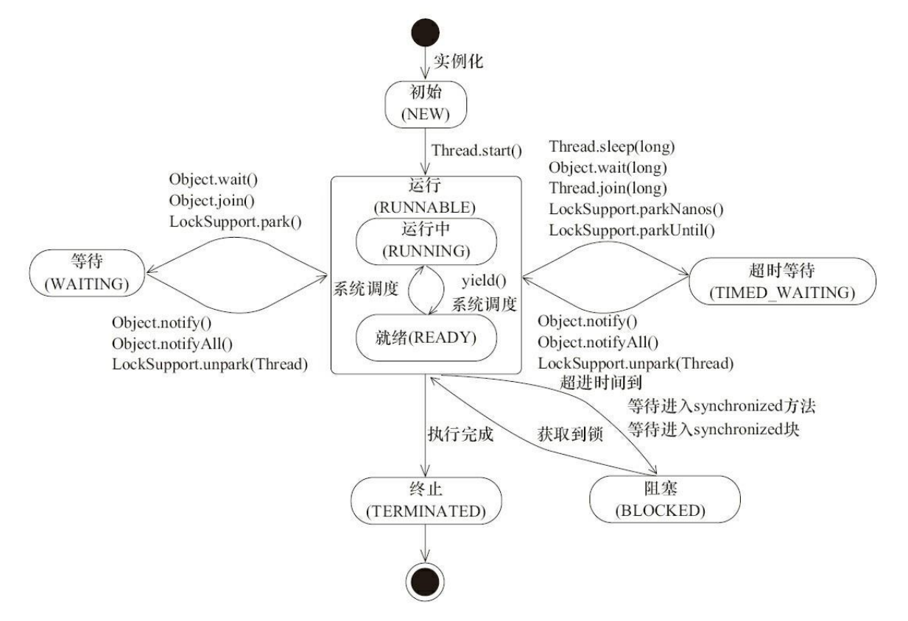
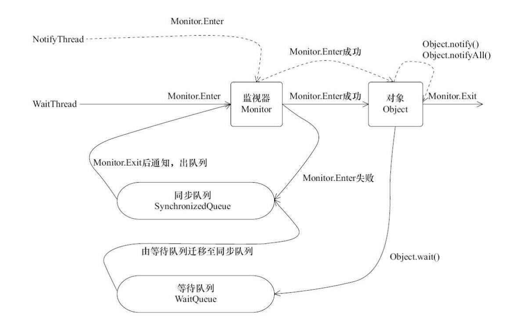
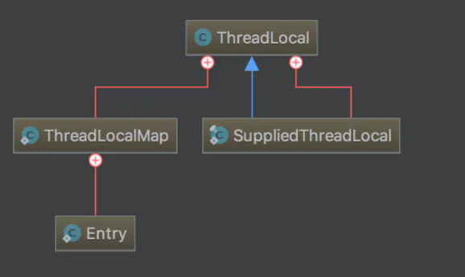
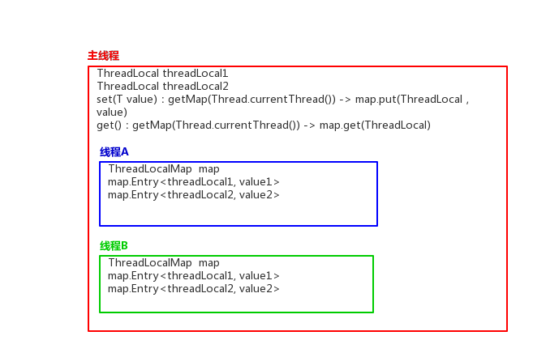

### Java 并发编程基础

#### 什么是线程

线程是系统调度的最小单元，操作系统在运行一个程序时，会为其创建一个进程，在这个进程中可以创建多个线程，每个线程都拥有各自的计数器，堆栈和局部变量等属性，并且能够访问共享的内存变量。

java程序天生就是多线程程序

#### 线程优先级

操作系统基本采用时分的形式调度运行的线程，操作系统会分出一个个的时间片，线程会分配到若干时间片，当线程的时间片用完了就会发生线程调用，并等待着下次分配，线程分配到的时间片多少决定了线程使用处理器资源的多少，而线程优先 级就是决定线程需要多或者少分配一些处理器资源的线程属性。

在 Java 线程中，通过一个整型成员变量 priority 来控制优先级，优先级的范围从 1~10，在线程构建的时候可以通过 setPriority(int)方法来修改优先级，默认优先级是 5， 优先级高的线程分配时间片的数量要多于优先级低的线程。

有些操作系统可能会忽略java程序设置的线程优先级

#### 线程的状态

在Java中线程一共有6中状态：

- new 初始状态，线程被创建但是还没有调用start()方法
- runnable 运行状态，java线程将操作系统中的就绪和运行两种状态笼统的称为"运行中"状态
- blocked 阻塞状态，表示线程因为锁而阻塞了
- waiting 等待状态，表示线程进入等待状态，进入该状态表示当前线程需要等待其他线程做出一些特定动作(通知或中断)
- time_waiting 超时等待状态，该状态不同于waiting，它是可以在指定的时间自行返回的
- terminaten 终止状态，表示当前线程已经执行完毕




Thread.java 中存在一个内部枚举类来标明线程的所有状态

~~~java
public enum State {
    NEW,
    RUNNABLE,
    BLOCKED,
    WAITING,
    TIMED_WAITING,
    TERMINATED;
}
~~~

可以通过 `getState()`获取当前线程的当前状态

#### Daemon线程

- Daemon线程是一种支持型线程，通常叫做守护线程，它的主要作用被用作程序中后台调度以及支持性工作。
- 当一个java虚拟机中不存在非Daemon线程的时候，也就是不存在除Daemon线程以外的其他线程的时候，java虚拟机将会退出。
- 可以通过Thread.setDaemon(true)将线程设置为Daemon线程，设置Daemon线程需要在启动线程之前设置。
- Daemon线程被用作完成支持型工作，但是在java虚拟机退出时Daemon线程中的finally不一定会执行，所以在构建Daemon线程时候不能通过finally块中的内容来确保执行关闭或清理资源的逻辑

#### 线程组

- 在java中使用 ThreadGroup类来表示线程组，可以对一批线程和线程组进行管理，可以把线程归属到某一个线程组中，线程组中可以有对象，也可以有线程组，类似于组合模式
- 用户创建的所有线程都属于指定线程组，如果没有显式指定属于哪个线程组，那么该线程就属于默认线程组（即main线程组）。默认情况下，子线程和父线程处于同一个线程组。在线程init的时候会将子线程加入父线程所在的线程组。
- 只有在创建线程时才能指定其所在的线程组，线程运行中途不能改变它所属的线程组，也就是说线程一旦指定所在的线程组就不能改变。

#### 线程的启动和终止

##### 线程启动前要构造一个线程

- 当一个线程被new时，会在构造方法的内部直接调用init方法，并将自己的参数传给init方法，线程内部维护了一个静态变量

  ~~~java
  private static int threadInitNumber;
  private static synchronized int nextThreadNum() {
      return threadInitNumber++;
  }
  ~~~

  当开发人员没有传入name参数的时候，java会调用nextThreadNum()方法并拼接上相应的字符串当做线程的name

- init有六个参数

  - Thread group  g 线程组，表示一组线程，其中也可以包含其他的线程组
  - Runnable target 线程方法的实体，可以是lambda表达式
  - String name 线程名字
  - long stackSize 这个线程所需的堆栈大小
  - AccessControlContext acc 访问控制上下文
  - boolean inheritThreadLocals 这个线程是否是可继承的，如果为true 可以将自己的一些信息继承给子线程

- ~~~java 
  // 必须要有线程名
  if (name == null) {
      throw new NullPointerException("name cannot be null");
  }
  //修改当前的线程名为新的线程名 方便线程的复用
  this.name = name;
  ~~~

- ```java
  Thread parent = currentThread();
  SecurityManager security = System.getSecurityManager();
  if (g == null) {
      /*通过安全管理器检查是否有恶意代码，这里要求线程组要有安全性保障*/
      if (security != null) {
          g = security.getThreadGroup();
      }
  
      /*此时如果为null，则直接使用父线程的线程组*/
      if (g == null) {
          g = parent.getThreadGroup();
      }
  }
  
  /*检查是否可以正常访问线程组*/
  g.checkAccess();
  
  /*检查并赋予权限*/
  if (security != null) {
      if (isCCLOverridden(getClass())) {
          security.checkPermission(SUBCLASS_IMPLEMENTATION_PERMISSION);
      }
  }
  /*设置此线程的线程组，将线程组的未启动线程数加1*/
  g.addUnstarted();
  ```

- ```java
  /*设置必要的属性*/
  //线程组
  this.group = g;
  //是否是守护线程， 要和父线程相同
  this.daemon = parent.isDaemon();
  //默认继承父线程的优先级
  this.priority = parent.getPriority();
  //设置线程的上下文加载器
  if (security == null || isCCLOverridden(parent.getClass()))
      this.contextClassLoader = parent.getContextClassLoader();
  else
      this.contextClassLoader = parent.contextClassLoader;
  this.inheritedAccessControlContext =
      acc != null ? acc : AccessController.getContext();
  //接口对象
  this.target = target;
  //设置优先级
  setPriority(priority);
  if (inheritThreadLocals && parent.inheritableThreadLocals != null)
      this.inheritableThreadLocals =
      ThreadLocal.createInheritedMap(parent.inheritableThreadLocals);
  /*堆栈大小*/
  this.stackSize = stackSize;
  
  /*设置线程id */
  tid = nextThreadID();
  ```

- 线程初始化后 该线程组的未运行线程计数从原来的基础上加一 ，该线程处于new 状态

##### 启动线程

- 线程对象在初始化完成之后，调用 start()方法就可以启动这个线程

- ```java
  // 当threadStatus==0 时 说明该线程处于new状态可以调用start方法
  if (threadStatus != 0)
      throw new IllegalThreadStateException();
  ```

- ```java
  //通知线程组 当前线程将要被启动，线程组计数减一
  group.add(this);
  ```

- ```java
  // 声明 作为 线程正常启动的标志
  boolean started = false;
  try {
  //private native void start0();
      start0();
      started = true;
  } finally {
      try {
          if (!started) {
              //启动失败的处理，比如线程组计数器加一，删除相关上下文信息  
              group.th readStartFailed(this);
          }
      } catch (Throwable ignore) {
          
      }
  }
  ```

- 同时还有run()方法， Thead类实现了Runnable接口，重写了run方法，如果线程直接调用run方法，则不会启动已经初始化的线程，只是主线程去调用其他方法的过程

- 线程启动后 处于 runnable 状态(running(运行中) +  ready(就绪))

##### 线程的中断

- 线程可以通过 方法 isInterrupted()来判断是否被中断，中断是其他线程中调用了该线程的interrupt()

- 对于已经处于结束状态和抛出 InterruptedException的线程，调用isInterrupted()方法会返回false

- 调用thread.interrupt()后会将该线程的中断状态为设置为true，中断的结果是什么取决于程序本身的逻辑，线程会不断的检测这个中断标志状态，用来判断线程是否被中断

- 对于处于sleep，join等操作的线程，如果被调用interrupt()后，会抛出InterruptedException，然后线程的中断标志位会由true重置为false，因为线程为了处理异常已经重新处于就绪状态。

- 对于阻塞的线程如synchronized，Lock.lock() ，的线程，调用interrupt()对于这几个问题无效(中断标志位会被修改但是没有效果)，因为它们都不抛出中断异常。如果拿不到资源，它们会无限期阻塞下去。

- ~~~java
  public static void main(String[] args) {
  
      Test03 test03 = new Test03();
  
      new Thread(test03::sleepAll,"c").start();
  
      Thread a = new Thread(() -> {
          System.out.println(Thread.currentThread().getName() + "线程启动");
          //            会被中断，中断后会被重置 中断标志
          //            try {
          //                Thread.sleep(5);
          //            } catch (InterruptedException e) {
          //                e.printStackTrace();
          //            }
  
          //           会被中断，中断的同时抛出InterruptedException异常
          test03.sleepAll();
  
          //            会被中断
          //            while (!Thread.currentThread().isInterrupted()){
          //
          //            }
  
          System.out.println("中断出现"+Thread.currentThread().getName() + "结束");
      },"a");
  
      Thread b = new Thread(() -> {
          System.out.println(Thread.currentThread().getName() + "线程启动");
          try {
              TimeUnit.SECONDS.sleep(1);
              /*中断a线程*/
              a.interrupt();
              System.out.println("a线程是否被中断:"+a.isInterrupted());
          } catch (InterruptedException e) {
              e.printStackTrace();
          }
      }, "b");
      System.out.println("a线程是否被中断:"+a.isInterrupted());
      a.start();
      b.start();
  
  }
  
  
  public synchronized void sleepAll(){
      try {
          TimeUnit.SECONDS.sleep(50);
      } catch (InterruptedException e) {
          e.printStackTrace();
      }
  }
  ~~~

##### suspend()、resume()和 stop() 已过期

- 实现了对线程的 暂停 恢复和终止
- 不建议使用，在暂停的时候会持续占有资源，终止时也有可能因为线程直接被喊停从而无法去释放占有的资源

##### 安全地终止线程

##### 设置优先级

~~~java
ThreadGroup g;
checkAccess();
//判断范围
if (newPriority > MAX_PRIORITY || newPriority < MIN_PRIORITY) {
    throw new IllegalArgumentException();
}
//当前线程优先级不能大于线程组的优先级
if((g = getThreadGroup()) != null) {
    if (newPriority > g.getMaxPriority()) {
        newPriority = g.getMaxPriority();
    }
    setPriority0(priority = newPriority);
}
~~~

##### 清理 exit(), 由系统调用，线程会主动空出所有的引用

#### 线程间通信

##### volatile和synchronize关键字

- java支持多个线程同时访问一个对象或者对象的成员变量，由于每个线程可以拥有这个变量的拷贝，所以在程序的执行过程中，一个线程看到的变量并不一定是最新的
- volatile可以保证所有线程对变量访问的可见性
- synchronized 可以修饰方法或者以同步块的形式来进行使用，它主要确保多 个线程在同一个时刻，只能有一个线程处于方法或者同步块中，它保证了线程对变量访 问的可见性和排他性。
- 任意一个对象都拥有自己的监视器，当这个对象由同步块或者这个对象的同步方法 调用时，执行方法的线程必须先获取到该对象的监视器才能进入同步块或者同步方法， 而没有获取到监视器（执行该方法）的线程将会被阻塞在同步块和同步方法的入口处， 进入 BLOCKED 状态

##### 等待/通知机制

###### 生产者和消费者模型

- 维护一个队列，生产者的工作是向队列中放入生产的"物品"，消费者的工作是消费放入了队列的"物品"
- 生产者会循环判断队列是否为满，如果队列已满则进行相应的处理 如睡眠一段时间，如果不满则继续生产，消费者同理，不过需要判断队列是否为空
- 这样的关系难以确保及时性，如果睡得过久，就不 能及时发现条件已经变化，也就是及时性难以保证
- 难以降低开销。如果降低睡眠的时间，消费者能更加迅速 地发现条件变化，但是却可能消耗更多的处理器资源

###### 等待/通知机制

- notify(),通知一个在对象上等待的线程，使其从wait()方法返回，而返回的前提是该线程获取到了对象的锁，选择哪个线程是随机的
- notifyAll(),通知所有等待在该对象上的线程，如果有多个线程在等待，那么就会进入竞争锁
- wait(),调用方法的线程进入waiting状态，只有等待另外的线程的通知或被中断才会返回，需要注意，调用wait()方法后，会释放对象的锁
- wait(long),超时等待一段时间，这里的参数时间是毫秒，也就是等待长达n毫秒，如果没有通知就超时返回
- wait(long,int),对于超时等待的更细粒度控制，可以达到纳秒

###### 注意

- 使用 wait()、notify()和 notifyAll()时需要先对调用对象加锁。
- 调用 wait()方法后，线程状态由 RUNNING 变为 WAITING，并将当前线程放置 到对象的等待队列
- notify()或 notifyAll()方法调用后，等待线程依旧不会从 wait()返回，需要调用 notify()或 notifAll()的线程释放锁之后，等待线程才有机会从 wait()返回。
- notify()方法将等待队列中的一个等待线程从等待队列中移到同步队列中，而 notifyAll() 方法则是将等待队列中所有的线程全部移到同步队列，被移动的线程 状态由 WAITING 变为 BLOCKED。
- 从 wait()方法返回的前提是获得了调用对象的锁。



###### 等待方遵循如下原则:

- 获取对象的锁。 
- 如果条件不满足，那么调用对象的 wait()方法，被通知后仍要检查条件。 
- 条件满足则执行对应的逻辑。

###### 通知方遵循如下原则:

- 获得对象的锁。
- 改变条件。
- 通知所有等待在对象上的线程。

##### 管道输入/输出流

- 用于线程之间的数据传输，而传输的媒介为内存。管道输入/输出流主要包括了如下 4 种具体实现：PipedOutputStream、PipedInputStream、PipedReader 和 PipedWriter，前两 种面向字节，而后两种面向字符。

- ~~~java
  PipedWriter out = new PipedWriter();
  PipedReader in = new PipedReader();
  ~~~

- 以上声明了输入流和输出流，使用的时候必须通过connect()建立连接,否则在使用时会抛出 IOException

- `out.conect(in)`

##### Thread.join()

- 调用后进入等待状态，等待被调用线程返回，之后继续执行
- join的意思是放弃当前线程的执行，并返回对应的线程
- 比如：程序在main线程中调用t1线程的join方法，则main线程放弃cpu控制权，并返回t1线程继续执行直到线程t1执行完毕所以结果是t1线程执行完后，才到主线程执行，相当于在main线程中同步t1线程，t1执行完了，main线程才有执行的机会
- A线程中调用了B线程的join方法，则相当于A线程调用了B线程的wait方法，在调用了B线程的wait方法后，A线程就会进入阻塞状态

##### ThreadLocal

- ThreadLocal，即线程变量，是一个以 ThreadLocal 对象为键、任意对象为值的存储结构。

- ThreadLocal中填充的变量属于当前线程，该变量对其他线程而言是隔离的。ThreadLocal为变量在每个线程中都创建了一个副本，那么每个线程可以访问自己内部的副本变量。

- 调用`get()`

  - 获取当前线程`Thread`对象，进而获取此线程对象中维护的`ThreadLocalMap`对象。
  - 判断当前的`ThreadLocalMap`是否存在,如果存在，则以当前的`ThreadLocal` 为 `key`，调用`ThreadLocalMap`中的`getEntry`方法获取对应的存储实体 `e`。找到对应的存储实体 `e`，获取存储实体 `e` 对应的 `value`值，即为我们想要的当前线程对应此`ThreadLocal`的值，返回结果值。
  - 如果不存在，则证明此线程没有维护的`ThreadLocalMap`对象，调用`setInitialValue`方法进行初始化。返回`setInitialValue`初始化的值。

- 调用`set(T value)`

  - 获取当前线程`Thread`对象，进而获取此线程对象中维护的`ThreadLocalMap`对象。
  - 判断当前的`ThreadLocalMap`是否存在：
  - 如果存在，则调用`map.set`设置此实体`entry`。
  - 如果不存在，则调用`createMap`进行`ThreadLocalMap`对象的初始化，并将此实体`entry`作为第一个值存放至`ThreadLocalMap`中。

- ~~~java
  public static void main(String[] args) {
  
      ThreadLocal<String> local = new ThreadLocal<>();
      Test03 test03 = new Test03();
  
      IntStream.range(0,10).forEach(value -> {
          new Thread(() -> {
              local.set("和名字一样的随机值" + value);
              test03.sleepAll();
              System.out.println(value + "的local里面是" + local.get());
              /*修改 */
              local.set("新的存储值" + (value + 1));
              test03.sleepAll();
              System.out.println(value + "的local里面是" + local.get());
          }, "随机名字" + value).start();
      });
  }
  ~~~

- 

- ThreadLocalMap是ThreadLocal的内部类，本质上是一个map，存储数据是key-value形式

- 在ThreadLocalMap中存在一个内部类，Entry。

- 其中的key是持有ThreadLocal的弱引用 ？

- ThreadLocalMap的引用在Thread中，每个线程向ThreadLocal中存入数据的时候，实际上都是向自己所持有的ThreadLocalMap中放入数据，

- 读的时候首先取出自己持有的ThreadLocalMap，然后根据ThreadLocal引用作为key取出value

- 

- ThreadLocal源码中

  ~~~java
  /**
   * The table, resized as necessary.
   * table.length MUST always be a power of two.
   */
  private Entry[] table;
  ~~~

- 这里的table是一个数组，既然我每次只塞一个值进去，为什么还要一个数组来存呢？

  其实一个Thread是可以对应多个ThreadLocal的，但是一个Thread只能有一个ThreadLocalMap，所以在ThreadLocal中就维护了一个Entry数组，用来存放不同的ThreadLocal对应的数据

  ~~~java
  ThreadLocal<String> local01 = new ThreadLocal<>();
  ThreadLocal<String> local02 = new ThreadLocal<>();
  Test03 test03 = new Test03();
  IntStream.range(0,10).forEach(value ->{
      new Thread(() -> {
          local01.set(Thread.currentThread().getName() + "local01:" + value);
          local02.set(Thread.currentThread().getName() + "local02:" + value);
          test03.sleepAll();
          System.out.println(local01.get());
          test03.sleepAll();
          System.out.println(local02.get());
      }).start();
  });
  ~~~

  

#### 线程应用实例

##### 等待超时模式

- 一种场景：调用一个方法时等待一段时间（一般来 说是给定一个时间段），如果该方法能够在给定的时间段之内得到结果，那么将结果立刻 返回，反之，超时返回默认结果。

- 算是对等待/通知的一个增强，加入了超时返回的操作

- 如果超时时间是T，那么在当前是时间  now +  T 之后的时间点 now01 就会超时，那么这个时候仅需要wait(T)j即可，等待结束后执行 T= now01 - now(这个now和之前的now并不是同一个，一般会比上一个多 T 甚至更多)，这个时候如果计算后的T小于0 那么就说明超时了，就可以返回结果，这个结果根据当前程序的逻辑来确定

  ~~~java
  // 对当前对象加锁
  public synchronized Object get(long mills) throws InterruptedException {
      //加上System.currentTimeMillis() 进入第一次循环
      long future = System.currentTimeMillis() + mills;
      long remaining = mills;
      // 当超时大于 0 
      //result 代表返回值，这里代表这个返回值不满足要求
      while ((result == null) && remaining > 0) {
          //等待
          wait(remaining);
          remaining = future - System.currentTimeMillis();
      }
      return result;
  }
  ~~~


### 总结

java线程的6中状态以及他们之间的转换关系：new 初始状态，runnable 运行中状态，blocked 阻塞状态，waiting 等待状态，time_waiting 超时等待状态，terminaten 终止状态

线程组：jvm使用线程组来管理线程，线程的部分信息如：线程优先级，是否守护线程，部分上下文都是在线程组中获取初始值，线程组一旦分配无法改变，一般来说，子线程和父线程是在同一个线程组中的。

线程初始化：设置name，检查安全，设置线程组，设置部分初始值：如优先级，是否守护线程堆栈大小，线程id等，之后线程组中未启动线程数++，此时的线程不会加入线程组中。

线程启动:：调用start()方法启动一个线程，检查线程是否已经启动，如果未启动则启动线程，线程组中未启动线程数--，所有线程数++，并把当前启动的线程add到线程组中，如果启动失败则回溯以上步骤

线程中断：线程的中断只是一个标志位，是其他线程通过该线程调用方法，改变标志位，本线程中可能会循环判断中断标志位是否被改变，当发现改变会根据线程实现的不同执行不同的操作，甚至有可能不进行操作，对于大部分线程来说这个标志位改变意味着线程任务完成，可以结束了

线程通信：线程通信的几种方式，通过共享变量，等待/通知模式(消费者生产者模式)，输入输出流，Thread.join()，ThreadLocal 

线程超时等待：等待通知模式的升级版，提供一个超时时间，当线程任务完成或者超时后直接返回，返回值根据线程实现而定。


