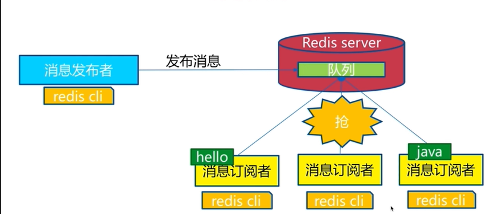

# ：Redis

## 一，nosql

> 什么是nosql

Nosql = Not Only SQL（不仅仅是SQL）

关系型数据库：表格，行，列

泛指非关系型数据库，随着web2.0互联网的诞生。，传统的关系型数据库很难对付web2.0时代，尤其是超大规模的高并发的社区，暴露出很多难以克服的问题，Nosql在当今大数据环境下发展的十分迅速，Redis是发展最快的，而且是我们当下必须要掌握的一个技术！

很多的数据类型用户的信息，社交网络，地理位置，这些数据类型的存储不需要一个固定的格式。不需要多余的操作就可以横向扩展，Map<String ,Object>，使用键值对来控制。

> nosql 特点

解耦！

1. 方便扩展。（数据之间没有关系，很好扩展）
2. 大数据高性能（Redis一秒写8万，读取11万，Nosql的缓存记录，是一种细粒度的缓存，性能会比较高）
3. 数据类型是多样性的，不需要实现设计数据库，如果是数据量十分大的表，很多人就无法设计了
4. 传统的RDBMS和Nosql
   - 传统的RDBMS
     - 结构化组织
     - SQL
     - 数据和关系都存在单独的表中
     - 数据操作，数据定义语言
     - 基础的事务
     - 。。。
   - Nosql
     - 不仅仅是数据
     - 没有固定的查询语言
     - 键值对存储，列存储，文档存储，图形数据库（社交关系）
     - 最终一致性
     - CAP定理和BASE（异地多话）

## 二，Nosql数据模型

## 三，Nosql四大分类

#### KV键值对：

- redis，
- tair，
- memocache

#### 文档型数据库 （bson，json）

- MongoDB
  - MongoDB是一个基于分布式文件存储的数据库
  - MongoDB是一个介于关系型数据库和非关系型数据库的中间产品，MongoDB是非关系型数据库中功能最丰富.最像关系型数据库的
- ConthDB

#### 列存储

- HBase
- 分布式数据库

#### 图关系数据库

- 他不是存图形，放的是关系
- Neo4j
- InfoGrid

## 四，CAP

CAP原则又称CAP定理，指的是在一个分布式系统中，一致性（Consistency）、可用性（Availability）、分区容错性（Partition tolerance）。CAP 原则指的是，这三个要素最多只能同时实现两点，不可能三者兼顾。

## 五，BASE

- BA: 基本可用（Basically Available）
- S: 柔性状态（Soft state）
- E: 最终一致（Eventually Consistent）

## 六，Redis入门

> redis是什么？

Redis(Remote Dictionary Server)，即远程字典服务！

是一个开源的使用ANSI C语言编写、支持网络、可基于内存亦可持久化的日志型、Key-Value数据库 ,并提供多种语言的API。

> Redis能干什么？

1. 内存存储，持久化，内存中是断电即失，所以说持久化很重要（RDB，AOF）
2. 效率高，可以用于高速缓存
3. 发布订阅系统
4. 地图信息分析
5. 计时器，计数器
6. 。。。。。

> 特性

1. 多样的数据类型
2. 持久化
3. 集群
4. 事务

## 七，Redis安装

1. 下载安装包  .gz
2. 解压redis安装包 `tar -zxvf 压缩包名.gz`
3. 进入解压后的文件，或看到redis的配置文件
4. `yum install gcc-c++`，安装c的基本环境
5. `make`,会把所有的环境下载配置好
6. `make install`
7. redis 的默认安装路径 `/usr/local/bin`
8. 将redis配置文件copy到当前文件下
9. redis默认不是后台启动，需要修改配置信息，配置文件中`deamonize yes`，保存退出
10. 启动redis`redis-server 配置文件路径`
11.  客户端 `redis-cli -p 6379`,指定端口号连接
12. 查看redis的端口是否启动，`ps -ef|grep redis`
13. 关闭Redis 服务  `shutdown` `exit`

##### 测试性能

redis-benchmark是一个压力测试工具

官方自带的工具

redis-benchmark命令参数

| 序号 | 选项 | 描述                                     | 默认值    |
| ---- | ---- | ---------------------------------------- | --------- |
| 1    | -h   | 指定服务器主机名                         | 127.0.0.1 |
| 2    | -p   | 指定服务器端口                           | 6379      |
| 3    | -s   | 指定服务器socket                         |           |
| 4    | -c   | 指定并发连接                             | 50        |
| 5    | -n   | 指定请求数                               | 10000     |
| 6    | -d   | 以字节的形式指定SET/GET值的数据大小      | 3         |
| 7    | -k   | 1=keep alive 0 = reconnet                | 1         |
| 8    | -r   | SET/GET/INCR 使用随机key,SADD 使用随机值 |           |
| 9    | -p   | 通过管道传输\<numreq>值                  | 1         |
| 10   | -q   | 强制退出redis 进显示query/sec值          |           |
| 11   | -csv | 以CSV格式输出                            |           |
| 12   | -l   | 生成循环，永久性测试                     |           |
| 13   | -t   | 仅运行以逗号分隔的测试命令列表           |           |
| 14   | -I   | Idel模式，仅打开N个idel连接并等待        |           |

简单测试：

~~~shell
#测试100个并发连接，100000请求
redis-benchmark -h localhost -c 100 -n 100000
~~~

~~~shell
====== GET ======
  100000 requests completed in 5.12 seconds  #对10万个请求进行写入
  100 parallel clients #100个并发客户端
  3 bytes payload #每次写入三个字节
  keep alive: 1 #只有一台服务器来处理这些请求，单机性能
  2.80% <= 1 milliseconds
42.07% <= 2 milliseconds
77.57% <= 3 milliseconds
84.74% <= 4 milliseconds
86.86% <= 5 milliseconds
87.58% <= 6 milliseconds
87.77% <= 7 milliseconds
87.86% <= 8 milliseconds
87.91% <= 9 milliseconds
87.94% <= 11 milliseconds
89.04% <= 12 milliseconds
93.19% <= 13 milliseconds
96.02% <= 14 milliseconds
97.46% <= 15 milliseconds
97.77% <= 16 milliseconds
97.78% <= 20 milliseconds
97.81% <= 21 milliseconds
97.82% <= 22 milliseconds
98.24% <= 23 milliseconds
99.22% <= 24 milliseconds
99.90% <= 25 milliseconds
99.97% <= 26 milliseconds
100.00% <= 26 milliseconds 
19512.20 requests per second #每秒处理这些请求
~~~

1. 切换数据库 `select 0~15`
2. 数据库大小容量 `dbsize`
3. 清空当前数据库 `flushdb`
4. 清空全部数据库`flushall`

> redis 是单线程的

redis是很快的，官方表示，redis是基于内存操作，CPU不是redis性能瓶颈，redis的瓶颈是根据机器的内存和网路带宽，既然可以使用单线程来实现，就是用单线程了

为什么单线程会这么快？

redis是将所有的数据全部放在内存中的，所以说使用单线程去操作效率就是最高的，多线程（CPU上下文切换：耗时的操作），对于内存系统来说，如果没有上下文切换效率就是最高的！

## 八，五大基本数据类型

### 0，Redis-Key

1. keys* 遍历所有的键 一般不在生产环境中使用

2. dbsize 计算key的总数

3. exists key 判断key是否存在

   存在返回1，不存在返回0

4. del key[key....] 删除key

   删除成功返回1，删除失败返回0

5. expire key seconds 设置key的过期时间

   expire key 30 设置30秒后过期

   ttl key 查询key的剩余时间

   ​	-2 表示key已经不存在了

   ​	-1表示key没有过期时间

   persist key 去掉key的过期时间，永不过期

6. type key 查看key的类型

7. move key 移除当前的key

8. ttl key  查看当前key的剩余时间

### 1，String

1. get key  查看一个key
2. set key value  设置存储一个key
3. del key [key...] 删除
4. incr key 自增一，不存在的话 从0开始 自增后get key = 1 
5. decr key 自减一，不存在的话 从0开始 自减后get key = -1
6. incrby key k 自增k，不存在的话 从0开始 自增后get key = k
7. decrby key k 自减k，不存在的话 从0开始 自减后get key = -k
8. set key value 不管key是否存在，都设置
9. setnx key value key不存在，才设置
10. set key value xx   key存在  才设置
11. mget key1 key2 kety3 批量获取key
12. mset key1 vlaue1 key2 value2 批量设置
13. getset key newvalue 为key设置一个新的值并返回旧的vlaue 
14. append key value   将value追加到旧的value，如果key不存在就相当于set key
15. strlen key 返回字符串的长度  注意中文
16. incrbyfloat key float(3.5)  增加key对应的值3.5
17. getrange key start end 获取字符串指定下标所有的值
18. setrange key index value 设置指定下标所有对应的值
19. setnx key time value 设置的key在time时间后过期 

### 2，List

1. rpush key value1 vaiue2 。。。。 从列表右端插入值可以是多个
2. lpush key value1 vaiue2 。。。。 从列表左 端插入值可以是多个
3. linsert key before|after value newValue 在list指定的值前|后插入newValue 需要遍历整个列表
4. lpop key 从列表左边弹出一个item
5. rpop key 从列表右边弹出一个item
6. lrem key count value 根据count的值删除所有和vlaue相等的项
   1. count>0 从左到右，删除最多count个value相等的项
   2. count<0 从右到左，删除最多Math.abs(count)个value相等的项
   3. count=0,删除所有和value相等的项
7. ltrim key start end 按照索引范围修建列表 start-end是下标索引，其范围内的元素保留
8. lrange key start end (包含end) 获取列表指定索引范围所有的item
9. lindex key index 获取列表指定索引的item
10. llen key 获取列表的长度
11. lset key index newValue 设置列表指定索引值为newValue 
12. blpop key timeout 这是lpop的阻塞版本，timeout是阻塞超时的时间,当timeout 为0 时为永远不阻塞 
13. brpop key timeout 这是rpop的阻塞版本，timeout是阻塞超时的时间,当timeout 为0 时为永远不阻塞

### 3，Set

1. sadd key element 向集合key添加element(如果element已经存在,则会添加失败)
2. srem key element 将集合key中的element移除掉
3. scard key 计算集合大小
4. sismember key value 判断value是否在集合中存在 0为不存在，1为存在
5. srandmember key count 从集中随机的挑选count个元素，不会破坏集合的数据
6. spop key 从集合中随机弹出一个元素 弹出不会再存在于集合中
7. smembers key  获取集合中的所有元素
   1. 返回结果无需
   2. 返回所有元素 如果元素较多 要小心使用 
8. sdiff key1 key2 可以得到集合key1对集合key2的差集
9. sinter key1 key2 可以得到两个集合的交集
10. sunion key1 key2 可以得到两个集合的并集

### 4，Hash

1. hget key field 获取hash key对应的field的value
2. hset key field value 设置hash key对应的field的value
3. hdel key field 删除hash key对应的field的value
4. hexists 判断hash key是否有field
5. hlen 获取hash key field的数量
6. hmget key1 field1 field2 field3。。。 批量获取hash key的一批field对应的值
7. hmset key1 field1 value1 field2 value2。。。批量设置hash key的一批field和vlaue
8. hgetall 返回hash key对应所有的field和value 都有
9. hvals key 返回hash key对应所有的field和value 只有value
10. hkeys key 返回hash key对应的所有field 只有field

### 5，Zset

1. zadd key scoreelement(可以是多对)，添加score和element 其中score可以是重复的但是element不能重复
2. zrem key element(可以是多个)  删除元素
3. zscore key element 返回元素的分数
4. zincrby key increScore element 增加或减少元素的分数  element可正可负
5. zcard key 返回总数的个数
6. zrange key start end[withscores] 返回指定索引范围内的升序元素 ,中括号内容为分值，填写后会打印分值
7. zrangebyscroe key minscore maxscore[withscores]返回指定分数范围内的升序元素 ,中括号内容为分值，填写后会打印分值
8. zcount key minscore maxscore 返回有序集合内在指定分数范围内的个数
9. zremrangebyrank key start end 删除指定排名内的升序元素
10. zremrangebyscore key minscore maxscore 删除指定分数内的升序元素

## 九，三种特殊数据类型

### 1，geospatial地理位置

朋友的定位，附近的人，打车距离计算

Redis的Geo在redis3.2就推出了。

~~~shell
#添加一个或者多个城市的地理位置信息
#规则，两级无法添加，我们一般会下载城市数据然后通过java一次性导入
#参数 key value(经度，维度，明成)
127.0.0.1:6379> geoadd china:city 116.40 39.90 beijing
127.0.0.1:6379> geoadd china:city 120.16 30.34 hangzhou 108.96 34.26 xian
~~~

> geopos

获得当前定位，一定是一个坐标值

~~~shell
#获取指定城市的经度和维度
geopos china:city '已导入的城市名'
127.0.0.1:6379> geopos china:city beijing
1) 1) "116.39999896287918091"
   2) "39.90000009167092543"
127.0.0.1:6379> geopos china:city xian
1) 1) "108.96000176668167114"
   2) "34.25999964418929977"
127.0.0.1:6379> geopos china:city hangzhou
1) 1) "120.1600000262260437"
   2) "30.34000014212725915"
~~~

> 两个位置之间的距离

~~~shell
geodist china:city '已导入的城市名''已导入的城市名' '距离单位'
127.0.0.1:6379> geodist china:city beijing shanghai km
"1067.3788"
~~~

> 附近的人

~~~shell
#以给定的经纬度为中心，找出某一半径内的元素
georadiuschina:city "中心点经度" "中心点维度" "半径距离" "距离单位"
#可以获取指定数量的人
georadiuschina:city "中心点经度" "中心点维度" "半径距离" "距离单位" withdist withcoord count "个数"
#指定已导入的城市为中心点
georadiusbymember china:city shanghai 400km 
~~~

> geohash命令 返回一个或多个位置元素的geohash表示

该命令将返回11个字符的geohash字符串

~~~shell
127.0.0.1:6379> geohash china:city beijing 
1) "wx4fbxxfke0"
127.0.0.1:6379> geohash china:city beijing chongqing
1) "wx4fbxxfke0"
2) "wm5xzrybty0"
~~~

> geo底层的实现原理就是zset，我们可以使用zset命令来操作geo

~~~shell
#查看地图中全部元素
127.0.0.1:6379> zrange china:city 0 -1
~~~

### 2，hyperloglog

> 什么是基数？

两个数据集不重复的元素的个数，可以接受误差

> 简介

hyperloglog，是用来做基数统计的算法

~~~shell
pfadd key a b c d e f g h #添加
pfcount key #查看个数
pfmerge key key1 key2#将key1和key2合并到key中
~~~

### 3，bitmaps

> 位存储

统计用户信息，活跃，不活跃，登录，未登录，打卡。

bitmaps位图 数据结构，都是操作二进制为来进行记录，就只有0和1两个状态

~~~shell
setbit sign 0 1#记录代表周一 已打卡
setbit sign 1 0
setbit sign 2 0
setbit sign 3 1
setbit sign 4 0
setbit sign 5 1
setbit sign 6 1
#周一：1，周二：0.。。
#查看某一天是否有打卡
getbit sign 3
#统计操作
bitcount sign
~~~

## 十，Redis配置详解

1. 配置文件 unit单位 对大小写不敏感

2. 可以包含其他的文件

   ~~~bash
   # include /path/to/local.conf
   # include /path/to/other.conf
   ~~~

3. 网络

   ~~~bash
   # bind 192.168.1.100 10.0.0.1
   # bind 127.0.0.1 ::1
   protected-mode no
   port 6379
   ~~~

4. 通用配置

   ~~~bash
   daemonize yes #以守护进程方式运行，默认是no
   pidfile /var/run/redis_6379.pid #如果以后台的方式运行。 我们就需要指定一个pid文件!
   # 日志
   # specify the server verbosity leve1.
   # This can be one of:
   # debug (a 1ot of information, useful for development/testing)
   # verbose (many rarely useful info, but not a mess ike the debug leve1)
   # notice (moderately verbose, what you want in production probab1y) 生产环境
   # warning (Conly very inportant / critical messages are logged)
   loglevel notice
   logfile "" #日志的文件位置名
   databases 16 #数据库的数量，默认是16个数据库
   always-show-logo yes #是否
   ~~~

   持久化，在规定的时间内，执行了多少次操作，则会持久化到文件，.rdb .aof redis是内存数据库，如果没有持久化，那么数据断电即失

   ~~~bash
   # 如果900s内，如果至少有一个1 key进行了修改，我们及进行持久化操作
   save 900 1
   # 如果300s内，如果至少有一个10 key进行了修改，我们及进行持久化操作
   save 300 10
   # 如果60s内，如果至少有一个10000 key进行了修改，我们及进行持久化操作
   save 60 10000
   # 我们学习持久化之后会设置自己的配置
   # 持久化如果出错。是否还需要继续工作
   stop-writes-on-bgsave-error yes 
   # 是否压缩rdb文件，需要消耗一些cpu资源
   rdbcompression yes
   # 保存rdb文件时，是否进行校验
   rdbchecksum yes
   # rdb文件保存的目录
   dir ./
   ~~~

   replication 复制，主从复制

   security 安全

   ~~~bash
   config get requirpass # 获取redis的密码
   config set requirpass "123456" # 设置redis的密码
   config get requirpass #再次获取密码，发现没有权限了
   auth 123456 # 使用密码进行登录
   ~~~

   限制 clients

   ~~~bash
   maxclient 10000 # redis 最大客户连接数
   maxmemory <bytes> # redis 配置最大的内存容量
   maxmemory-policy noeviction # 内存到达上限之后的处理策略
   ~~~

   1. volatile-lru: 只对设置了过期时间的key进行LRU（默认值）
   2. allkeys-lru: 删除lru算法的key
   3. volatile-random: 随机删除即将过期的key
   4. allkeys-random: 随机删除一个key
   5. volatile-ttl: 删除即将过期的
   6. noeviction: 永不过期，返回错误

   append only模式 aof配置

   ~~~bash
   appendonly no # 默认是不开启aof模式的，默认是使用rdb方式持久化的，在大部分所有的情况下，rdb完全够用
   appendfilename "appendonly.aof" #持久化的文件的名字
   
   appendfsync always # 每次修改都会 sync 消耗性能
   appendfsync everysec # 每秒执行一次sync 可能会丢失者1s的数据
   appendfsync no # 不执行sync 这个时候操作系统自己同步数据，速度最快
   ~~~

   

## 十一，Redis持久化

redis是内存数据库，如果不将内存中的数据库状态保存到磁盘，那么一旦服务器进程退出，服务器中的数据库状态也会消失，所以redis提供了redis 提供了持久化的功能

### 1，RDB(Redis DateBase)

> 什么是RDB

在指定的时间间隔内将内存中的数据集快照写入磁盘.也就是行话讲的Snapshot快照,它恢复时是将快照文件直接读到内存里。

Redis会单独创建(fork) 一个子进程来进行持久化。会先将数据写入到-一个时文件中,待持久化过程都结束了。再用这个临时文件替换上次持久化好的文件。整个过程中,主进程是不进行任何IO操作的。这就确保了极高的性能。如果需要进行大规模数据的恢复，且对于数据恢复的完整性不是非常敏感.那RDB方式要比AOF方式更加的高效。RDB的缺点是最后一次持久化后的数据可能丢失。redis默认的持久化文件就是rdb,一般不需要修改。

**在生产环境我们会将这个文件备份**

==rdb保存的文件就是dump.rdb==

~~~bash
# 配置文件
dbfilename dump.rdb
save 60 5 #只要在60s内修改了5次key，就会触发rdb操作
~~~

> 触发机制

1. save的规则满足的情况下，会自动触发rdb规则
2. 执行flushall命令，也会触发rdb规则
3. 退出redis。也会触发rdb规则

备份就自动生成一个dump.rdb

> 如何恢复rdb文件

1. 只需要将rdb文件放在我们redis启动目录就可以，redis启动时会自动检查dump.rdb恢复其中的数据

2. 查看需要存放的位置

   ~~~shell
   config get dir
   1) "dir"
   2) "/" #如果在这个目录下存在 dump.rdb文件，启动就会自动恢复数据
   ~~~

优点：

1. 适合大规模的数据恢复！
2. 对数据的完整性要求不高

缺点：

1. 需要一定的时间间隔进程操作，如果redis以为宕机，那么最后一次修改数据就没有了
2. fock进程的时候，会占用一定的内存空间

### 2，AOF(Append Only File)

将我们的所有命令都记录下来，恢复的时候就把这个文件全部再执行一遍

以日志的形式来记录每个写操作,将Redis执行过的所有指令记录下来(读操作不记录) , 只许追加文件但不可以改写文件, redis启动之初会读取该文件重新构建数据,换言之. redis重启的话就根据日志文件的内容将写指令从前到后执行一-次以完成数据的恢复工作
==Aof保存的是appendonly.aof文件==

~~~shell
#配置文件修改
appendonly yes #这里改为yes即可
appendfilename "appendonly.aof" #持久化的文件的名字

# appendfsync always # 每次修改都会 sync 消耗性能
appendfsync everysec # 每秒执行一次sync 可能会丢失者1s的数据
# appendfsync no # 不执行sync 这个时候操作系统自己同步数据，速度最快
~~~

如果aof文件有错误，那么redis是启动不起来的，我们需要修复这个文件，redis为我们提供了修复工具，redis-check-aof --fix

优点：

1. 每一次修改都同步。文件的完整性会更好
2. 每秒同步一次，可能会丢失一秒的数据
3. 从不同步，效率最高

缺点：

1. 相对于数据文件来说，aof远远大于rdb,修复的速度也比rdb慢
2. aof运行效率也要比rdb慢，所以我们redis默认的配置就是rdb持久化

## 十二，Redis事务操作

### 事务

redis事务本质：一组命令的集合，一个事务中的所有命令都会被序列化，在事务执行过程中，会按照顺序执行

一次性，顺序性，排他性执行一系列的命令

redis事务没有隔离级别的概念

所有的命令在事务中并没有直接被执行，只有发起执行命令的时候才会执行 ==Exec==

**redis单条命令是保证原子性的，但是redis事务不保证原子性**

redis的事务

- 开启事务(multi)
- 命令入队()
- 执行事务(exec)

> 放弃事务

- discard 取消事务

> 编译型异常 

- 代码有问题！命令有错 ，事务中所有的命令都不会被执行

> 运行时异常 

- 如果事务队列中存在语法型错误，那么执行命令时候，其他命令是可以正常执行的

> 监控

#### 悲观锁

- 很悲观，认为什么时候都会出问题，无论做什么都会加锁！

#### 乐观锁

- 很乐观，认为什么时候都不会出问题，所以不会上锁！跟新数据时候去判断一下，再次期间是否有人修改过这个数据
- 获取version
- 更新的时候比较version

> redis 的监视测试

~~~shell
#正常执行
127.0.0.1:6379> set money 100
OK
127.0.0.1:6379> set out 0
OK
127.0.0.1:6379> watch money
OK
127.0.0.1:6379> multi
OK
127.0.0.1:6379> DECRBY money 20
QUEUED
127.0.0.1:6379> INCRBY out 20
QUEUED
127.0.0.1:6379> EXEC
1) (integer) 80
2) (integer) 20
~~~

watch key #加锁

unwatch  #解锁

## 十三，Redis实现订阅发布

redis发布订阅(pub/sub)是一种==消息通信模式==：发送者(pub)发送消息，订阅者(sub)接受消息。

redis客户端可以订阅任意数量的频道

订阅/发布消息图：

第一个：消息发送者

第二个：频道

第三个：消息订阅者

> 命令

这些命令被广泛用于构建即时通信应用，比如网络聊天室(chatroom)和实时广播，实时提醒等

| 序号 | 命令及描述                                                   |
| ---- | ------------------------------------------------------------ |
| 1    | PSUBSCRIBE patterm [patterm...]订阅一个或多个符合给定模式的频道 |
| 2    | PUBSUB subcommand [argument [argument...]]查看订阅与发布系统状态 |
| 3    | PUBLISH channel message将信息发送到指定的频道                |
| 4    | PUNSUBSCRIBE [patterm [patterm...]]退订所有给定模式的频道    |
| 5    | SUBSCRIBE channel [channel...]订阅给定一个或多个频道的信息   |
| 6    | UNSUBSCRIBE [channel [channel...]]指退订给定的频道           |

> 测试：

~~~shell
# 订阅
127.0.0.1:6379> SUBSCRIBE shidacaizi #订阅一个频道
Reading messages... (press Ctrl-C to quit)
1) "subscribe"
2) "shidacaizi"
3) (integer) 1
#等待读取推送信息
1) "message" #消息
2) "shidacaizi" #那个频道的消息
3) "hello shidacaizi" #消息的内容
1) "message"
2) "shidacaizi"
3) "nihaoa"
~~~

~~~shell
#发送端
[root@izuf653r015pxzev02q80ez ~]# redis-cli  #发布者发送消息到频道
127.0.0.1:6379> PUBLISH shidacaizi "hello shidacaizi"
(integer) 1
127.0.0.1:6379> PUBLISH shidacaizi "nihaoa"
(integer) 1
~~~

> 原理

Redis是使用C实现的,通过分析Redis源码里的pubsub.c文件,了解发布和订阅机制的底层实现,籍此加深对Redis的理解。

Redis通过PUBLISHL SUBSCRIBE 和PSUBSCRIBE等命令实现发布和订阅功能。

通过SUBSCRIBE命令订阅某频道后, redis-server 里维护了-个字典,字典的键就是一个个channel(频道) , 而字典的值则是一个链表,链表中保存了所有订阅这个channel的客户端。SUBSCRIBE 命令的关键,就是将客户端添加到给定channel的订阅链表中。

通过PUBLISH命令向订阅者发送消息, redis-server会使用给定的频道作为键,在它所维护的channel字典中查找记录了订阅这个频道的所有客户端的链表,遍历这个链表,将消息发布给所有订阅者。

Pub/Sub从字面上理解就是发布( Publish )与订阅( Subscribe ) , 在Redis中,你可以设定对某-个key值进行消 息发布及消息订阅，当一个key值上进行了消息发布后,所有订阅它的客户端都会收到相应的消息。这一-功能最明显 的用法就是用作实时消息系统,比如普通的即时聊天,群聊等功能。

## 十四，Redis主从复制

#### 概念

主从复制，是指将一台redis服务器的数据，复制到其他redis服务器，前者称为主节点(master/leader)，后者称为从节点(slave/follower) ;数据的复制是单向的，只能由主节点到从节点。Master以写为主，Slave 以读为主。

默认情况下,每台Redis服务器都是主节点;且一个主节点可以有多个从节点(或没有从节点) ,但一个从节点只能有一一个主节点。

> 主从复制的作用主要包括:

1.数据冗余:主从复制实现了数据的热备份,是持久化之外的一种数据冗余方式。

2、故障恢复:当主节点出现问题时,可以由从节点提供服务,实现快速的故障恢复;实际上是一种服务的冗余。

3、负载均衡:在主从复制的基础上，配合读写分离，可以由主节点提供写服务，由从节点提供读服务(即写Redis数据时应用连接主节点,读Redis数据时应用连接从节点) , 分担服务器负载;尤其是在写少读多的场景下,通过多个从节点分担读负载,可以大大提高Redis服务器的并发量。

4、高可用基石:除了上述作用以外,主从复制还是哨兵和集群能够实施的基础,因此说主从复制是Redis高可用的基础。

一般来说 ,要将Redis运用于工程项目中,只使用一台Redis是万万不能的,原因如下:

1.从结构上,单个Redis服务器会发生单点故障,并且- 台服务器需要处理所有的请求负载,压力较大;

2、从容量上,单个Redis服务器内存容量有限, 就算一台Redis服务器内存容量为256G ,也不能将所有内存用作Redis存储内存,一般来说，单台Redis最大使用内存不应该超过20G。

#### 环境配置

只配置从库，不用配置主库！

~~~shell
127.0.0.1:6379> info replication #查看当前库的信息
# Replication
role:master #角色
connected_slaves:0 #没有从机
master_replid:5e09ecc24bf9c0d388acd84eb56d9cef34b0cd36
master_replid2:50d6f1a420823f61d4be730ee855de9746877624
master_repl_offset:55547
second_repl_offset:55548
repl_backlog_active:0
repl_backlog_size:1048576
repl_backlog_first_byte_offset:0
repl_backlog_histlen:0
~~~

> 修改对应的配置文件

1. 端口
2. pid名字
3. log文件名字
4. dump.rdb名字

~~~shell
#修改完毕后
[root@izuf653r015pxzev02q80ez ~]# ps -ef|grep redis
root      5993     1  0 18:03 ?        00:00:05 redis-server *:6380
root      6054     1  0 18:09 ?        00:00:03 redis-server *:6379
root      6062  6015  0 18:10 pts/2    00:00:00 redis-cli -p 6379
root      6857  5412  0 19:01 pts/0    00:00:00 redis-cli -p 6380
root      6859     1  0 19:01 ?        00:00:00 redis-server *:6381
root      6864  5434  0 19:01 pts/1    00:00:00 redis-cli -p 6381
root      6887  6867  0 19:01 pts/3    00:00:00 grep --color=auto redis
~~~

#### 一主二从

==默认情况下，没台Redis服务器都是主节点==

一般情况下只用配置从机就可以了，不需要配置主机

测试：

~~~shell
127.0.0.1:6380> SLAVEOF 127.0.0.1 6379 #通过slaveof命令把6380改为6379的从机
OK
127.0.0.1:6380> info replication
# Replication
role:slave 
master_host:127.0.0.1 #在这里可以看到主机的配置
master_port:6379
master_link_status:up
master_last_io_seconds_ago:0
master_sync_in_progress:0
slave_repl_offset:0
slave_priority:100
slave_read_only:1
connected_slaves:0
master_replid:19e118a6dee6025689e665c879b31229f0b7f49e
master_replid2:0000000000000000000000000000000000000000
master_repl_offset:0
second_repl_offset:-1
repl_backlog_active:1
repl_backlog_size:1048576
repl_backlog_first_byte_offset:1
repl_backlog_histlen:0

#------------------------------
127.0.0.1:6379> INFO replication #在这里可以看到从机的信息
# Replication
role:master
connected_slaves:1
slave0:ip=127.0.0.1,port=6380,state=online,offset=112,lag=0
master_replid:19e118a6dee6025689e665c879b31229f0b7f49e
master_replid2:0000000000000000000000000000000000000000
master_repl_offset:112
second_repl_offset:-1
repl_backlog_active:1
repl_backlog_size:1048576
repl_backlog_first_byte_offset:1
repl_backlog_histlen:112
~~~

配置完后是有两个从机的，这个是通过命令临时配置，永久配置是，在配置文件中配置的。

~~~shell
#文件配置
# Master-Replica replication. Use replicaof to make a Redis instance a copy of
# another Redis server. A few things to understand ASAP about Redis replication.
#
#   +------------------+      +---------------+
#   |      Master      | ---> |    Replica    |
#   | (receive writes) |      |  (exact copy) |
#   +------------------+      +---------------+
#
# 1) Redis replication is asynchronous, but you can configure a master to
#    stop accepting writes if it appears to be not connected with at least
#    a given number of replicas.
# 2) Redis replicas are able to perform a partial resynchronization with the
#    master if the replication link is lost for a relatively small amount of
#    time. You may want to configure the replication backlog size (see the next
#    sections of this file) with a sensible value depending on your needs.
# 3) Replication is automatic and does not need user intervention. After a
#    network partition replicas automatically try to reconnect to masters
#    and resynchronize with them.
#
# replicaof <masterip> <masterport>
replicaof 127.0.0.1 6379
# If the master is password protected (using the "requirepass" configuration
# directive below) it is possible to tell the replica to authenticate before
# starting the replication synchronization process, otherwise the master will
# refuse the replica request.
#
# masterauth <master-password>
~~~

> 细节

1. 主机负责写，从机负责读
2. 主机断开连接，从机依然是连接到主机的，但是没有写操作，这个时候，主机如果回来了，从机依旧可以直接获取到从机写的信息！
3. 如果是使用命令行来配置的主从，那这个时候就会变回主机，只要变回从机，就会立刻从主机中获取值，

> 复制原理

Slave 启动成功连接到master后会发送-个sync同步命令

Master接到命令,启动后台的存盘进程,同时收集所有接收到的用于修改数据集命令,在后台进程执行完毕之后, master将传送整个数据文件到slave ,并完成一次完全同步。

全量复制:而slave服务在接收到数据库文件数据后,将其存盘并加载到内存中。

增量复制: Master继续将新的所有收集到的修改命令依次传给slave ,完成同步

但是只要是重新连接master , 一次完全同步(全量复制)将被自动执行

## 十五，Redis哨兵模式

> 不使用哨兵

如果主机断开了连接，可以使用`slaveof no one`让自己变成主机，其他节点就可以手动连接到最新的主节点，如果这个时候之前的主机修复了那么需要重新配置

> 哨兵

sentinel.conf

~~~bash
#哨兵配置文件
#sentinel monitor 被监控的名称 host port 要选举谁
sentinel monitor myredis 127.0.0.1 6379 1
~~~

启动哨兵

~~~shell
redis-sentinel "sentinel文件位置"
~~~

主机断开连接后会从剩余的从机里选出一个主机，这个时候主机回来之后，只能做新的主机的从机

> 优点

1. 哨兵集群，基于主从复制模式，所有的主从配置优点，都有
2. 主从可以切换，故障可以转移，系统的可用性就会更好
3. 哨兵模式就是主从模式的升级，手动到自动，更加健壮

> 缺点

1. redis不好在线扩容，集群容量一旦到达上限，在线扩容就十分麻烦
2. 实现哨兵模式的配置其实很麻烦的，里面有很多选择

> 哨兵模式的全部配置

~~~bash
# *** IMPORTANT ***
#
# By default Sentinel will not be reachable from interfaces different than
# localhost, either use the 'bind' directive to bind to a list of network
# interfaces, or disable protected mode with "protected-mode no" by
# adding it to this configuration file.
#
# Before doing that MAKE SURE the instance is protected from the outside
# world via firewalling or other means.
#
# For example you may use one of the following:
#
# bind 127.0.0.1 192.168.1.1
bind 0.0.0.0
#
# protected-mode no

protected-mode no

# port <sentinel-port>
# The port that this sentinel instance will run on
port 26379

# By default Redis Sentinel does not run as a daemon. Use 'yes' if you need it.
# Note that Redis will write a pid file in /var/run/redis-sentinel.pid when
# daemonized.
daemonize yes

# When running daemonized, Redis Sentinel writes a pid file in
# /var/run/redis-sentinel.pid by default. You can specify a custom pid file
# location here.
pidfile "/var/run/redis-sentinel.pid"

# Specify the log file name. Also the empty string can be used to force
# Sentinel to log on the standard output. Note that if you use standard
# output for logging but daemonize, logs will be sent to /dev/null
logfile ""

# sentinel announce-ip <ip>
# sentinel announce-port <port>
#
# The above two configuration directives are useful in environments where,
# because of NAT, Sentinel is reachable from outside via a non-local address.
#
# When announce-ip is provided, the Sentinel will claim the specified IP address
# in HELLO messages used to gossip its presence, instead of auto-detecting the
# local address as it usually does.
#
# Similarly when announce-port is provided and is valid and non-zero, Sentinel
# will announce the specified TCP port.
#
# The two options don't need to be used together, if only announce-ip is
# provided, the Sentinel will announce the specified IP and the server port
# as specified by the "port" option. If only announce-port is provided, the
# Sentinel will announce the auto-detected local IP and the specified port.
#
# Example:
#
# sentinel announce-ip 1.2.3.4

# dir <working-directory>
# Every long running process should have a well-defined working directory.
# For Redis Sentinel to chdir to /tmp at startup is the simplest thing
# for the process to don't interfere with administrative tasks such as
# unmounting filesystems.
dir "/tmp"

# sentinel monitor <master-name> <ip> <redis-port> <quorum>
#
# Tells Sentinel to monitor this master, and to consider it in O_DOWN
# (Objectively Down) state only if at least <quorum> sentinels agree.
#
# Note that whatever is the ODOWN quorum, a Sentinel will require to
# be elected by the majority of the known Sentinels in order to
# start a failover, so no failover can be performed in minority.
#
# Replicas are auto-discovered, so you don't need to specify replicas in
# any way. Sentinel itself will rewrite this configuration file adding
# the replicas using additional configuration options.
# Also note that the configuration file is rewritten when a
# replica is promoted to master.
#
# Note: master name should not include special characters or spaces.
# The valid charset is A-z 0-9 and the three characters ".-_".
# sentinel monitor mymaster 127.0.0.1 6379 2
# sentinel myid 18ab4b6b600fad65c6afe3bbb57e3ea49671726b

# sentinel auth-pass <master-name> <password>
#
# Set the password to use to authenticate with the master and replicas.
# Useful if there is a password set in the Redis instances to monitor.
#
# Note that the master password is also used for replicas, so it is not
# possible to set a different password in masters and replicas instances
# if you want to be able to monitor these instances with Sentinel.
#
# However you can have Redis instances without the authentication enabled
# mixed with Redis instances requiring the authentication (as long as the
# password set is the same for all the instances requiring the password) as
# the AUTH command will have no effect in Redis instances with authentication
# switched off.
#
# Example:
#
# sentinel auth-pass mymaster MySUPER--secret-0123passw0rd

# sentinel down-after-milliseconds <master-name> <milliseconds>
#
# Number of milliseconds the master (or any attached replica or sentinel) should
# be unreachable (as in, not acceptable reply to PING, continuously, for the
# specified period) in order to consider it in S_DOWN state (Subjectively
# Down).
#
# Default is 30 seconds.
sentinel myid 01476bb08f63a2c88e86a8940667d17575e57cf3

# sentinel parallel-syncs <master-name> <numreplicas>
#
# How many replicas we can reconfigure to point to the new replica simultaneously
# during the failover. Use a low number if you use the replicas to serve query
# to avoid that all the replicas will be unreachable at about the same
# time while performing the synchronization with the master.
sentinel deny-scripts-reconfig yes

# sentinel failover-timeout <master-name> <milliseconds>
#
# Specifies the failover timeout in milliseconds. It is used in many ways:
#
# - The time needed to re-start a failover after a previous failover was
#   already tried against the same master by a given Sentinel, is two
#   times the failover timeout.
#
# - The time needed for a replica replicating to a wrong master according
#   to a Sentinel current configuration, to be forced to replicate
#   with the right master, is exactly the failover timeout (counting since
#   the moment a Sentinel detected the misconfiguration).
#
# - The time needed to cancel a failover that is already in progress but
#   did not produced any configuration change (SLAVEOF NO ONE yet not
#   acknowledged by the promoted replica).
#
# - The maximum time a failover in progress waits for all the replicas to be
#   reconfigured as replicas of the new master. However even after this time
#   the replicas will be reconfigured by the Sentinels anyway, but not with
#   the exact parallel-syncs progression as specified.
#
# Default is 3 minutes.
sentinel monitor mymaster 47.103.31.36 6381 1

# SCRIPTS EXECUTION
#
# sentinel notification-script and sentinel reconfig-script are used in order
# to configure scripts that are called to notify the system administrator
# or to reconfigure clients after a failover. The scripts are executed
# with the following rules for error handling:
#
# If script exits with "1" the execution is retried later (up to a maximum
# number of times currently set to 10).
#
# If script exits with "2" (or an higher value) the script execution is
# not retried.
#
# If script terminates because it receives a signal the behavior is the same
# as exit code 1.
#
# A script has a maximum running time of 60 seconds. After this limit is
# reached the script is terminated with a SIGKILL and the execution retried.

# NOTIFICATION SCRIPT
#
# sentinel notification-script <master-name> <script-path>
#
# Call the specified notification script for any sentinel event that is
# generated in the WARNING level (for instance -sdown, -odown, and so forth).
# This script should notify the system administrator via email, SMS, or any
# other messaging system, that there is something wrong with the monitored
# Redis systems.
#
# The script is called with just two arguments: the first is the event type
# and the second the event description.
#
# The script must exist and be executable in order for sentinel to start if
# this option is provided.
#
# Example:
#
# sentinel notification-script mymaster /var/redis/notify.sh

# CLIENTS RECONFIGURATION SCRIPT
#
# sentinel client-reconfig-script <master-name> <script-path>
#
# When the master changed because of a failover a script can be called in
# order to perform application-specific tasks to notify the clients that the
# configuration has changed and the master is at a different address.
#
# The following arguments are passed to the script:
#
# <master-name> <role> <state> <from-ip> <from-port> <to-ip> <to-port>
#
# <state> is currently always "failover"
# <role> is either "leader" or "observer"
#
# The arguments from-ip, from-port, to-ip, to-port are used to communicate
# the old address of the master and the new address of the elected replica
# (now a master).
#
# This script should be resistant to multiple invocations.
#
# Example:
#
# sentinel client-reconfig-script mymaster /var/redis/reconfig.sh

# SECURITY
#
# By default SENTINEL SET will not be able to change the notification-script
# and client-reconfig-script at runtime. This avoids a trivial security issue
# where clients can set the script to anything and trigger a failover in order
# to get the program executed.

sentinel config-epoch mymaster 1

# REDIS COMMANDS RENAMING
#
# Sometimes the Redis server has certain commands, that are needed for Sentinel
# to work correctly, renamed to unguessable strings. This is often the case
# of CONFIG and SLAVEOF in the context of providers that provide Redis as
# a service, and don't want the customers to reconfigure the instances outside
# of the administration console.
#
# In such case it is possible to tell Sentinel to use different command names
# instead of the normal ones. For example if the master "mymaster", and the
# associated replicas, have "CONFIG" all renamed to "GUESSME", I could use:
#
# SENTINEL rename-command mymaster CONFIG GUESSME
#
# After such configuration is set, every time Sentinel would use CONFIG it will
# use GUESSME instead. Note that there is no actual need to respect the command
# case, so writing "config guessme" is the same in the example above.
#
# SENTINEL SET can also be used in order to perform this configuration at runtime.
#
# In order to set a command back to its original name (undo the renaming), it
# is possible to just rename a command to itsef:
#
# SENTINEL rename-command mymaster CONFIG CONFIG
# Generated by CONFIG REWRITE
sentinel leader-epoch mymaster 1
sentinel known-replica mymaster 47.103.31.36 6380
sentinel known-replica mymaster 47.103.31.36 6379
sentinel current-epoch 1
~~~

## 十六，缓存穿透及解决方案

### 缓存穿透

> 概念

缓存穿透的概念很简单,用户想要直询一个数据,发现redis内存数据库没有,也就是缓存没有命中,于是向持久层数据库查询。发现也没有,于是本次查询失败。当用户很多的时候,缓存都没有命中,于是都去请求了持久层数据库。这会给持久层数据库造成很大的压力,这时候就相当于出现了缓存穿透。

> 解决方案

#### 布隆过滤器

布隆过滤器是一种数据结构,对所有可能查询的参数以hash形式存储,在控制层先进行校验,不符合则丢弃,从而避免了对底层存储系统的查询压力;

#### 缓存空对象

当存储层不命中后,即使返回的空对象也将其缓存起来，同时会设置一个过期时间,之后再访问这个数据将会从缓存中获取,保护了后端数据源;

但是这种方法会存在两个问题:

1、如果空值能够被缓存起来,这就意味着缓存需要更多的空间存储更多的键,因为这当中可能会有很多的空值的键;

2、即使对空值设置了过期时间,还是会存在缓存层和存储层的数据会有一-段时间窗口的不一 致,这对于需要保持一致性的业务会有影响。

### 缓存击穿

> 概念

这里需要注意和缓存击穿的区别，缓存击穿,是指一-个key非常热点 ,在不停的扛着大并发,大并发集中对这一个点进行访问 ,当这个key在失效的瞬间,持续的大并发就穿破缓存,直接请求数据库,就像在一个屏障上凿开了一个洞。

当某个key在过期的瞬间,有大量的请求并发访问,这类数据一般是热点数据,由于缓存过期,会同时访问数据库来查询最新数据，并且回写缓存,会导使数据库瞬间压力过大。

> 解决方案

#### 热点数据用不过期

从缓存层面来看,没有设置过期时间,所以不会出现热点key过期后产生的问题。

#### 加互斥锁

分布式锁:使用分布式锁,保证对于每个key同时只有一个线程去查询后端服务,其他线程没有获得分布式锁的权限,因此只需要等待即可。这种方式将高并发的压力转移到了分布式锁，因此对分布式锁的考验很大。

## 十七，缓存雪崩及解决方案

### 缓存雪崩

> 概念

缓存雪崩，是指在某-一个时间段,缓存集中过期失效。Redis 宕机!

产生雪崩的原因之一,比如在写本文的时候,马上就要到双十二零点,很快就会迎来一波抢购 ,这波商品时间比较集中的放入了缓存，假设缓存一个小时。那么到了凌晨一点钟的时候 ，这批商品的缓存就都过期了。而对这批商品的访问查询,都落到了数据库上,对于数据库而言, 就会产生周期性的压力波峰。于是所有的请求都会达到存储层,存储层的调用量会暴增,造成存储层也会挂掉的情况。

其实集中过期,倒不是非常致命,比较致命的缓存雪崩,是缓存服务器某个节点宕机或断网，因为自然形成的缓存雪崩, 一定是在某个时间段集中创建缓存,这个时候,数据库也是可以顶住压力的。无非就是对数据库产生周期性的压力而已。而缓存服务节点的宕机,对数据库服务器造成的压力是不可预知的,很有可能瞬间就把数据库压垮。

> 解决方案

#### redis高可用

这个思想的含义是,既然redis有可能挂掉,那我多增设几台redis ,这样一台挂掉之后其他的还可以继续工作,其实就是搭建的集群。

#### 限流降级

这个解决方案的思想是,在缓存失效后,通过加锁或者队列来控制读数据库写缓存的线程数量。比如对某个key只允许一个线程查询数据和写缓存,其他线程等待。

#### 数据预热

数据加热的含义就是在正式部署之前,我先把可能的数据先预先访问-遍,这样部分可能大量访问的数据就会加载到缓存中。在即将发生大并发访问前手动触发加载缓存不同的key ,设置不同的过期时间,让缓存失效的时间点尽量均匀。

## 十八，基础API值Jedis操作

使用java来操作redis

> 什么是Jedis

是redis官方推荐的java连接开发工具,使用java操作redis的中间件,如果你要是用redis那么一定要对Jedis十分熟悉

- 导入依赖

  ~~~xml
  <dependencies>
      <!-- https://mvnrepository.com/artifact/redis.clients/jedis -->
      <dependency>
          <groupId>redis.clients</groupId>
          <artifactId>jedis</artifactId>
          <version>3.2.0</version>
          <type>jar</type>
          <scope>compile</scope>
      </dependency>
      <dependency>
          <groupId>com.alibaba</groupId>
          <artifactId>fastjson</artifactId>
          <version>1.2.62</version>
      </dependency>
  </dependencies>
  ~~~

- 连接数据库

  ~~~java
  Jedis jedis = new Jedis("47.103.31.36",6379);
  ~~~

- 操作命令

- 断开连接

## 十九，SpringBoot集成Redis操作

在SpringBoot2.x之后，原来使用的jedis被替换为了lettuce

jrdis:采用的直连，多个线程操作的话，是不安全的，如果想避免，使用jedis pool连接池，近似BIO模式

lettuce：采用netty，实例可以再多个线程中共享，不存在线程不安全的情况，可以减少线程数据，更像NIO模式

## 二十，Redis的实践分析

